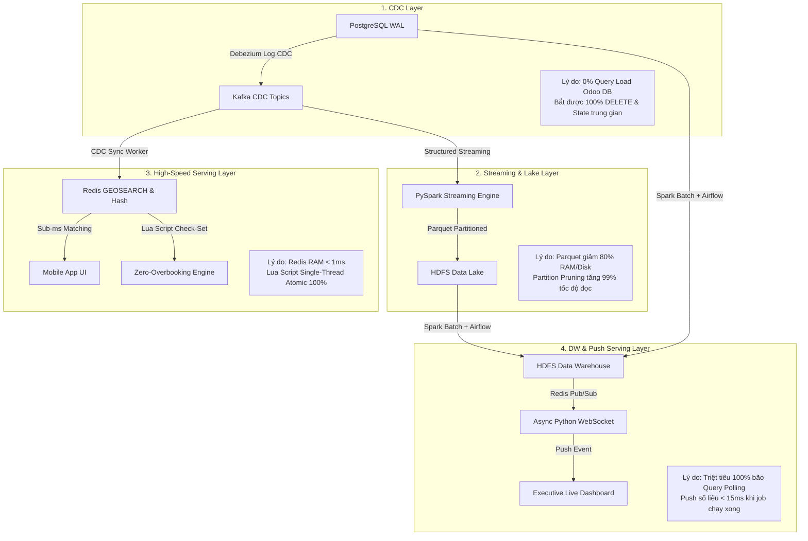

# 📐 System Architecture & Business Requirements Specification
## Enterprise Fleet Maintenance & Repair Data Platform

Tài liệu Phân tích Kiến trúc Hệ thống, Bài toán Nghiệp vụ và Đánh đổi Công nghệ (Technology Selection & Trade-Off Analysis) dưới góc nhìn **Data Engineering System Architect**.

---

## 1. 🎯 Dataset & Business Requirements (Bài toán Nghiệp vụ & Nhu cầu Dữ liệu)

### 1.1 Mục tiêu Nghiệp vụ Cốt lõi (Core Business Objectives)

1. **Tối ưu Bán Dịch vụ Bảo dưỡng & Sửa chữa (Maintenance & Repair Service Revenue)**:
   - *Bối cảnh*: Doanh thu từ công sửa chữa (Labor) và các gói bảo dưỡng định kỳ là nguồn thu nhập cốt lõi của hệ thống trạm dịch vụ (Head).
   - *Giải pháp*: Cung cấp tính năng tìm kiếm trạm sửa chữa gần nhất trong bán kính $R$ km có sẵn slot và đặt lịch giữ chỗ tức thì (Atomic Slot Reservation), giúp tối ưu hóa công suất slot tại trạm và tăng số lượng xe bảo dưỡng/sửa chữa.

2. **Tối ưu Bán Linh kiện Chính hãng (Original Parts Sales Maximization)**:
   - *Bối cảnh*: Tăng lượng tiêu thụ linh kiện chính hãng tại các Head thuộc hệ thống thay vì các linh kiện mua ngoài trôi nổi.
   - *Giải pháp*: Công khai minh bạch tồn kho và bảng giá linh kiện chính hãng thời gian thực từ Odoo ERP lên ứng dụng di động, kết hợp với các gói dịch vụ thay lắp linh kiện chính hãng tại trạm.

3. **Quản lý Nguồn cung & Lập kế hoạch Nhập/Xuất Tồn kho (Supply Chain & Inventory Demand Planning)**:
   - *Bối cảnh*: Ban Quản lý cần dữ liệu chuẩn xác để lập kế hoạch nhập/xuất kho linh kiện phù hợp cho từng Head, tránh tình trạng đứt gãy tồn kho (hết linh kiện khi khách cần) hoặc tồn đọng vốn (nhập quá nhiều linh kiện ít dùng).
   - *Giải pháp*: Phân tích tần suất sử dụng linh kiện lịch sử từ Data Warehouse kết hợp với xu hướng phát hiện mã lỗi cảm biến (DTC codes) từ luồng Telemetry streaming để giúp các cấp quản lý lập kế hoạch nhập/xuất số lượng linh kiện tối ưu cho từng vùng.

4. **Báo cáo Doanh thu & Tỉ suất Lợi nhuận (Revenue & Profit Margin Analytics)**:
   - *Bối cảnh*: Các cấp quản lý thiếu bức tranh tổng thể phân rã giữa Doanh thu Dịch vụ (Labor) và Doanh thu Bán linh kiện (Parts) để đánh giá hiệu quả kinh doanh thực tế.
   - *Giải pháp*: Xây dựng Data Warehouse Star Schema cung cấp báo cáo đa chiều về Tổng doanh thu, Doanh thu dịch vụ, Doanh thu linh kiện, và **Tỉ suất Lợi nhuận gộp (Profit Margin %)** theo từng Head theo Tuần, Tháng, Quý và **Năm tài khóa (Fiscal Year: 01/10 - 30/09)**.

---

## 2. 🔍 Data Understanding & Data Modeling (Góc nhìn Data Engineer)

### 2.1 Thấu hiểu Định dạng Dữ liệu (Data Formats & Attributes)

| Nguồn Dữ liệu | Loại / Định dạng | Cấu trúc Cột & Thuộc tính Cốt lõi (Schema Attributes) | Mục đích trong Pipeline |
|---|---|---|---|
| **Odoo OLTP DB (PostgreSQL)** | RDBMS (3NF Normalised), WAL Binary Stream | `heads` (lat, lng, capacity), `customers` (status, fleet_size), `components` (code, category), `parts_inventory` (quantity, unit_price), `work_orders`, `invoices`. | CDC Extraction $\rightarrow$ Synced vào Redis Cache & Data Warehouse. |
| **Truck Telemetry Stream (Kafka)** | Semi-structured JSON Stream | `truck_plate`, `timestamp`, `location` (`latitude`, `longitude`), `metrics` (`speed_kmh`, `engine_temp_c`, `oil_pressure`), `dtc_codes` (Array[String]). | Stream Ingestion $\rightarrow$ Ghi HDFS Raw Data Lake & Cảnh báo khẩn cấp. |
| **Repair Request Stream (Kafka)** | Semi-structured JSON Stream | `request_id`, `customer_id`, `truck_plate`, `requested_at`, `location`, `issue_category`, `urgency`. | Stream Ingestion $\rightarrow$ Ghi HDFS Raw Data Lake. |
| **Raw Data Lake (HDFS Storage)** | Columnar Snappy Parquet | Partitioned by `year=YYYY/month=MM/day=DD/`. Schema ép kiểu qua StructType. | Lưu trữ dữ liệu thô dài hạn phục vụ Ad-hoc Analytics & AI Training. |
| **Serving Store (Redis Data Structures)** | In-Memory Data Structures | Geo-Index (`geo:heads`), Hashes (`head:info:{id}`, `head:parts:{head_id}`), String Keys (`report:agg:*`). | Phục vụ truy vấn tìm kiếm < 1ms và Atomic Reservation. |
| **Data Warehouse (HDFS Star Schema)** | Columnar Parquet Star Schema | Bảng Fact (`fact_repair_service_revenue`, `fact_parts_sales`) và Bảng Dim (`dim_customer` SCD Type 2, `dim_head`, `dim_component`, `dim_date`). | Phục vụ báo cáo BI, Olap Queries & Airflow Orchestration. |

### 2.2 Quy trình Thiết kế Data Model (Data Modeling Thought Process)
1. **Tầng OLTP (3NF Normalization)**: Tách riêng bảng master data `components` khỏi `parts_inventory` để đạt chuẩn 3NF. Khi sửa tên/danh mục linh kiện, CDC chỉ phát 1 event duy nhất thay vì fan-out hàng nghìn rows.
2. **Tầng Data Lake (Immutable Event Append Only)**: Dữ liệu cảm biến được coi là bất biến (Immutable). Ghi dưới dạng Snappy Parquet partitioned theo ngày để tối ưu I/O.
3. **Tầng Data Warehouse (Dimensional Star Schema & SCD Type 2)**: 
   - **Bảng Dim Customer**: Áp dụng **SCD Type 2** để lưu vết lịch sử biến đổi trạng thái khách hàng (`mới` $\rightarrow$ `cũ` $\rightarrow$ `thường niên`).
   - **Surrogate Keys**: Dùng MD5 Hash (`MD5(customer_id + effective_date + status)`) làm Surrogate Key thay vì dùng trực tiếp Odoo ID để tránh trùng lặp khi một khách hàng có nhiều bản ghi lịch sử.

---

## 3. ⚙️ Technology Selection & Trade-Off Analysis (Lựa chọn Công nghệ & Phân tích Đánh đổi)

Phần này giúp bạn làm chủ 100% các câu hỏi phỏng vấn xoáy vào lý do lựa chọn công nghệ:



### 3.1 Cầu nối Trích xuất Dữ liệu: Debezium Log-Based CDC vs SQL Query Polling

| Tiêu chí | Log-Based CDC (Debezium + Postgres WAL) | Query-Based Polling (`SELECT WHERE updated_at > t`) |
|---|---|---|
| **Tải tác động OLTP DB** | **0% Query Load**. Đọc trực tiếp WAL log từ đĩa. | **Rất cao**. Quét index/table lặp đi lặp lại gây khóa I/O. |
| **Bắt sự kiện DELETE** | **Bắt được 100%** nhờ WAL payload `op: d`. | **Mất hoàn toàn**. Query SELECT không thấy dòng đã xóa. |
| **Biến đổi trạng thái trung gian**| **Bắt được 100%** mọi transaction commit. | **Bị bỏ lỡ**. Chỉ thấy trạng thái cuối tại thời điểm poll. |
| **Độ trễ (Latency)** | **< 1 giây** (Streaming WAL decoding). | **5 phút - 1 giờ** (Phụ thuộc cronjob polling). |
| **Đánh đổi (Trade-off)** | Cần cấu hình `wal_level=logical` và quản lý WAL Disk Lag. | Đơn giản, dễ viết script nhưng không scale được. |

> **Kết luận Lựa chọn**: Dùng **Debezium Log-Based CDC** vì Odoo là hệ thống OLTP vận hành cốt lõi của doanh nghiệp, tuyệt đối không được gây quá tải I/O.

---

### 3.2 Hệ thống Message Bus: Kafka Multi-Broker vs RabbitMQ / AWS SQS

| Tiêu chí | Apache Kafka (Multi-Broker 3 Nodes) | RabbitMQ |
|---|---|---|
| **Cơ chế lưu trữ** | **Append-only Commit Log** lưu trên đĩa (Replayable). | Message Queue trong bộ nhớ (Xóa sau khi ACK). |
| **Khả năng Replay Dữ liệu** | **Cho phép Replay lại offset cũ** khi downstream sập. | Không cho phép replay sau khi consumer đã nhận. |
| **Tốc độ xử lý (Throughput)**| **Hàng trăm nghìn msgs/giây** (Sequential I/O). | Trung bình (~10.000 msgs/giây). |
| **High Availability** | **Cluster 3 Brokers** (`RF=3`, `min.insync.replicas=2`). | Exchange Mirroring phức tạp hơn. |
| **Đánh đổi (Trade-off)** | Cần quản lý Zookeeper/KRaft và cấu hình Topic cẩn thận. | Dễ dựng hơn nhưng không lưu vết dữ liệu lâu dài. |

> **Kết luận Lựa chọn**: Dùng **Kafka Multi-Broker (3 Brokers)** vì dữ liệu CDC và Telemetry cần tính năng Replay (đọc lại offset) khi Spark hay Redis worker bị sự cố.

---

### 3.3 Engine Xử lý Dữ liệu: Apache Spark (Structured Streaming & Batch) vs Native Python / Flink

| Tiêu chí | Apache Spark (Structured Streaming & Batch) | Native Python Scripts | Apache Flink |
|---|---|---|---|
| **Kiến trúc Engine** | **Unified Engine** (Xử lý cả Streaming & Batch trong cùng 1 codebase). | Single-threaded script. | Native Event-driven Streaming Engine. |
| **Bộ tối ưu hóa** | **Catalyst Optimizer** & **Tungsten Memory Engine** (Nén RAM Off-heap). | Không có bộ tối ưu. | Chuyên biệt cho Low-latency streaming. |
| **Tích hợp HDFS & DWH**| **Chuẩn công nghiệp**. Đọc/ghi Parquet HDFS cực kỳ tối ưu. | Chậm, phải tự quản lý file I/O. | Cần thêm connector phức tạp. |
| **Tính chịu lỗi (Fault-tolerance)**| **Checkpointing & Write-Ahead Log** đảm bảo Exactly-Once. | Dễ mất dữ liệu khi sập giữa chừng. | RocksDB Checkpointing rất tốt. |

> **Kết luận Lựa chọn**: Dùng **Apache Spark** vì dự án cần cả **Structured Streaming** (ghi HDFS Data Lake) và **Spark Batch** (tính toán SCD Type 2 & Star Schema Data Warehouse). Dùng chung 1 framework giúp tiết kiệm chi phí vận hành và đào tạo.

---

### 3.4 Storage Store cho Serving Layer: Redis 7+ vs PostgreSQL (PostGIS) / Elasticsearch

| Tiêu chí | Redis 7+ (GEOSEARCH + Hash + Lua) | PostgreSQL (PostGIS Extension) | Elasticsearch |
|---|---|---|---|
| **Kiến trúc Lưu trữ** | **In-Memory RAM Data Structures**. | Disk-based RDBMS với Spatial Index. | Disk-based Inverted Index. |
| **Độ trễ Tìm kiếm (Latency)**| **Sub-millisecond (< 1ms)**. | 20ms - 100ms (Phụ thuộc I/O đĩa). | 10ms - 50ms. |
| **Kiểm soát Tranh chấp (Concurrency)**| **Atomic Lua Script** (Single-threaded execution 100% Zero-Overbooking). | Dùng `SELECT ... FOR UPDATE` (Gây Lock Table/Row). | Không hỗ trợ ACID Concurrency Control. |
| **Đánh đổi (Trade-off)** | Giới hạn dung lượng bởi RAM máy tính. | Chịu tải kém hơn khi lượng request tăng đột biến. | Tốn bộ nhớ index, không phù hợp cho Transaction. |

> **Kết luận Lựa chọn**: Dùng **Redis 7+** vì tính năng `GEOSEARCH` trên RAM cho độ trễ < 1ms, kết hợp **Lua Script** giải quyết triệt để bài toán Race Condition/Overbooking khi nhiều lái xe cùng đặt chỗ 1 trạm.

---

### 3.5 Kiến trúc Phục vụ Báo cáo Dashboard: Push-Based WebSockets vs Pull-Based REST Polling

| Tiêu chí | Push-Based WebSocket (Redis Pub/Sub -> Async Python) | Pull-Based REST API Polling |
|---|---|---|
| **Cơ chế hoạt động** | Server **chủ động đẩy (push)** dữ liệu khi có event mới. | Client **gửi request lặp lại** 5s/lần hỏi dữ liệu. |
| **Tải trên Server/DB** | **0% Request rác**. Giữ 1 kết nối TCP duy nhất. | **Rất nặng**. 30 sếp mở Dashboard = 360 reqs/phút. |
| **Độ trễ Báo cáo (Latency)**| **< 15ms** ngay khi Spark/Airflow job hoàn tất. | Trễ trung bình 2.5 giây đến 5 phút. |
| **Đánh đổi (Trade-off)** | Cần duy trì kết nối WebSocket và xử lý Reconnection. | Viết code API đơn giản nhưng gây tốn tài nguyên hệ thống. |

> **Kết luận Lựa chọn**: Dùng **Push-Based WebSocket** kết hợp Redis Pub/Sub để triệt tiêu hoàn toàn 100% bão Query Polling lên Database và đưa số liệu báo cáo tới Ban Giám Đốc tức thì.

---

## 4. 📁 Cấu trúc Tổ chức Dự án (Project Directory Layout)

```
fleet-platform/
├── README.md                       # Master Repository Documentation
├── SYSTEM-DESIGN-SPEC.md           # System Architecture & Trade-Off Document
├── requirements.txt                # Python Dependencies
├── .gitignore                      # Git Exclusion Rules
├── .env                            # Environment Hostnames & Credentials
│
├── infra/                          # Infrastructure Configurations & Setup Guides
│   ├── kafka/                      # Kafka Multi-Broker server.properties & scripts
│   ├── postgres/                   # PostgreSQL WAL & pg_hba configs
│   ├── debezium/                   # Debezium Distributed Connect worker & connector JSONs
│   ├── redis/                      # Redis 7+ server configs
│   ├── spark/                      # Spark standalone cluster configs
│   ├── airflow/                    # Airflow systemd & postgres metadata configs
│   └── scripts/verify-all-infra.sh # Automated Health-Check Script
│
├── oltp/                           # Source OLTP Database & CDC Pipeline
│   ├── sql/
│   │   ├── 01_schema.sql           # DDL 7 Tables + REPLICA IDENTITY FULL
│   │   ├── 02_seed_data.sql        # Realistic Business Seed Data (VN Context)
│   │   └── 03_cdc_permissions.sql  # Replication Grants & Publication Setup
│   └── scripts/
│       ├── data_producer.py        # Odoo Business Transaction Simulator
│       └── verify_cdc.py           # Automated CDC Payload Verification Script
│
├── streaming/                      # Real-Time Telemetry & Repair Request Ingestion
│   ├── schemas/telemetry_schemas.py# PySpark StructType Explicit Schemas
│   ├── jobs/streaming_telemetry_ingestion.py # PySpark Streaming Job to HDFS Parquet
│   └── producers/telemetry_mock_producer.py  # Continuous GPS Telemetry & DTC Generator
│
├── serving/                        # High-Speed Serving & Concurrency Engine
│   ├── workers/redis_cdc_sync.py   # CDC Worker Sync -> Redis GEO & Hash
│   ├── services/
│   │   ├── head_matching_service.py # Sub-ms Station Matching via Redis GEOSEARCH
│   │   └── slot_reservation.py     # Atomic Lua Script Slot Reservation Engine
│   └── tests/test_redis_matching.py# Concurrency Test Suite (50 Parallel Threads)
│
├── analytics/                      # Data Warehousing & Batch Airflow Pipeline
│   ├── jobs/
│   │   ├── scd2_customer_dimension.py # PySpark SCD Type 2 Pipeline
│   │   └── batch_dwh_aggregation.py   # PySpark Batch Financial/Inventory Aggregator
│   └── dags/
│       ├── dag_weekly_report.py    # Airflow Weekly Report DAG
│       ├── dag_monthly_report.py   # Airflow Monthly Report DAG
│       └── dag_fiscal_year_report.py # Airflow Fiscal Year DAG (Oct 01)
│
├── websocket_backend/              # Push-Based Serving Presentation Layer
│   ├── websocket_serving_backend.py# Async Python WebSocket Server (Port 8765)
│   └── dashboard_mockup.html       # Executive Live Dashboard UI (Chart.js)
│
└── interview_prep/                 # Study Workspace & Interview Scenarios
    ├── 01_50_INTERVIEW_SCENARIOS.md# 50 Deep Interview Scenarios
    ├── 02_PYSPARK_PRACTICE_EXERCISES.py # PySpark Practice Code Set 1
    ├── 03_AIRFLOW_PRACTICE_DAGS.py  # Airflow Practice DAGs Set 1
    ├── 04_POSTGRES_ADVANCED_SQL.sql # Advanced PostgreSQL SQL Set 1
    ├── 05_MIDDLE_SENIOR_THEORY_CHATS.md # Theoretical Cheat-Sheet
    ├── 06_PYSPARK_ADVANCED_PRACTICE_2.py # PySpark Practice Code Set 2
    ├── 07_AIRFLOW_ADVANCED_PRACTICE_2.py # Airflow Practice DAGs Set 2
    ├── 08_POSTGRES_ADVANCED_SQL_2.sql # Advanced PostgreSQL SQL Set 2
    └── 09_WEBSOCKET_ASYNC_PRACTICE.py # Async WebSocket Practice Code
```

---

## 5. 📚 Tài liệu hóa & Kế hoạch Ôn tập Phỏng vấn

Tất cả các thành phần kiến trúc, mã nguồn thực hành và 50 kịch bản phỏng vấn chuyên sâu đã được đóng gói hoàn chỉnh trong thư mục [`interview_prep/`](file:///F:/thinhnt/Finance/coding-interview-university/fleet-platform/interview_prep).

### Roadmap Ôn tập Khuyên dùng:
1. **Bước 1**: Đọc kĩ file `SYSTEM-DESIGN-SPEC.md` này để nắm vững bức tranh tổng thể và lý do lựa chọn công nghệ.
2. **Bước 2**: Chạy thực hành các file Python/SQL trong `interview_prep/` để gõ code nhuần nhuyễn.
3. **Bước 3**: Nghiền ngẫm file `01_50_INTERVIEW_SCENARIOS.md` theo nguyên lý Rolls-Royce để tự tin trả lời mọi câu hỏi phỏng vấn của nhà tuyển dụng.
