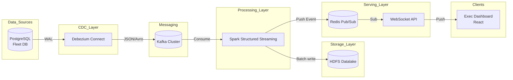

# 📘 100 CÂU HỎI PHỎNG VẤN SENIOR DE — PHẦN 5: KUBERNETES, CI/CD & SYSTEM DESIGN (Q81-Q100)

## Mở đầu
Phần 5 tập trung vào khả năng triển khai, vận hành hạ tầng (Kubernetes, Docker), quy trình CI/CD, thiết kế hệ thống tổng thể (System Design) và tư duy kiến trúc của một Senior Data Engineer. Context xoay quanh kiến trúc hệ thống giám sát đội xe (Fleet Maintenance Platform) chạy trên 3-node bare-metal cluster.

---

### Câu 81: Docker Fundamentals: Phân biệt Image và Container. Multi-stage builds và layer caching hoạt động như thế nào và tại sao lại quan trọng trong Data Engineering?

**Trả lời chuẩn Senior:**
- **Image vs Container:**
  - **Image** là một khuôn mẫu tĩnh, read-only, chứa mã nguồn, thư viện, dependencies và biến môi trường cần thiết để chạy một ứng dụng.
  - **Container** là một instance đang chạy của một Image. Container thêm một lớp read-write (container layer) lên trên các lớp read-only của image.
- **Layer Caching:**
  - Mỗi chỉ thị trong Dockerfile (như `RUN`, `COPY`) tạo ra một layer mới. Docker cache các layer này. Nếu một layer không đổi, Docker sẽ dùng lại cache, giúp build nhanh hơn.
  - *Best Practice:* Sắp xếp các lệnh từ ít thay đổi nhất (như cài đặt OS, dependencies) đến thay đổi nhiều nhất (mã nguồn ứng dụng) để tối ưu caching.
- **Multi-stage builds:**
  - Cho phép sử dụng nhiều khối `FROM` trong một Dockerfile. Mỗi `FROM` bắt đầu một stage mới.
  - Ta có thể copy các artifact đã build từ stage trước sang stage sau, bỏ lại tất cả các công cụ build nặng nề (như gcc, maven) ở stage trước.
  - *Quan trọng trong DE:* Data applications thường cần build phức tạp (ví dụ biên dịch UDFs cho Spark bằng Scala/Java, compile C libraries cho Python). Multi-stage build giúp giảm dung lượng image từ vài GB xuống còn vài trăm MB, giảm tải cho registry và tăng tốc độ pull image khi scale pod trên Kubernetes.

```dockerfile
# Stage 1: Build stage
FROM maven:3.8-openjdk-11 AS builder
WORKDIR /app
COPY pom.xml .
COPY src ./src
RUN mvn clean package -DskipTests

# Stage 2: Run stage
FROM openjdk:11-jre-slim
WORKDIR /app
COPY --from=builder /app/target/spark-job.jar ./spark-job.jar
CMD ["java", "-jar", "spark-job.jar"]
```

---

### Câu 82: Trong phát triển local, bạn sử dụng Docker Compose như thế nào? Cấu hình networking, volumes và `depends_on` hoạt động ra sao?

**Trả lời chuẩn Senior:**
Docker Compose là công cụ đắc lực để dựng toàn bộ data pipeline (PostgreSQL, Kafka, Spark, Redis) ở local environment.

- **Networking:** Compose mặc định tạo ra một custom bridge network cho ứng dụng. Các container có thể giao tiếp với nhau thông qua tên service (DNS resolution nội bộ).
- **Volumes:** Dùng để persist data. Chẳng hạn, ánh xạ thư mục local vào container PostgreSQL (`./pgdata:/var/lib/postgresql/data`) để dữ liệu không bị mất khi container restart.
- **`depends_on`:** Định nghĩa thứ tự khởi động. Chẳng hạn Kafka phải đợi Zookeeper/KRaft, Spark Streaming phải đợi Kafka. Tuy nhiên, `depends_on` mặc định chỉ đợi container kia *start*, không đợi nó *ready*. Để đợi ready, phải kết hợp với `condition: service_healthy`.

```yaml
services:
  kafka:
    image: confluentinc/cp-kafka:7.3.0
    ports:
      - "9092:9092"
    healthcheck:
      test: ["CMD", "nc", "-z", "localhost", "9092"]
      interval: 10s
      timeout: 5s
      retries: 5

  spark-worker:
    image: my-spark-worker:latest
    depends_on:
      kafka:
        condition: service_healthy
```

---

### Câu 83: Trình bày kiến trúc của Kubernetes. Các thành phần như API Server, etcd, Scheduler, Kubelet, Kube-proxy có vai trò gì trong cụm 3-node bare-metal của chúng ta?

**Trả lời chuẩn Senior:**
Trong cụm 3-node (1 Master, 2 Workers/Slaves), kiến trúc K8s chia làm Control Plane (trên Master) và Data Plane (trên Workers).

- **Control Plane (Node Master):**
  - **kube-apiserver:** Cổng giao tiếp duy nhất (brain của cluster). Nhận mọi lệnh từ `kubectl` hoặc các component khác.
  - **etcd:** Key-value store phân tán, lưu trữ toàn bộ trạng thái (state) và cấu hình của cluster. Nếu etcd sập, cluster mất não.
  - **kube-scheduler:** Quyết định Pod nào sẽ chạy trên Node nào dựa trên resource requests/limits, affinity/anti-affinity rules.
  - **kube-controller-manager:** Theo dõi trạng thái cluster qua API Server và cố gắng điều chỉnh trạng thái hiện tại về trạng thái mong muốn (vd: NodeController, ReplicaSetController).
- **Data Plane (Worker Nodes):**
  - **kubelet:** Agent chạy trên mỗi node, nhận lệnh từ API Server và đảm bảo các container đang chạy đúng theo đặc tả của Pod.
  - **kube-proxy:** Xử lý network routing, duy duy trì các rule iptables/IPVS để traffic định tuyến chính xác đến các Pod của Service.
  - **Container Runtime:** Engine thực sự chạy container (containerd, CRI-O).

---

### Câu 84: Phân biệt các resource cốt lõi trong Kubernetes: Pod, Deployment, Service, ConfigMap, Secret. Ứng dụng cụ thể trong Data Pipeline?

**Trả lời chuẩn Senior:**
- **Pod:** Đơn vị thực thi nhỏ nhất, chứa một hoặc nhiều container chia sẻ chung network và storage. *Ứng dụng:* 1 Pod chạy Spark Driver, 1 Pod chạy Spark Executor.
- **Deployment:** Quản lý ReplicaSet và Pods, cung cấp khả năng declarative updates, rolling updates và self-healing. *Ứng dụng:* Deploy các stateless services như WebSocket API cho dashboard.
- **Service:** Tạo một static IP/DNS entry tĩnh để load balance traffic tới các Pod đang chạy. *Ứng dụng:* Tạo một `ClusterIP` Service cho Redis để Spark có thể đẩy dữ liệu vào mà không cần quan tâm IP thực của Redis Pod.
- **ConfigMap:** Tách cấu hình ứng dụng (không nhạy cảm) ra khỏi image. *Ứng dụng:* Lưu `log4j.properties` cho Spark hoặc `redis.conf`.
- **Secret:** Lưu trữ thông tin nhạy cảm đã được encode base64. *Ứng dụng:* Lưu password kết nối PostgreSQL, Kafka SASL credentials.

---

### Câu 85: Phân biệt Requests và Limits trong Kubernetes (CPU/Memory). Điều gì xảy ra khi Pod vượt quá các ngưỡng này?

**Trả lời chuẩn Senior:**
Requests và Limits dùng để cấp phát tài nguyên trên node, đặc biệt quan trọng với các ứng dụng ngốn tài nguyên như Spark.

- **Requests:** Lượng tài nguyên *tối thiểu* mà node phải đảm bảo cho Pod. Scheduler dùng request để quyết định xếp Pod vào node nào.
- **Limits:** Lượng tài nguyên *tối đa* mà Pod được phép sử dụng.
- **Điều gì xảy ra khi vượt quá?**
  - **CPU (Compressible resource):** Khi vượt quá CPU Limit, container sẽ bị *throttled* (bóp băng thông CPU), chạy chậm lại nhưng KHÔNG bị kill.
  - **Memory (Incompressible resource):** Khi vượt quá Memory Limit, container sẽ bị OS gửi tín hiệu OOM (Out Of Memory) và tiến trình bị kill (OOMKilled status trong K8s).

*Senior Tip cho Spark:* Luôn set Memory Limit lớn hơn tổng của `spark.executor.memory` + `spark.executor.memoryOverhead` để tránh executor bị OOMKilled bất thình lình.

---

### Câu 86: Với các stateful workloads như PostgreSQL, Kafka, HDFS trên Kubernetes, làm sao để quản lý storage bằng PV và PVC? Tại sao không dùng Deployment?

**Trả lời chuẩn Senior:**
- **StatefulSet vs Deployment:** Với data apps cần giữ state, network identity ổn định (như Kafka broker-0, broker-1) và thứ tự khởi tạo/xóa nghiêm ngặt, ta phải dùng **StatefulSet**, không dùng Deployment (các pod của deployment vô danh và stateless).
- **PersistentVolume (PV):** Là một phân vùng lưu trữ vật lý trong cụm được quản trị viên cấp phát (ví dụ NFS, local hostPath, SAN).
- **PersistentVolumeClaim (PVC):** Là yêu cầu sử dụng storage từ phía người dùng/Pod. K8s sẽ bind PVC vào một PV phù hợp.

Trên cụm bare-metal, để tối ưu I/O cho Kafka và PostgreSQL, tôi ưu tiên sử dụng `Local Persistent Volumes` kết hợp với StorageClass. Khi StatefulSet scale lên, nó dùng `volumeClaimTemplates` để tự động cấp phát PVC riêng biệt cho từng Pod (vd: mỗi Kafka broker có ổ cứng riêng).

---

### Câu 87: Phân biệt Liveness Probe, Readiness Probe và Startup Probe trong K8s. Tại sao phải cấu hình cẩn thận cho Data apps?

**Trả lời chuẩn Senior:**
Các probes kiểm tra sức khỏe của ứng dụng:
1. **Liveness Probe:** "Tôi còn sống không?". Nếu fail, kubelet sẽ restart container. *Sai lầm phổ biến:* Set timeout liveness probe quá ngắn trên Spark Executor lúc nó đang GC pause, khiến executor bị restart oan.
2. **Readiness Probe:** "Tôi đã sẵn sàng nhận traffic chưa?". Nếu fail, endpoint của Pod bị loại khỏi Service (không nhận traffic) nhưng KHÔNG bị kill. *Ứng dụng:* API Gateway kiểm tra xem nó đã kết nối được Redis chưa trước khi phục vụ request từ client.
3. **Startup Probe:** Dùng cho các ứng dụng khởi động rất chậm (như Kafka cần recover segments lớn, HDFS NameNode). K8s sẽ tắt Liveness/Readiness cho đến khi Startup Probe pass. Nếu không có startup probe, liveness probe có thể giết chết app trước khi nó kịp khởi động xong.

---

### Câu 88: Bạn thiết kế CI/CD pipeline cho nền tảng này như thế nào? Mô tả các pipeline stages.

**Trả lời chuẩn Senior:**
Sử dụng GitOps với GitLab CI/CD và ArgoCD.

- **CI Pipeline (GitLab CI):**
  1. `Linting & Test`: Chạy `pylint`, `black`, Unit Tests cho PySpark code và UDFs.
  2. `Build`: Đóng gói Docker image cho các services (Spark jobs, WebSocket app, Airflow DAGs).
  3. `Scan`: Dùng Trivy để scan security vulnerabilities trong image.
  4. `Push`: Đẩy image lên private Container Registry (Harbor/GitLab Registry) kèm tag theo Git SHA.
- **CD Pipeline (ArgoCD - Pull based):**
  - Không push thẳng vào cluster. Thay vào đó, CI commit YAML changes (với image tag mới) vào một repo `fleet-infra-k8s`.
  - ArgoCD chạy trong cluster, liên tục theo dõi repo này. Khi thấy lệch state, ArgoCD tự động pull cấu hình mới và apply (sync) vào Kubernetes (Update Deployment, StatefulSet).

---

### Câu 89: Trình bày chiến lược Git Branching phù hợp cho Data Engineering team? Trunk-based vs GitFlow?

**Trả lời chuẩn Senior:**
Với DE (đặc biệt khi kết hợp dbt/Spark code và infrastructure configs), tôi ưu tiên **Trunk-based Development** thay vì GitFlow cồng kềnh.

- **Tại sao?** Data models và pipelines thay đổi liên tục, merge conflict ở SQL/Spark code nếu để lâu (như GitFlow) cực kỳ tốn công xử lý.
- **Quy trình:**
  - Mọi người checkout short-lived feature branches từ `main`.
  - Push code liên tục, mở Merge Request (MR).
  - CI chạy tự động kiểm thử.
  - Review và merge nhanh vào `main` trong vòng 1-2 ngày.
  - Release từ `main` qua hệ thống tag.
- Sử dụng Feature Flags hoặc "table view swapping" để ẩn các data model chưa hoàn thiện trên production thay vì giữ code lâu trên nhánh riêng.

---

### Câu 90: Trong cụm bare-metal, bạn dùng Infrastructure as Code (IaC) như Terraform và Ansible ra sao?

**Trả lời chuẩn Senior:**
Trên môi trường Cloud (AWS/GCP), Terraform quản lý toàn bộ. Nhưng trên bare-metal, cách tiếp cận phải kết hợp:

- **Terraform:** Dùng để provision VM từ Hypervisor (như Proxmox, VMware) nếu bare-metal chạy ảo hóa, hoặc cấu hình Firewall, DNS (Cloudflare), cấu hình mạng.
- **Ansible:** Đây là công cụ chủ lực cho bare-metal.
  1. `OS Provisioning`: Cập nhật kernel, disable swap (bắt buộc cho K8s), cấu hình sysctl (network tuning cho Kafka).
  2. `Kubernetes Setup`: Dùng Ansible playbook (hoặc Kubespray) để tự động cài đặt containerd, kubelet, cấu hình Master node (kubeadm init) và join Worker nodes (kubeadm join).
  3. Cài đặt các storage drivers (như Rook-Ceph hoặc Local Path Provisioner).

---

### Câu 91: System Design: Trình bày kiến trúc tổng thể từ đầu đến cuối của hệ thống Fleet Platform.

**Trả lời chuẩn Senior:**



1. **Source:** PostgreSQL (hệ thống Odoo) ghi dữ liệu.
2. **CDC:** Debezium đọc WAL, stream thay đổi thành các event.
3. **Buffer:** Kafka nhận event, đảm bảo durability và decouple producer/consumer.
4. **Stream Processing:** Spark Streaming đọc từ Kafka, thực hiện stateful processing (join, aggregate metric theo phút/giờ).
5. **Sink 1 (Cold/Warm):** Dữ liệu raw và aggregated được ghi xuống HDFS (định dạng Parquet/Delta) để batch training hoặc BI reporting sau này.
6. **Sink 2 (Hot/Real-time):** Spark bắn cảnh báo/metrics vừa tính toán vào Redis Pub/Sub.
7. **Serving:** WebSocket Server (NodeJS/Go) subscribe Redis channel, ngay lập tức push dữ liệu lên màn hình ReactJS của Giám đốc.

---

### Câu 92: Tại sao phải có Kafka chen giữa Debezium và Spark? Sao không cho Spark đọc trực tiếp từ DB hoặc Debezium đẩy thẳng vào Redis?

**Trả lời chuẩn Senior:**
Đây là nguyên tắc **Backpressure Isolation** và **Decoupling**.
1. **Bảo vệ Database:** Nếu Spark đọc trực tiếp từ DB (polling), khi scale ra nhiều job, nó sẽ gây quá tải DB (lock contention, I/O spike).
2. **Backpressure & Fault Tolerance:** Debezium chỉ đẩy data đi, nếu đẩy thẳng vào Redis hoặc Spark mà hệ thống sau bị chậm, Debezium sẽ bị tràn bộ nhớ hoặc phải drop data. Kafka đóng vai trò là "Shock Absorber". Nếu Spark chết hoặc phải bảo trì 2 tiếng, dữ liệu vẫn an toàn trên Kafka. Khi Spark lên lại, nó đọc bù theo offset.
3. **Multi-consumers:** Cùng một sự kiện CDC (ví dụ: xe cập nhật trạng thái), Spark Streaming cần đọc để tính realtime, nhưng sau này có thêm một job Flink hoặc Airflow batch cũng muốn đọc luồng đó. Kafka pub/sub model cho phép N consumers độc lập đọc chung một topic.

---

### Câu 93: Tại sao luồng thời gian thực lại thiết kế Spark đẩy vào Redis Pub/Sub, mà không dùng Airflow để trigger đẩy dữ liệu?

**Trả lời chuẩn Senior:**
Đây là vấn đề về **Separation of Concerns** (Tách biệt trách nhiệm) và đặc tả độ trễ.
- **Airflow là một Batch Orchestrator,** không phải stream processor. Nó chạy dựa trên scheduling (ví dụ cron 5 phút một lần), và overhead sinh ra từ scheduler là vài giây đến vài chục giây. Nó hoàn toàn không phù hợp cho millisecond-latency streaming.
- **Spark Structured Streaming** đang chạy continuous/micro-batch processing. Nó đã nắm giữ trạng thái (state) và dữ liệu mới nhất. Việc Spark trực tiếp connect tới Redis qua sink custom để push data là con đường ngắn nhất, ít điểm chết nhất. Airflow chỉ nên dùng để điều phối luồng dữ liệu dọn dẹp hoặc batch reports chạy hàng đêm xuống HDFS.

---

### Câu 94: Giám đốc (CTO) nói "Kiến trúc này nhiều components quá: Debezium, Kafka, Spark, Redis, HDFS. Tại sao không dùng mỗi Postgres và chạy cron script Python cho rẻ?". Bạn bảo vệ kiến trúc này thế nào?

**Trả lời chuẩn Senior:**
Là một Senior, tôi đánh giá Trade-off giữa Chi phí hiện tại vs Khả năng mở rộng tương lai (Scalability & Maintainability).
- **Phản biện Cron Python + Postgres:**
  - Nếu chỉ có 100 xe, script Python `SELECT` từ Postgres mỗi 5 phút là đủ.
  - NHƯNG, khi có 10,000 xe (10,000 tọa độ/giây), câu lệnh `SELECT` liên tục sẽ kill hiệu năng OLTP của Postgres, làm sập hệ thống Odoo nội bộ.
  - Script Python không có cơ chế phục hồi (fault tolerance) chuẩn, chết ở đâu phải cày lại log ở đó. Không quản lý được state khi tính rolling window.
- **Bảo vệ kiến trúc:**
  - **Debezium + Kafka:** Đảm bảo Zero-impact đến hệ thống vận hành (Odoo). Dữ liệu được replciate real-time mà không làm chậm DB.
  - **Spark + HDFS:** Xử lý scale ngang (horizontal scaling). 1 node hay 100 node Spark code không đổi. Lưu trữ lâu dài trên HDFS phục vụ AI dự đoán hỏng hóc sau này.
  - Dù phức tạp lúc setup, nhưng với K8s, chi phí vận hành (Ops) sẽ giảm dần do tính năng tự phục hồi (self-healing).

---

### Câu 95: Nếu được làm lại dự án này trên cùng phần cứng, bạn sẽ thay đổi điều gì về mặt công nghệ? (Ví dụ: Delta Lake trên MinIO, SSE vs WebSocket)

**Trả lời chuẩn Senior:**
Tôi sẽ đề xuất 2 thay đổi lớn:
1. **Thay HDFS bằng MinIO (Object Storage) + Delta Lake / Iceberg:**
   - *Lý do:* HDFS rất tốn tài nguyên (NameNode ăn RAM lớn) và khó vận hành trên K8s. MinIO là S3-compatible, kiến trúc nhẹ, cloud-native, dễ deploy trên K8s bằng Helm. Kết hợp Delta Lake sẽ cho phép ACID transactions, schema evolution, time-travel ngay trên object storage.
2. **Thay WebSocket bằng Server-Sent Events (SSE) cho luồng Data Push:**
   - *Lý do:* Executive Dashboard chỉ cần nhận dữ liệu từ server (one-way, Push-based), hiếm khi gửi dữ liệu chiều ngược lại. WebSocket thiết lập kết nối 2 chiều (bi-directional) gây tốn tài nguyên server. SSE dùng giao thức HTTP chuẩn, tận dụng được caching, dễ dàng qua proxy/load balancer (Nginx) hơn WebSocket rất nhiều.

---

### Câu 96: Khi team ERP (Odoo) thêm hoặc xóa cột trong PostgreSQL, làm sao hệ thống của bạn (Schema Evolution) xử lý mượt mà mà không sập pipeline?

**Trả lời chuẩn Senior:**
Sự thay đổi schema luôn là ác mộng. Cách xử lý:
1. **Tại tầng Debezium/Kafka:** Cấu hình Debezium sử dụng **Apicurio Registry** hoặc **Confluent Schema Registry**. Dữ liệu được serialize dưới dạng Avro/Protobuf. Khi Odoo thêm cột, Schema Registry sẽ update version mới (Backward Compatibility). Debezium tiếp tục chạy bình thường.
2. **Tại tầng Spark:**
   - Nếu đọc Kafka lưu HDFS Parquet cũ: pipeline có thể fail nếu cột thay đổi data type.
   - *Best Practice:* Sử dụng **Delta Lake**. Cấu hình `.option("mergeSchema", "true")`. Khi DataFrame của Spark phát hiện cột mới, nó sẽ tự động update schema của bảng Delta bên dưới, các bản ghi cũ sẽ có giá trị NULL cho cột mới này. Zero downtime.

---

### Câu 97: Disaster Recovery Plan: Kịch bản Master Node của Kubernetes bị cháy nguồn, điều gì xảy ra với Data Pipeline? Cách khắc phục?

**Trả lời chuẩn Senior:**
- **Điều gì xảy ra ngay lập tức?**
  - Vì Data Plane (Worker nodes) vẫn chạy, các Pod Spark, Kafka, Redis *đang chạy* vẫn tiếp tục hoạt động. Data pipeline KHÔNG sập ngay.
  - Nhưng, Control Plane chết. Ta không thể dùng `kubectl`, không thể scale pod, nếu 1 pod sập nó sẽ không được scheduler cấp phát lại.
- **Khắc phục dài hạn (Kiến trúc HA):**
  - Cụm 3-node với 1 Master là Anti-Pattern cho Production. Kế hoạch DR đúng đắn là phải có **3 Master Nodes** tạo thành một etcd quorum (thuật toán Raft). Nếu 1 Master cháy, 2 Master còn lại vẫn đạt đa số (>50%), cluster tự động bầu leader mới và hoạt động bình thường, admin chỉ việc mua node mới cắm vào.

---

### Câu 98: Tối ưu chi phí (Cost optimization) trên Bare-metal: Dù không trả tiền Cloud theo giờ, làm sao bạn đảm bảo tài nguyên được dùng tối ưu nhất?

**Trả lời chuẩn Senior:**
Dù là bare-metal, tối ưu tài nguyên nghĩa là kéo dài thời gian phải mua thêm server mới.
1. **Metrics & Monitoring:**
   - Cài đặt Prometheus + cAdvisor để monitor CPU/Memory/Disk I/O của từng Pod.
2. **Right-sizing Resource Requests:**
   - Sử dụng **VPA (Vertical Pod Autoscaler)** ở chế độ *Recommendation*. Nó sẽ theo dõi Spark jobs chạy thực tế tốn bao nhiêu RAM, từ đó tôi tinh chỉnh lại Resource Requests/Limits trong YAML thay vì cấp bừa 8GB RAM cho mọi executor.
3. **Storage Tiering:**
   - Các dữ liệu nóng (Kafka log 7 ngày, Redis) đặt trên ổ NVMe. Dữ liệu lạnh (HDFS/MinIO archive) đặt trên ổ HDD dung lượng cao để tiết kiệm chi phí mua ổ cứng tốc độ cao.

---

### Câu 99: Team Collaboration: Bạn làm cách nào để Onboard một Data Engineer Junior mới vào dự án có nền tảng phức tạp này?

**Trả lời chuẩn Senior:**
Quy trình onboarding chuẩn:
1. **Day 1 (Architecture Overview):** Đưa cho họ bản vẽ System Design (như trên), giải thích luồng dữ liệu (Data Lineage) "What" và "Why", thay vì vội vàng đi vào "How".
2. **Day 2-3 (Local Dev Environment):** Cung cấp `docker-compose.yml`. Yêu cầu họ khởi động toàn bộ pipeline thu nhỏ ở local (Postgres -> Kafka -> Spark). Chạy thử 1 đoạn PySpark script giả lập luồng data.
3. **Week 2 (Tracer Bullet Tasks):** Giao một task cực nhỏ đi xuyên suốt hệ thống. Ví dụ: "Thêm 1 metric đếm số lần xe dừng đỗ vào dashboard". Họ sẽ phải sửa SQL, sửa Spark UDF, build Docker image, và deploy lên nhánh staging.
4. **Documentation:** Yêu cầu họ đọc Data Dictionary (định nghĩa schema) và ADRs (Architecture Decision Records). Bất kỳ chỗ nào họ thấy khó hiểu, yêu cầu họ update lại tài liệu để người sau dễ đọc hơn.

---

### Câu 100: Career Growth: Theo bạn, điều gì phân biệt một Senior Data Engineer và một Staff/Principal Data Engineer?

**Trả lời chuẩn Senior:**
Sự khác biệt không nằm ở số lượng code viết ra, mà nằm ở Tầm nhìn và Tác động (Impact/Scope).
- **Senior DE:**
  - Nhận một bài toán (có cấu trúc), tự biết cách chọn tool, thiết kế pipeline, tối ưu hóa (tuning Spark), và đưa vào production ổn định. Tập trung vào mảng kỹ thuật (Do things right).
- **Staff / Principal DE:**
  - Hoạt động ở mức liên phòng ban (Cross-functional). Thường xuyên hỏi "Why are we doing this?".
  - *Định hướng công nghệ:* Họ là người quyết định có nên đập bỏ HDFS để lên Delta Lake không, đánh giá rủi ro, dự toán ngân sách.
  - *Multiplier effect:* Họ nâng cao năng lực của toàn bộ team bằng cách định nghĩa best practices, tạo ra các internal frameworks (ví dụ: tạo 1 CI/CD template cho mọi dự án, viết custom Terraform provider) để các team khác làm việc nhanh hơn. Họ giải quyết những bài toán mà chưa ai định hình được (Do the right things).

---
*Hoàn thành Bộ 100 Câu hỏi Phỏng vấn Senior Data Engineer!*
