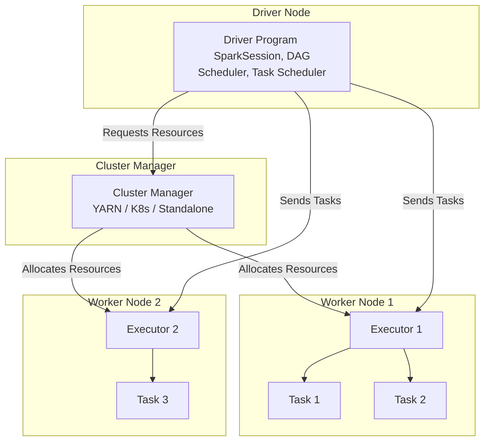
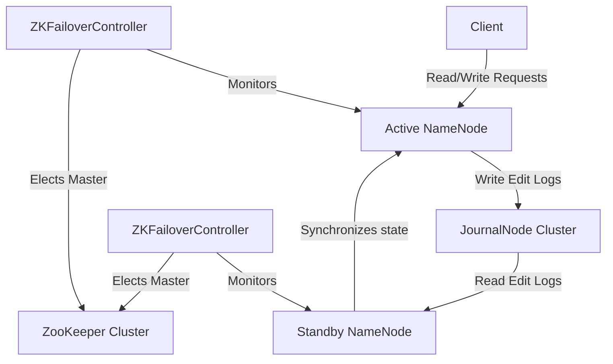

# CẨM NANG ÔN LUYỆN PHỎNG VẤN: APACHE SPARK & HADOOP

Tài liệu này tập trung vào kiến thức nền tảng, thiết kế hệ thống, các kỹ thuật tối ưu hóa hiệu năng thực tế, cài đặt Docker/Direct và cơ chế đảm bảo uptime 24/7 cho Apache Spark và Hadoop.

---

## PHẦN 1: KIẾN THỨC NỀN TẢNG APACHE SPARK

### 1. Kiến trúc Apache Spark (Spark Architecture)
Spark hoạt động theo mô hình **Master-Slave (Driver-Executor)**.



*   **Driver Program**: 
    *   Trái tim của ứng dụng Spark. Chứa hàm `main()` và khởi tạo `SparkSession`.
    *   Phân tích code, xây dựng **Logical Plan** và **Physical Plan**.
    *   Chuyển đổi thành đồ thị có hướng không chu trình (**DAG - Directed Acyclic Graph**).
    *   Chia DAG thành các **Stages** và các **Tasks**, sau đó phân phối các Tasks đến các Executor thông qua **Task Scheduler**.
    *   Thu thập kết quả từ các Executor (nếu gọi các Action như `collect()`).
*   **Cluster Manager**:
    *   Chịu trách nhiệm cấp phát tài nguyên cho ứng dụng.
    *   Hỗ trợ: **YARN** (phổ biến nhất trên Hadoop on-premise), **Kubernetes (K8s)** (xu hướng cloud-native), **Standalone** (Master-Worker tích hợp sẵn của Spark), **Mesos** (ít dùng).
*   **Executor**:
    *   Tiến trình chạy trên các Worker Nodes chịu trách nhiệm thực thi các Task được Driver gửi xuống.
    *   Lưu trữ dữ liệu trong bộ nhớ (In-memory caching) hoặc Disk thông qua **Block Manager**.
    *   Mỗi Executor chạy nhiều luồng (**Threads**) tương ứng với số **Cores** được cấp phát để xử lý song song các Task.

---

### 2. RDD vs DataFrame vs Dataset
| Tiêu chí | RDD (Resilient Distributed Dataset) | DataFrame | Dataset |
| :--- | :--- | :--- | :--- |
| **Kiểu dữ liệu** | Không có Schema rõ ràng (chỉ là tập hợp các đối tượng Java/Python). | Có Schema rõ ràng dưới dạng các dòng (Rows) có tên cột. | Định kiểu mạnh (Strongly-typed), kết hợp lợi ích của RDD và DataFrame. |
| **Ngôn ngữ hỗ trợ** | Java, Scala, Python, R. | Java, Scala, Python, R. | Chỉ hỗ trợ Scala và Java (Python không có compile-time type-safety). |
| **Tối ưu hóa** | Thủ công. Spark không hiểu cấu trúc bên trong dữ liệu của bạn để tối ưu hóa. | Rất mạnh nhờ **Catalyst Optimizer** và **Tungsten Engine**. | Tương tự DataFrame, tối ưu hóa qua Catalyst và Tungsten. |
| **Hiệu năng với Python** | **Kém** (PySpark RDD yêu cầu serialize/deserialize dữ liệu qua socket giữa JVM và Python Process). | **Tốt** (PySpark DataFrame ánh xạ trực tiếp sang JVM, không bị overhead của Python). | Không áp dụng cho Python. |

> **[!IMPORTANT]  
> Quy tắc thực tế (Rule of Thumb):** Always sử dụng **DataFrame / Spark SQL** cho các tác vụ ETL thông thường. Chỉ dùng RDD khi bạn cần kiểm soát dữ liệu ở mức cực kỳ thấp (low-level API), làm việc với các định dạng dữ liệu phi cấu trúc không thể biểu diễn dưới dạng bảng, hoặc viết các thuật toán phân tán tự chế.

---

### 3. Spark Execution Model: Jobs, Stages, Tasks và DAG
*   **DAG (Directed Acyclic Graph)**: Đồ thị thể hiện các bước biến đổi dữ liệu (Transformations) từ nguồn đến đích. Spark tối ưu hóa DAG này trước khi chạy.
*   **Job**: Được kích hoạt bất cứ khi nào ứng dụng Spark gọi một **Action** (ví dụ: `count()`, `write()`, `collect()`). Một ứng dụng Spark có thể có nhiều Jobs.
*   **Stage**: Mỗi Job được chia thành các Stages. Ranh giới giữa các Stages được xác định bởi **Wide Transformations** (các phép biến đổi yêu cầu Shuffle dữ liệu qua mạng như `groupBy()`, `join()`).
    *   **Stage chạy song song**: Các Stage không phụ thuộc nhau có thể chạy song song.
    *   **Stage tuần tự**: Stage sau phải đợi Stage trước hoàn thành nếu có phụ thuộc Shuffle (Wide Dependency).
*   **Task**: Đơn vị thực thi nhỏ nhất trong Spark. Một Task được áp dụng trên một phân vùng dữ liệu (**Partition**) đơn lẻ. Driver sẽ gửi các Task này đến các Executor để thực thi song song. Số lượng Tasks trong một Stage bằng số lượng Partitions của Stage đó.

```
[Spark Application]
   └── [Job 1 (Triggered by Action)]
          ├── [Stage 1 (Narrow Transformations - no Shuffle)]
          │      ├── Task 1 (on Partition 1)
          │      └── Task 2 (on Partition 2)
          └── [Stage 2 (Wide Transformation - after Shuffle)]
                 ├── Task 3 (on Partition 3)
                 └── Task 4 (on Partition 4)
```

---

### 4. Lazy Evaluation và Transformations vs Actions
*   **Lazy Evaluation**: Spark không thực thi các biến đổi dữ liệu ngay lập tức khi chúng được định nghĩa. Nó chỉ ghi lại các bước biến đổi này vào DAG. Việc tính toán thực sự chỉ bắt đầu khi một **Action** được gọi. Điều này giúp Catalyst Optimizer có thể tối ưu hóa toàn bộ pipeline (ví dụ: gộp các bộ lọc `filter()` lại, loại bỏ các cột không dùng đến trước khi đọc dữ liệu).
*   **Transformations**: Biến đổi một DataFrame thành một DataFrame khác.
    *   **Narrow Transformations**: Các phép biến đổi mà dữ liệu của một partition đầu ra chỉ phụ thuộc vào một partition đầu vào duy nhất. Không yêu cầu trao đổi dữ liệu qua mạng (No Shuffle). Ví dụ: `map()`, `filter()`, `flatMap()`, `union()`.
    *   **Wide Transformations**: Các phép biến đổi mà dữ liệu của một partition đầu ra phụ thuộc vào nhiều partition đầu vào khác nhau. Đòi hỏi di chuyển dữ liệu qua mạng giữa các executor (Shuffle). Ví dụ: `groupBy()`, `join()`, `distinct()`, `repartition()`.
*   **Actions**: Các câu lệnh kích hoạt việc tính toán DAG và trả kết quả về Driver hoặc ghi xuống bộ nhớ ngoài. Ví dụ: `collect()`, `show()`, `count()`, `write()`, `take()`.

---

### 5. Shuffle Operations và Cách giảm thiểu Shuffle
**Shuffle** là quá trình phân phối lại dữ liệu trên toàn cluster để các phân vùng dữ liệu có cùng khóa (keys) nằm trên cùng một executor. Đây là tác vụ **tốn kém nhất** trong Spark vì nó liên quan đến:
*   Ghi dữ liệu tạm thời ra Disk (Disk I/O).
*   Truyền dữ liệu qua mạng (Network I/O).
*   Serialize và Deserialize dữ liệu.

**Cách giảm thiểu Shuffle trong thực tế:**
1.  **Sử dụng Broadcast Join**: Thay thế Join thông thường bằng Broadcast Hash Join khi một trong hai bảng nhỏ (dưới 10MB mặc định, có thể cấu hình lên đến vài GB tùy bộ nhớ). Spark sẽ copy toàn bộ bảng nhỏ sang tất cả các Executor, loại bỏ hoàn toàn bước Shuffle bảng lớn.
2.  **Filter sớm**: Áp dụng `filter()` và loại bỏ cột (`select()`) càng sớm càng tốt để giảm khối lượng dữ liệu tham gia vào quá trình Shuffle.
3.  **Thay thế `repartition()` bằng `coalesce()`**: Khi giảm số lượng phân vùng (Partitions), `coalesce()` không yêu cầu Shuffle toàn bộ dữ liệu như `repartition()`, nó chỉ gộp các partition gần nhau lại.
4.  **Tránh các toán tử tạo Shuffle không cần thiết**: Ví dụ dùng `reduceByKey` thay vì `groupByKey` trong RDD API vì `reduceByKey` thực hiện pre-aggregation (gộp cục bộ trước khi shuffle) trên từng executor, làm giảm đáng kể lượng dữ liệu truyền qua mạng.

---

### 6. Mô hình quản lý bộ nhớ Spark (Spark Memory Model)
Spark quản lý bộ nhớ của Executor (`spark.executor.memory`) theo kiến trúc **Unified Memory Manager** phân chia như sau:

```
+-------------------------------------------------------------------------+
|                          Executor Memory                                |
+----------------------------------------------------+--------------------+
|               Spark Memory (60%)                   | User Memory (40%)  |
+-------------------------+--------------------------+--------------------+
|  Storage Memory (50%)   |  Execution Memory (50%)  | Metadata, UDFs,    |
|  (Cached Data, Broadcast|  (Joins, Shuffles,       | RDD overhead, etc. |
|   variables)            |   Aggregations)          |                    |
+-------------------------+--------------------------+--------------------+
|              Dynamic Occupancy Loop                |
+----------------------------------------------------+
```

*   **Spark Memory**: Dành cho tính toán và lưu trữ cache dữ liệu. Được cấu hình bởi tỷ lệ `spark.memory.fraction` (mặc định 0.6 hay 60% tổng bộ nhớ JVM).
    *   **Execution Memory**: Dùng cho các phép toán như Joins, Shuffles, Aggregations.
    *   **Storage Memory**: Dùng để lưu trữ dữ liệu cache (`.cache()`, `.persist()`) và các biến Broadcast.
    *   **Cơ chế chiếm dụng động (Dynamic Occupancy)**:
        *   Nếu không có dữ liệu cache, Execution Memory có thể chiếm dụng toàn bộ Storage Memory.
        *   Nếu Storage Memory bị Execution Memory chiếm dụng, và sau đó cần lưu cache, Spark sẽ ghi đè hoặc đẩy bớt cache ra Disk.
        *   Nhưng nếu Storage Memory đang chiếm dụng bộ nhớ của Execution Memory và Execution Memory cần bộ nhớ để tính toán, Spark sẽ **thu hồi lại ngay lập tức**, đẩy cache ra Disk hoặc giải phóng nó để ưu tiên cho Execution Memory (vì Execution Memory không thể bị tràn mà không làm nghẹt hệ thống).
*   **User Memory**: Bộ nhớ dành cho các cấu trúc dữ liệu người dùng tự định nghĩa, metadata của Spark, các hàm Python UDF, v.v. Chiếm phần còn lại (mặc định 40%).
*   **Off-Heap Memory**: Nằm ngoài JVM, được quản lý bởi Project Tungsten để tránh overhead của JVM Garbage Collection (`spark.memory.offHeap.enabled`).

---

### 7. Chiến lược Phân vùng (Partitioning Strategies)
Phân vùng xác định cách dữ liệu được chia nhỏ để chạy song song trên các executor.
*   **Hash Partitioning**: Mặc định cho Spark SQL/DataFrames khi thực hiện shuffle. Spark sử dụng thuật toán Hash Key (`Java Object.hashCode() % numPartitions`) để phân phối dữ liệu.
*   **Range Partitioning**: Phân chia dữ liệu dựa trên các khoảng giá trị của khóa (ví dụ: ID từ 1-10000 vào partition 1, 10001-20000 vào partition 2). Thường dùng khi dữ liệu cần được sắp xếp (`sort()`, `orderBy()`).
*   **Custom Partitioning**: Cho phép tự định nghĩa hàm phân vùng (chỉ áp dụng được trên RDD API).

---

### 8. Catalyst Optimizer và Tungsten Engine
*   **Catalyst Optimizer**: Công cụ tối ưu hóa truy vấn Spark SQL. Nó tự động chuyển đổi code của bạn qua 4 giai đoạn:
    1.  **Analysis**: Kiểm tra tính hợp lệ của schema, tên bảng, tên cột dựa trên *Catalog*. Tạo ra *Analyzed Logical Plan*.
    2.  **Logical Optimization**: Áp dụng các quy tắc tối ưu hóa toán học/logic như *Constant Folding* (tính toán trước các giá trị hằng số), *Predicate Pushdown* (đẩy bộ lọc filter xuống sát nguồn dữ liệu để giảm đọc đĩa), *Column Pruning* (chỉ đọc các cột cần thiết). Tạo ra *Optimized Logical Plan*.
    3.  **Physical Planning**: Tạo ra nhiều *Physical Plans* khả thi và đánh giá chi phí (Cost-Based Model - CBO) để chọn ra plan tốt nhất (ví dụ: quyết định dùng Broadcast Join hay SortMerge Join).
    4.  **Code Generation**: Tạo ra Java bytecode chạy trực tiếp trên JVM bằng kỹ thuật Quasiquotes.
*   **Tungsten Execution Engine**: Tập trung vào việc tối ưu hóa phần cứng ở mức thấp (bare-metal performance):
    *   **Off-Heap Memory Management**: Tự quản lý bộ nhớ dạng byte array thay vì các đối tượng Java để loại bỏ overhead của Garbage Collection (GC) và giảm dung lượng lưu trữ trong bộ nhớ.
    *   **Whole-Stage Code Generation**: Gộp nhiều toán tử trong DAG thành một hàm Java duy nhất chạy trong một vòng lặp (loop), tránh việc truyền dữ liệu qua lại giữa các iterator và tăng tận dụng thanh ghi CPU (L1/L2/L3 Cache).

---

## PHẦN 2: KỸ THUẬT TỐI ƯU HÓA HIỆU NĂNG SPARK (SPARK PERFORMANCE TUNING)

### 1. Xử lý lệch dữ liệu (Data Skew)
Data Skew là hiện tượng một vài phân vùng dữ liệu (Partitions) có dung lượng hoặc số dòng lớn hơn rất nhiều so với các phân vùng còn lại. Executor nhận các partition lệch này sẽ chạy lâu hơn (straggler task), khiến toàn bộ Spark Job bị nghẽn (vì tốc độ job bị giới hạn bởi task chậm nhất).

```
[Normal Partitions] ─── Tasks take 2 seconds each ─── [Done]
[Skewed Partition ] ─── Task takes 2 hours       ───────────────────────────> [Nghẽn]
```

**Các giải pháp xử lý Data Skew:**
*   **Salting (Thêm muối)**:
    1.  Thêm một cột phụ chứa giá trị ngẫu nhiên (ví dụ từ 1 đến N) vào khóa Join/GroupBy của bảng bị lệch.
    2.  Nhân bản (Replicate) các dòng của bảng còn lại tương ứng N lần với các giá trị từ 1 đến N.
    3.  Thực hiện Join/GroupBy trên khóa mới (Original Key + Salt Key). Cách này phân tán dữ liệu bị lệch ra thành N phân vùng khác nhau.
*   **Broadcast Join**: Nếu join bảng bị lệch (lớn) với một bảng nhỏ, hãy tăng cấu hình để kích hoạt Broadcast Join. Khi đó bảng nhỏ được gửi đến tất cả các Executor và bảng lớn không bị shuffle (không bị phân bổ lại theo khóa dẫn đến lệch dữ liệu).
*   **Adaptive Query Execution (AQE) - Skew Join Optimization**: Từ Spark 3.0, bật `spark.sql.adaptive.skewJoin.enabled=true`. Spark sẽ tự động phát hiện các partition bị lệch trong lúc chạy và chia nhỏ chúng thành các partition con, sau đó join song song với phân vùng tương ứng của bảng kia.

---

### 2. Căn chỉnh phân vùng (Partition Tuning)
*   **Số lượng partition mặc định cho Shuffle**: `spark.sql.shuffle.partitions` mặc định là `200`.
    *   Nếu dữ liệu của bạn nhỏ (ví dụ: vài trăm MB), 200 partition là quá nhiều → tạo ra nhiều task nhỏ cực kỳ lãng phí thời gian quản lý (Task scheduling overhead). Hãy giảm xuống còn `10` hoặc `20`.
    *   Nếu dữ liệu lớn (ví dụ: hàng trăm GB hoặc TB), 200 partition là quá ít → mỗi partition sẽ nặng vài GB, gây tràn bộ nhớ (Out of Memory - OOM). Hãy tăng lên `1000`, `2000` hoặc nhiều hơn. Quy tắc chung: Mỗi partition sau shuffle nên nặng từ **100MB đến 200MB**.
*   **Coalesce vs Repartition**:
    *   `repartition(N)`: Tăng hoặc giảm số lượng partition. Yêu cầu **Full Shuffle** dữ liệu. Luôn tạo ra các partition có kích thước đồng đều nhau.
    *   `coalesce(N)`: Chỉ dùng để **giảm** số lượng partition. Nó gộp các partition trên cùng một Executor hoặc các executor gần nhau mà **không gây Shuffle** (Narrow dependency). Tuy nhiên, có thể gây lệch dữ liệu (skew) nếu gộp không đều.

---

### 3. Các chiến lược Join trong Spark
Spark tự động chọn chiến lược Join tối ưu nhất thông qua Catalyst Optimizer, nhưng bạn cần hiểu rõ để can thiệp khi cần thiết:

1.  **Broadcast Hash Join (BHJ)**:
    *   *Điều kiện*: Một trong hai bảng nhỏ hơn `spark.sql.autoBroadcastJoinThreshold` (mặc định 10MB, có thể cấu hình tăng lên tối đa 8GB nhưng khuyến nghị dưới 2-3GB để tránh OOM Driver).
    *   *Cơ chế*: Copy bảng nhỏ tới tất cả các Executor. Không shuffle bảng lớn.
    *   *Hiệu năng*: Tốt nhất.
2.  **Sort Merge Join (SMJ)**:
    *   *Điều kiện*: Dành cho các bảng lớn join với nhau, khóa join có thể sort được.
    *   *Cơ chế*: Gồm 2 bước:
        1.  **Shuffle**: Cả hai bảng được shuffle theo khóa join sao cho các dòng cùng khóa về cùng partition.
        2.  **Sort & Merge**: Sắp xếp dữ liệu trong từng partition theo khóa rồi quét tuần tự để ghép cặp.
    *   *Hiệu năng*: Ổn định nhất cho dữ liệu cực lớn vì nó ghi dữ liệu tạm ra disk nếu thiếu RAM (không bị OOM như Hash Join).
3.  **Shuffle Hash Join (SHJ)**:
    *   *Điều kiện*: Dùng cho bảng lớn, nhưng cấu trúc dữ liệu không thích hợp để sort.
    *   *Cơ chế*: Shuffle dữ liệu dựa trên khóa. Build một Hash Table của partition nhỏ hơn trong bộ nhớ trên mỗi Executor rồi quét partition lớn hơn để join.
4.  **Broadcast Nested Loop Join (BNLJ)**:
    *   *Điều kiện*: Không có khóa join (ví dụ join dùng toán tử `>=`, `<` hoặc `non-equality join`).
    *   *Hiệu năng*: Rất tệ. Tránh tối đa trong production.

---

### 4. Caching & Cấu hình Persistence Levels
Khi một DataFrame được tái sử dụng nhiều lần trong các tác vụ ETL phía sau, hãy cache nó để tránh việc Spark phải tính toán lại toàn bộ DAG từ đầu.
*   `df.cache()`: Tương đương với gọi `.persist(StorageLevel.MEMORY_AND_DISK)`.
*   Các mức độ Persist phổ biến:
    *   `MEMORY_ONLY`: Chỉ lưu trên RAM dưới dạng các Object Java đã deserialize. Tốc độ truy xuất nhanh nhất nhưng tốn RAM nhất. Nếu thiếu RAM, các partition thừa sẽ bị tính toán lại khi cần.
    *   `MEMORY_AND_DISK`: Lưu trên RAM, phần thừa tự động ghi xuống đĩa cứng (Disk). Khuyên dùng vì tránh được tính toán lại mà không lo OOM.
    *   `MEMORY_ONLY_SER` / `MEMORY_AND_DISK_SER`: Lưu dưới dạng dữ liệu đã được tuần tự hóa (Serialized byte array). Tiết kiệm RAM hơn nhiều nhưng tốn CPU để deserialize khi đọc lại.
    *   `DISK_ONLY`: Chỉ lưu trên Disk.

> **[!TIP]  
> Mẹo Caching:** Nhớ giải phóng bộ nhớ bằng `df.unpersist()` sau khi kết thúc pipeline sử dụng dữ liệu cache để tránh chiếm tài nguyên của các job chạy sau.

---

### 5. Khử tuần tự hóa (Serialization): Kryo vs Java
Mặc định Spark sử dụng Java Serialization để truyền dữ liệu qua mạng hoặc ghi xuống đĩa. Tuy nhiên Java Serialization rất cồng kềnh và chậm.
*   **Kryo Serialization** nhanh hơn gấp 10 lần và tiết kiệm bộ nhớ hơn 2-5 lần so với Java.
*   *Cách bật Kryo*:
    ```python
    spark.conf.set("spark.serializer", "org.apache.spark.serializer.KryoSerializer")
    # Khuyến nghị đăng ký các class tự định nghĩa với Kryo để tối ưu hơn nữa
    spark.conf.set("spark.kryo.registrationRequired", "true")
    ```

---

### 6. Adaptive Query Execution (AQE)
Kể từ Spark 3.0, AQE được bật mặc định. Nó thay đổi kế hoạch thực thi (Physical Plan) dựa trên thông tin thực tế thu thập được trong quá trình chạy:
*   **Coalescing Post-Shuffle Partitions**: Tự động gộp các partition nhỏ sau bước Shuffle thành một partition lớn để tránh lãng phí task.
*   **Converting Sort-Merge Join to Broadcast Join**: Nếu sau khi filter dữ liệu ở stage trước, kích thước thực tế của một bảng giảm xuống dưới ngưỡng broadcast, AQE tự động chuyển Sort-Merge Join thành Broadcast Join ngay lúc runtime.
*   **Skew Join Optimization**: Tự xử lý data skew như đã giải thích ở trên.
*   *Cấu hình bật AQE*:
    ```python
    spark.conf.set("spark.sql.adaptive.enabled", "true")
    ```

---

### 7. Tối ưu hóa Spark Job xử lý 50 Terabytes (Câu hỏi phỏng vấn thực tế từ Grab)
**Đề bài:** Thiết kế tối ưu hóa một Spark Job xử lý 50TB dữ liệu, thực hiện chuyển đổi một cột có định dạng string `YYYY-MM-DD` sang 3 cột `day`, `month`, `year`.

**Phân tích & Phương án giải quyết:**
1.  **Định dạng dữ liệu đầu vào (Storage Format)**:
    *   50TB dữ liệu thô dạng CSV hay JSON là một thảm họa cho Spark. Ta phải lưu trữ dữ liệu dưới định dạng **Parquet** hoặc **ORC** có cơ chế **nén (Snappy/ZSTD)** và lưu trữ dạng cột (Columnar Storage).
    *   Nhờ cơ chế **Column Pruning**, Spark sẽ chỉ đọc đúng 1 cột ngày tháng này lên bộ nhớ để xử lý mà không cần load các cột khác của 50TB dữ liệu, làm giảm dung lượng dữ liệu cần đọc xuống chỉ còn vài chục GB.
2.  **Phép biến đổi (Transformation)**:
    *   Sử dụng các hàm có sẵn của Spark SQL (`year()`, `month()`, `dayofmonth()`) trực tiếp trên DataFrame API. Các hàm này được biên dịch trực tiếp thành Java Bytecode tối ưu bởi **Tungsten Engine** (Whole-Stage Code Generation).
    *   **TUYỆT ĐỐI KHÔNG** sử dụng Python UDF (`User Defined Function`) thông thường vì nó sẽ bắt buộc Spark phải khởi tạo các tiến trình Python (Python workers) trên Executor, tuần tự hóa dữ liệu từ JVM sang Python qua socket để xử lý rồi chuyển ngược lại JVM, gây nghẽn cổ chai CPU.
3.  **Phân vùng dữ liệu (Partitioning)**:
    *   Vì phép biến đổi này chỉ là chuyển đổi giá trị trên từng dòng (Narrow Transformation - không có GroupBy hay Join), nó **không tạo ra bất kỳ bước Shuffle nào**.
    *   Tuy nhiên, ta cần cấu hình kích thước partition đầu vào hợp lý. Sử dụng tính năng **Partition Pruning**. Nếu dữ liệu được phân chia thư mục (partitioned) trên đĩa theo cột ngày tháng năm (ví dụ: `year=2026/month=07/`), ta chỉ cần đọc các partition cần thiết thay vì scan toàn bộ 50TB.
4.  **Cấu hình Cluster Sizing & Memory**:
    *   Bật **AQE (Adaptive Query Execution)** để Spark tự xử lý các partition không đều.
    *   Bật **Kryo Serializer** để truyền nhận dữ liệu nhanh hơn nếu có ghi xuống đĩa tạm.
    *   Cấu hình Executor hợp lý: Tránh cấu hình 1 Executor quá to (ví dụ 16 cores, 64GB RAM) vì sẽ gặp vấn đề nghẽn Garbage Collection (GC). Cấu hình tối ưu thường là **5 Cores** mỗi Executor (`spark.executor.cores=5`) để tối đa hóa hiệu năng HDFS I/O song song, và tính toán số lượng executor tương ứng dựa trên tổng tài nguyên cluster.

---

## PHẦN 3: SPARK WITH PYTHON (PYSPARK)

### 1. PySpark vs Scala Spark
Khi viết code Spark bằng Scala, code được biên dịch trực tiếp thành bytecode chạy trên JVM của Executor.
Khi viết bằng Python (PySpark):
*   **Với DataFrame API**: Hiệu năng **tương đương Scala** vì PySpark DataFrame chỉ là một lớp bọc (wrapper) bằng Python gửi các lệnh gọi logical plan sang JVM ở phía dưới qua thư viện `Py4J`. Việc thực thi thực tế vẫn diễn ra hoàn toàn trên JVM.
*   **Với RDD API & UDFs**: PySpark cực kỳ chậm. Dữ liệu phải serialize từ JVM sang Python Process để Python xử lý, sau đó deserialize ngược lại JVM.

---

### 2. Python UDF vs Pandas UDF (Vectorized UDF)
Nếu bắt buộc phải viết hàm tự chế (UDF) trong Python, hãy sử dụng **Pandas UDF** (yêu cầu cài đặt thư viện `pyarrow`).
*   **Pandas UDF** sử dụng **Apache Arrow** để truyền trực tiếp dữ liệu dạng cột (Vectorized batches) từ JVM sang Python mà không cần serialize/deserialize từng dòng (row-by-row), sau đó dùng thư viện Pandas (viết bằng C) để tính toán cực nhanh.

**Code ví dụ so sánh:**

```python
from pyspark.sql.functions import udf, pandas_udf
from pyspark.sql.types import IntegerType
import pandas as pd

# 1. KHÔNG NÊN DÙNG: Python UDF thông thường (Row-by-row)
@udf(returnType=IntegerType())
def normal_udf(x):
    if x is None:
        return 0
    return x * 2

# 2. NÊN DÙNG: Pandas UDF (Vectorized)
@pandas_udf(IntegerType())
def pandas_vectorized_udf(s: pd.Series) -> pd.Series:
    return s * 2

# Sử dụng trong Spark
df = df.withColumn("double_val", pandas_vectorized_udf(df["value"]))
```

---

### 3. Đọc Ghi Dữ Liệu & ETL Pipeline Code hoàn chỉnh
Dưới đây là template một file PySpark ETL hoàn chỉnh: Đọc từ PostgreSQL (Database) → Xử lý, làm sạch → Ghi vào Delta Lake / Data Warehouse (hoặc Parquet).

```python
import os
from pyspark.sql import SparkSession
from pyspark.sql.functions import col, to_date, year, month, dayofmonth, when

def create_spark_session():
    # Khởi tạo Spark Session tích hợp Delta Lake và JDBC Driver
    return SparkSession.builder \
        .appName("Production-ETL-Pipeline") \
        .config("spark.serializer", "org.apache.spark.serializer.KryoSerializer") \
        .config("spark.sql.adaptive.enabled", "true") \
        .config("spark.sql.extensions", "io.delta.sql.DeltaSparkSessionExtension") \
        .config("spark.sql.catalog.spark_catalog", "org.apache.spark.sql.delta.catalog.DeltaCatalog") \
        .config("spark.jars.packages", "org.postgresql:postgresql:42.6.0,io.delta:delta-core_2.12:2.4.0") \
        .getOrCreate()

def extract_from_postgres(spark):
    # Đọc dữ liệu từ Database PostgreSQL dùng JDBC
    jdbc_url = f"jdbc:postgresql://{os.getenv('DB_HOST', 'localhost')}:5432/{os.getenv('DB_NAME', 'finance')}"
    properties = {
        "user": os.getenv("DB_USER", "postgres"),
        "password": os.getenv("DB_PASSWORD", "secret"),
        "driver": "org.postgresql.Driver",
        # Các tham số tối ưu hóa đọc ghi DB
        "fetchsize": "10000",
        "numPartitions": "10",
        "partitionColumn": "id",
        "lowerBound": "1",
        "upperBound": "1000000"
    }
    return spark.read.jdbc(url=jdbc_url, table="transactions", properties=properties)

def transform_data(df):
    # 1. Filter các dòng bị lỗi / null
    df_clean = df.filter(df["amount"].isNotNull() & (df["amount"] > 0))
    
    # 2. Xử lý tối ưu hóa chuyển đổi ngày tháng (Grab Interview Question)
    # Tránh UDF, dùng các hàm Native Spark SQL
    df_transformed = df_clean.withColumn("parsed_date", to_date(col("transaction_date"), "yyyy-MM-dd")) \
                             .withColumn("year", year(col("parsed_date"))) \
                             .withColumn("month", month(col("parsed_date"))) \
                             .withColumn("day", dayofmonth(col("parsed_date")))
                             
    # 3. Phân loại giao dịch (Business logic)
    df_final = df_transformed.withColumn(
        "category_level",
        when(col("amount") >= 10000, "HIGH")
        .when((col("amount") >= 1000) & (col("amount") < 10000), "MEDIUM")
        .otherwise("LOW")
    )
    return df_final.select("id", "user_id", "amount", "year", "month", "day", "category_level")

def load_to_dw(df, output_path):
    # Ghi dữ liệu xuống định dạng Delta Lake phân vùng theo year, month
    # Delta Lake hỗ trợ ACID transactions, time travel và merge dữ liệu
    df.write \
      .format("delta") \
      .mode("overwrite") \
      .partitionBy("year", "month") \
      .save(output_path)

if __name__ == "__main__":
    spark = create_spark_session()
    try:
        raw_df = extract_from_postgres(spark)
        processed_df = transform_data(raw_df)
        load_to_dw(processed_df, "/data/dw/transactions_delta")
        print("ETL Job completed successfully.")
    except Exception as e:
        print(f"ETL Job failed with error: {str(e)}")
        raise e
    finally:
        spark.stop()
```

---

## PHẦN 4: HỆ SINH THÁI HADOOP (HADOOP ECOSYSTEM)

Dù hiện nay các hệ thống Cloud-native (S3, GCS, ADLS + Spark on K8s) dần thay thế Hadoop, kiến thức về Hadoop vẫn là phần bắt buộc trong phỏng vấn Data Engineer (đặc biệt tại các Ngân hàng lớn như MB Bank, VPBank hoặc Grab).

### 1. Kiến trúc HDFS (Hadoop Distributed File System)
HDFS là hệ thống lưu trữ phân tán có khả năng tự phục hồi, lưu dữ liệu dưới dạng các block (mặc định 128MB).
*   **NameNode**:
    *   Master Node. Quản lý **Metadata** (thư mục, tập tin, phân bổ block trên các DataNode nào).
    *   Lưu toàn bộ Metadata trên RAM để truy xuất nhanh.
    *   Là điểm nghẽn đơn lẻ (Single Point of Failure - SPOF) nếu không cấu hình High Availability.
*   **DataNode**:
    *   Slave Node. Thực tế lưu trữ các data block trên ổ đĩa vật lý của server.
    *   Định kỳ gửi tín hiệu **Heartbeat** và **Block Report** về NameNode để cập nhật trạng thái.
*   **Cơ chế sao chép (Block Replication)**:
    *   Mỗi block được nhân bản mặc định **3 lần** (Replication Factor = 3).
    *   **Rack Awareness**: HDFS phân bổ thông minh: Block 1 nằm trên DataNode 1 (cùng Rack), Block 2 nằm trên DataNode 2 (cùng Rack), Block 3 nằm trên DataNode 3 (khác Rack) để tránh mất dữ liệu khi mất nguồn cả một tủ mạng (Rack).

---

### 2. Kiến trúc YARN (Yet Another Resource Negotiator)
YARN là hệ điều hành phân tán quản lý tài nguyên của cluster Hadoop.
*   **ResourceManager (RM)**:
    *   Master duy nhất toàn cluster. Quyết định phân bổ tài nguyên (RAM, CPU) cho toàn bộ ứng dụng đang chạy.
*   **NodeManager (NM)**:
    *   Slave chạy trên từng worker server. Giám sát việc sử dụng tài nguyên của các **Containers** trên server đó và báo cáo về RM.
*   **ApplicationMaster (AM)**:
    *   Mỗi ứng dụng (ví dụ 1 Spark Job) khi khởi chạy sẽ có một ApplicationMaster riêng. Nó đàm phán với ResourceManager để xin container chạy các Task, phối hợp với các NodeManager để giám sát task.

---

### 3. Lập trình MapReduce (Word Count Code thực tế trên bảng trắng)
**Câu hỏi phỏng vấn Grab/MB:** Viết mã giả hoặc code thực tế thuật toán Map-Reduce đếm từ (Word Count).

Đây là cách viết bằng **Python** sử dụng cơ chế Streaming (hoặc mô tả logic trực tiếp):

**Mapper (`mapper.py`):**
```python
#!/usr/bin/env python
import sys

# Đọc dữ liệu từ Standard Input (stdin)
for line in sys.stdin:
    # Xóa khoảng trắng thừa và chia từ
    words = line.strip().split()
    for word in words:
        # Xuất ra STDOUT khóa và giá trị phân tách bằng tab: <word>\t1
        print(f"{word}\t1")
```

**Reducer (`reducer.py`):**
```python
#!/usr/bin/env python
import sys

current_word = None
current_count = 0
word = None

for line in sys.stdin:
    line = line.strip()
    # Tách từ và số lượng 1 từ mapper
    word, count = line.split('\t', 1)
    try:
        count = int(count)
    except ValueError:
        continue

    # YARN tự động Sort & Shuffle dữ liệu theo khóa (word) trước khi đưa vào Reducer
    if current_word == word:
        current_count += count
    else:
        if current_word:
            # Xuất ra tổng số lượng của từ trước đó
            print(f"{current_word}\t{current_count}")
        current_word = word
        current_count = count

# Xuất từ cuối cùng
if current_word == word:
    print(f"{current_word}\t{current_count}")
```

---

## PHẦN 5: CÀI ĐẶT & THIẾT LẬP DOCKER (SPARK & HADOOP)

Để phục vụ phát triển (Local Development) và thử nghiệm, ta dùng Docker Compose để giả lập một cụm Hadoop + Spark hoàn chỉnh.

### File `docker-compose.yml` (Spark Cluster + HDFS)

```yaml
version: '3.8'

services:
  # HDFS NameNode
  namenode:
    image: bde2020/hadoop-namenode:2.0.0-hadoop3.2.1-java8
    container_name: namenode
    restart: always
    ports:
      - "9870:9870"
      - "9000:9000"
    volumes:
      - hadoop_namenode:/hadoop/dfs/name
    environment:
      - CLUSTER_NAME=test-cluster
    env_file:
      - ./hadoop.env

  # HDFS DataNode
  datanode:
    image: bde2020/hadoop-datanode:2.0.0-hadoop3.2.1-java8
    container_name: datanode
    restart: always
    ports:
      - "9864:9864"
    volumes:
      - hadoop_datanode:/hadoop/dfs/data
    environment:
      - SERVICE_PRECONDITION="namenode:9000"
    env_file:
      - ./hadoop.env
    depends_on:
      - namenode

  # Spark Master
  spark-master:
    image: bitnami/spark:3.4.1
    container_name: spark-master
    restart: always
    ports:
      - "8080:8080"
      - "7077:7077"
    environment:
      - SPARK_MODE=master
      - SPARK_RPC_AUTHENTICATION_ENABLED=no
      - SPARK_RPC_ENCRYPTION_ENABLED=no
      - SPARK_LOCAL_STORAGE_ENCRYPTION_ENABLED=no
      - SPARK_SSL_ENABLED=no

  # Spark Worker 1
  spark-worker-1:
    image: bitnami/spark:3.4.1
    container_name: spark-worker-1
    restart: always
    ports:
      - "8081:8081"
    environment:
      - SPARK_MODE=worker
      - SPARK_MASTER_URL=spark://spark-master:7077
      - SPARK_WORKER_CORES=2
      - SPARK_WORKER_MEMORY=2g
    depends_on:
      - spark-master

  # Spark Worker 2
  spark-worker-2:
    image: bitnami/spark:3.4.1
    container_name: spark-worker-2
    restart: always
    ports:
      - "8082:8082"
    environment:
      - SPARK_MODE=worker
      - SPARK_MASTER_URL=spark://spark-master:7077
      - SPARK_WORKER_CORES=2
      - SPARK_WORKER_MEMORY=2g
    depends_on:
      - spark-master

volumes:
  hadoop_namenode:
  hadoop_datanode:
```

### File cấu hình biến môi trường `hadoop.env`
```env
CORE_CONF_fs_defaultFS=hdfs://namenode:9000
CORE_CONF_hadoop_http_staticuser_user=root
CORE_CONF_hadoop_tmp_dir=/tmp
HDFS_CONF_dfs_replication=1
```

*Khởi động cluster:* `docker-compose up -d`

---

## PHẦN 6: HOẠT ĐỘNG ỔN ĐỊNH & DỰ PHÒNG THẢM HỌA (24/7 UPTIME)

Làm thế nào để hệ thống Spark & Hadoop luôn luôn Uptime, Job không bao giờ bị fail? Đây là bài toán kinh điển trong phỏng vấn.

### 1. High Availability cho Hadoop HDFS (HDFS NameNode HA)
*   **Vấn đề**: NameNode thông thường là điểm lỗi duy nhất. Nếu sập NameNode, toàn bộ cluster tê liệt.
*   **Giải pháp (NameNode HA - Active/Standby)**:
    *   Chạy 2 NameNode song song: **Active NameNode** (xử lý tất cả các request của client) và **Standby NameNode** (đồng bộ hóa trạng thái để sẵn sàng thay thế).
    *   **Shared Edit Logs**: Sử dụng một nhóm các node **JournalNodes (JN)**. Khi Active NameNode thực hiện thay đổi metadata, nó ghi nhật ký (Edit Log) lên JournalNodes. Standby NameNode liên tục đọc logs này từ JournalNodes để cập nhật trạng thái RAM của mình.
    *   **Split-brain Prevention (Fencing)**: Đảm bảo tại một thời điểm chỉ có 1 NameNode làm Active. Sử dụng ZooKeeper để bầu chọn tự động (ZKFailoverController - ZKFC). Nếu ZKFC phát hiện Active cũ mất liên lạc, nó sẽ ngắt nguồn (fence) hoặc SSH để kill tiến trình Active cũ trước khi thăng chức Standby lên Active.



---

### 2. High Availability cho YARN (ResourceManager HA)
*   Tương tự NameNode, cấu hình 2 ResourceManager Active/Standby.
*   Trạng thái các ứng dụng đang chạy (YARN Applications) được lưu trữ vào một bộ lưu trữ ngoài an toàn (thường là **ZooKeeper** hoặc chính **HDFS**). Khi ResourceManager Active bị sập, Standby nhảy lên Active và khôi phục lại trạng thái ứng dụng mà không cần restart lại các Spark jobs đang chạy.

---

### 3. Đảm bảo Spark Jobs chạy ổn định 24/7 không bị Fail
Để một Spark Job tự phục hồi và chạy ổn định 24/7, áp dụng các kỹ thuật sau:
*   **Cơ chế Checkpoint trong Spark**:
    *   Định kỳ lưu trữ trạng thái của RDD/DataFrame và đồ thị DAG xuống một hệ thống lưu trữ bền vững (HDFS hoặc S3).
    *   Nếu một Executor bị sập hoặc thậm chí Driver bị sập giữa chừng, Spark có thể đọc dữ liệu từ điểm checkpoint gần nhất để tiếp tục chạy thay vì chạy lại từ đầu.
    ```python
    spark.sparkContext.setCheckpointDir("hdfs://namenode:9000/spark/checkpoints")
    df.checkpoint()
    ```
*   **Speculative Execution (Thực thi đầu cơ)**:
    *   Nếu một Task chạy quá chậm trên một Worker bị lỗi phần cứng/mạng, Spark sẽ tự động chạy một bản sao (Task clone) trên một Worker khác song song. Task nào hoàn thành trước sẽ được lấy kết quả, Task còn lại bị hủy.
    *   Cấu hình trong `spark-defaults.conf`: `spark.speculation=true`.
*   **Dynamic Resource Allocation (Cấp phát tài nguyên động)**:
    *   Cho phép Spark tự động tăng/giảm số lượng Executor tùy thuộc vào hàng đợi công việc. Giúp tiết kiệm tài nguyên hệ thống và tránh bị treo job do thiếu executor.
    *   `spark.dynamicAllocation.enabled=true`
    *   `spark.dynamicAllocation.minExecutors=1`
    *   `spark.dynamicAllocation.maxExecutors=50`
*   **Spark on Kubernetes (K8s) cho Auto-healing**:
    *   Khi chạy Spark trên K8s, K8s Control Plane giám sát các Pod chứa Driver và Executor. Nếu một Pod bị chết vì lỗi phần cứng vật lý, K8s sẽ tự động spin up một Pod mới trên node khác để duy trì công việc.

---

## PHẦN 7: HỆ THỐNG GIÁM SÁT & CẢNH BÁO (MONITORING & ALERTING)

Để hệ thống hoạt động ổn định, bắt buộc phải có hệ thống Monitor để phát hiện lỗi sớm.

### 1. Kiến trúc giám sát chuẩn Production
Sử dụng bộ công cụ: **Prometheus + Grafana + Spark Metrics System**.

```
[Spark Executor]
       │ (Sends JMX/JVM Metrics)
       ▼
[Prometheus JMX Exporter] (Exposes metrics endpoint /metrics)
       ▲
       │ (Scrapes metrics periodically)
[Prometheus Server]
       ▲
       │ (Visualizes / Triggers alerts)
[Grafana Dashboard] ───► [Alert Manager (Slack/PagerDuty/Email)]
```

---

### 2. Các chỉ số quan trọng cần thiết lập cảnh báo (Key Metrics)

| Metric | Mô tả | Ngưỡng cảnh báo (Trigger Alert) | Ý nghĩa hành động |
| :--- | :--- | :--- | :--- |
| **Garbage Collection Time** | Thời gian JVM dọn dẹp bộ nhớ trên Executor. | `JVM GC Time > 10%` tổng thời gian chạy Task. | Báo hiệu Executor đang thiếu RAM trầm trọng hoặc rò rỉ bộ nhớ. Cần tăng `spark.executor.memory` hoặc tối ưu cấu trúc dữ liệu. |
| **Executor Deserialization Time** | Thời gian chuyển đổi dữ liệu khi nhận. | `Deserialization Time > 15%` thời gian Task. | Dữ liệu serialize quá cồng kềnh. Hãy chuyển sang Kryo Serializer. |
| **Shuffle Read/Write Blocking Time** | Thời gian các task đợi đọc ghi dữ liệu shuffle qua mạng. | Đột biến tăng vọt liên tục. | Network giữa các Node bị nghẽn hoặc đĩa SSD của các worker đã hết I/O operations (IOPS). |
| **Active Tasks vs Dead Executors** | Số lượng executor bị chết đột ngột. | `Dead Executors > 0`. | Executor bị YARN/K8s kill vì lỗi OOM (Out of Memory) vượt ngưỡng RAM cho phép (`yarn.nodemanager.vmem-pmem-ratio`). |
| **HDFS Under-replicated Blocks** | Số lượng block bị mất bản sao. | `Under-replicated blocks > 0`. | Có DataNode bị hỏng ổ đĩa hoặc sập nguồn. Hệ thống cần tự động nhân bản lại block. |

---

### 3. Cấu hình Prometheus Rules gửi Alert về Slack (Mẫu file YAML)

```yaml
groups:
  - name: spark-alerts
    rules:
      # 1. Cảnh báo khi có Executor bị sập đột ngột
      - alert: SparkExecutorDead
        expr: spark_driver_numDeadExecutors > 0
        for: 1m
        labels:
          severity: critical
        annotations:
          summary: "Spark Executor Dead on {{ $labels.application_id }}"
          description: "An executor has died. Check Yarn/K8s logs for Out Of Memory (OOM) errors."

      # 2. Cảnh báo khi Garbage Collection quá cao
      - alert: SparkExecutorGCTimeHigh
        expr: rate(spark_executor_jvm_gc_time_seconds[5m]) / rate(spark_executor_cpu_time_seconds[5m]) * 100 > 10
        for: 2m
        labels:
          severity: warning
        annotations:
          summary: "High GC Time on {{ $labels.executor_id }}"
          description: "JVM GC time is taking more than 10% of CPU time. Risk of OOM."

      # 3. Cảnh báo khi HDFS NameNode bị lỗi
      - alert: HdfsMissingBlocks
        expr: hadoop_namenode_MissingBlocks > 0
        for: 1m
        labels:
          severity: page
        annotations:
          summary: "HDFS Missing Blocks Detected"
          description: "Some data blocks are permanently lost. Immediate action required!"
```

---

## PHẦN 8: BỘ CÂU HỎI PHỎNG VẤN VỀ SPARK & HADOOP

### Câu 1: Làm thế nào để giải quyết vấn đề Data Skew trong Spark?
*   *Trả lời*: Giải thích cơ chế Salting (thêm muối) bằng cách gán random key từ `1` đến `N` cho khóa join bảng lớn, đồng thời nhân bản bảng nhỏ tương ứng `N` lần. Ngoài ra đề cập đến tính năng tự động tối ưu hóa Skew Join của AQE từ Spark 3.0.

### Câu 2: Sự khác biệt giữa `map()` và `flatMap()`?
*   *Trả lời*:
    *   `map()`: Nhận 1 phần tử đầu vào và trả ra đúng 1 phần tử đầu ra.
    *   `flatMap()`: Nhận 1 phần tử đầu vào và trả ra một mảng/tập hợp (0, 1 hoặc nhiều) phần tử đầu ra, sau đó làm phẳng (flatten) tập hợp đó.

### Câu 3: Kể tên các tầng bộ nhớ (Storage Levels) của Caching. Bạn sẽ chọn tầng nào mặc định?
*   *Trả lời*: Kể ra `MEMORY_ONLY`, `MEMORY_AND_DISK`, `MEMORY_ONLY_SER`, v.v. Khuyên dùng **`MEMORY_AND_DISK`** hoặc **`MEMORY_AND_DISK_SER`** (nếu RAM nhỏ) làm mặc định cho môi trường sản xuất để tránh bị sập job hoặc tính toán lại khi tràn bộ nhớ.

### Câu 4: Làm thế nào để optimize một Spark job xử lý 50TB dữ liệu?
*   *Trả lời*: Tập trung vào các ý chính: Sử dụng định dạng Parquet/Delta Lake để tận dụng Column Pruning và Partition Pruning; Bật AQE; Tránh Python UDF mà dùng Native Spark SQL; Điều chỉnh `spark.sql.shuffle.partitions` phù hợp; Phân bổ số Cores trên Executor là 5. (Xem chi tiết ở Phần 2).

### Câu 5: Kể tên các thành phần trong HDFS High Availability?
*   *Trả lời*: Active NameNode, Standby NameNode, JournalNode Cluster (để chia sẻ edit logs), ZooKeeper Cluster cùng với ZKFC (ZooKeeper Failover Controller) để tự động failover và ngăn chặn hiện tượng "Split-brain".
