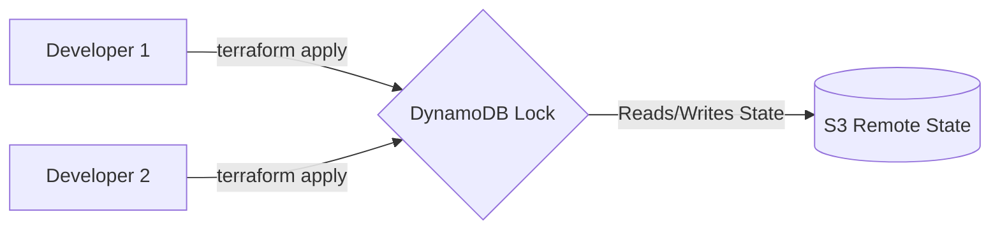

# CẨM NANG ÔN LUYỆN PHỎNG VẤN: INFRASTRUCTURE AS CODE (TERRAFORM)

Tài liệu này tập trung vào kiến thức nền tảng Terraform, thiết kế hạ tầng dữ liệu (Data Infrastructure), quản lý State, phân chia môi trường (dev, staging, prod) và cách cấu hình giám sát cảnh báo hạ tầng tự động.

---

## PHẦN 1: TẠI SAO DATA ENGINEER CẦN TERRAFORM (IaC)?

### 1. Khái niệm Infrastructure as Code (IaC)
IaC là phương pháp quản lý và cấu hình hạ tầng CNTT (máy chủ, cơ sở dữ liệu, mạng, quyền truy cập) thông qua các tệp cấu hình dạng code (declarative files), thay vì cấu hình thủ công bằng giao diện click chuột (UI) của các nhà cung cấp đám mây (AWS Console, Google Cloud Console).

### 2. Lợi ích đối với Data Engineer
*   **Tái bản hạ tầng (Reproducibility)**: Dễ dàng dựng lại một cụm Spark (EMR/Dataproc) hoặc kho dữ liệu (Redshift/BigQuery) giống hệt nhau giữa các môi trường `dev`, `staging` và `prod`.
*   **Kiểm soát phiên bản (Version Control)**: Hạ tầng được lưu trữ trên Git. Mọi thay đổi đều được review qua Pull Request (PR).
*   **Tránh "Trôi cấu hình" (Configuration Drift)**: Tránh việc ai đó tự ý sửa đổi quyền hoặc kích thước database trên Cloud Console mà không thông báo cho team.
*   **Quản lý chi phí (Cost Management)**: Tự động tắt/bật hoặc xóa sạch các tài nguyên thử nghiệm (Sandbox) bằng một câu lệnh duy nhất: `terraform destroy`.

---

## PHẦN 2: KIẾN TRÚC VÀ CÚ PHÁP HCL CỦA TERRAFORM

Terraform sử dụng ngôn ngữ **HCL (HashiCorp Configuration Language)** để khai báo hạ tầng ở dạng declarative (mô tả trạng thái mong muốn của hệ thống và Terraform tự tìm cách thực thi).

### 1. Vòng đời lệnh Terraform (Terraform Workflow)
1.  `terraform init`: Khởi tạo thư mục dự án, tải về các thư viện Drivers (Providers) tương ứng (AWS, GCP, Azure).
2.  `terraform plan`: So sánh code hiện tại với trạng thái thực tế của Cloud và file State, sau đó hiển thị ra những thay đổi dự kiến sẽ được tạo, sửa hoặc xóa (Khuyên dùng trước khi apply).
3.  `terraform apply`: Thực thi các thay đổi lên Cloud để đạt được trạng thái khai báo trong code.
4.  `terraform destroy`: Xóa bỏ toàn bộ tài nguyên được định nghĩa trong dự án.

```
[HCL Code] ──► [terraform init] ──► [terraform plan] ──► [terraform apply] ──► [Cloud Infra]
```

### 2. Cú pháp HCL cơ bản (Mẫu)
```hcl
# Khai báo Provider (AWS)
provider "aws" {
  region = "ap-southeast-1" # Singapore
}

# Sử dụng Data Source để truy vấn thông tin có sẵn trên Cloud
data "aws_vpc" "existing_vpc" {
  filter {
    name   = "tag:Name"
    values = ["production-vpc"]
  }
}

# Định nghĩa một Resource (Tài nguyên cần tạo mới - S3 Bucket)
resource "aws_s3_bucket" "data_lake" {
  bucket = "company-data-lake-prod"

  tags = {
    Environment = "Production"
    Team        = "Data-Engineering"
  }
}
```

---

## PHẦN 3: THIẾT KẾ HẠ TẦNG DỮ LIỆU BẰNG TERRAFORM (AWS)

Dưới đây là các ví dụ HCL thực tế dùng để thiết kế hạ tầng Big Data cơ bản.

### 1. Tạo S3 Data Lake Bucket với Lifecycle Policies (Lưu trữ rẻ tiền)
Dữ liệu thô (Raw data) nạp vào Data Lake cần được tối ưu chi phí lưu trữ: Lưu ở S3 Standard trong 30 ngày, sau đó tự chuyển sang S3 Glacier (lưu trữ siêu rẻ) và xóa hẳn sau 365 ngày.

```hcl
resource "aws_s3_bucket" "datalake" {
  bucket = "my-company-datalake-prod-ap-southeast-1"
}

# Bật phiên bản (Versioning) để tránh mất mát dữ liệu
resource "aws_s3_bucket_versioning" "datalake_versioning" {
  bucket = aws_s3_bucket.datalake.id
  versioning_configuration {
    status = "Enabled"
  }
}

# Cấu hình Lifecycle Policy tự động chuyển vùng lưu trữ
resource "aws_s3_bucket_lifecycle_configuration" "datalake_lifecycle" {
  bucket = aws_s3_bucket.datalake.id

  rule {
    id     = "archive-old-data"
    status = "Enabled"

    # Di chuyển dữ liệu cũ sang Glacier để tiết kiệm tiền sau 30 ngày
    transition {
      days          = 30
      storage_class = "GLACIER"
    }

    # Xóa vĩnh viễn dữ liệu sau 365 ngày
    expiration {
      days = 365
    }
  }
}
```

---

### 2. Provisioning AWS EMR Cluster (Spark & Hadoop)
Tạo một cụm EMR gồm 1 Master Node và 2 Core Nodes chạy Spark/Hadoop phục vụ các job ETL lớn.

```hcl
resource "aws_emr_cluster" "spark_cluster" {
  name          = "emr-spark-etl-prod"
  release_label = "emr-6.10.0" # Chứa Spark 3.3, Hadoop 3.3
  applications  = ["Spark", "Hadoop", "Hive"]

  ec2_attributes {
    subnet_id                         = "subnet-0bb8db195c8087fc4" # Subnet ID trong VPC của bạn
    emr_managed_master_security_group = "sg-09b9f71c4c1a84f32"
    emr_managed_slave_security_group  = "sg-0c5a2c4e1b2f3a4b5"
    instance_profile                  = "EMR_EC2_DefaultRole"
  }

  # Node chính điều phối (Master)
  master_instance_group {
    instance_type = "m5.xlarge"
  }

  # Các worker nodes tính toán (Core)
  core_instance_group {
    instance_type  = "m5.xlarge"
    instance_count = 2
  }

  service_role = "EMR_DefaultRole"

  configurations_json = <<EOF
  [
    {
      "Classification": "spark",
      "Properties": {
        "maximizeResourceAllocation": "true"
      }
    }
  ]
  EOF

  tags = {
    Environment = "Production"
    Project     = "Data-ETL"
  }
}
```

---

### 3. Cài đặt CSDL Amazon RDS PostgreSQL (Database nguồn hoặc Metadata DB)
```hcl
resource "aws_db_instance" "postgres_db" {
  allocated_storage    = 20
  max_allocated_storage = 100 # Auto-scaling dung lượng đĩa cứng
  engine               = "postgres"
  engine_version       = "13.7"
  instance_class       = "db.t3.medium"
  db_name              = "finance"
  username             = "db_admin"
  password             = "SuperSecretPassword123" # Khuyên dùng AWS Secrets Manager
  parameter_group_name = "default.postgres13"
  skip_final_snapshot  = true
  publicly_accessible  = false # Bảo mật: Không public ra internet
  vpc_security_group_ids = ["sg-0a1b2c3d4e5f6g7h8"]
}
```

---

## PHẦN 4: QUẢN LÝ TERRAFORM STATE (STATE MANAGEMENT)

### 1. Terraform State là gì?
Terraform lưu trữ bản đồ ánh xạ từ mã nguồn HCL sang các tài nguyên thực tế trên Cloud vào một file có tên `terraform.tfstate`.
*   **Vai trò**: Giúp Terraform biết cần tạo mới cái gì, cập nhật cái gì hay xóa cái gì khi chạy lệnh `apply`.

### 2. Remote State & State Locking (Bảo vệ dự án khi làm việc nhóm)
> **[!WARNING]  
> Rủi ro lớn:** Nếu lưu file State ở máy local (`local state`), đồng nghiệp không thể biết trạng thái hạ tầng hiện tại. Nếu 2 người cùng chạy `terraform apply` một lúc, hạ tầng sẽ bị ghi đè và lỗi.

**Giải pháp (Remote State Backend):**
*   Lưu file State lên S3 bucket dùng chung.
*   Sử dụng **DynamoDB Table** làm công cụ khóa trạng thái (**State Locking**). Khi bạn chạy `apply`, Terraform sẽ khóa DynamoDB lại. Người khác chạy lệnh lúc này sẽ bị từ chối cho đến khi bạn hoàn thành.



**Code cấu hình Backend S3 + DynamoDB:**
```hcl
terraform {
  required_version = ">= 1.0.0"

  backend "s3" {
    bucket         = "my-company-tfstate-bucket"
    key            = "global/s3/terraform.tfstate"
    region         = "ap-southeast-1"
    
    # Kích hoạt State Locking qua DynamoDB
    dynamodb_table = "terraform-state-locks"
    encrypt        = true
  }
}
```

---

## PHẦN 5: TỔ CHỨC THƯ MỤC NHIỀU MÔI TRƯỜNG (MULTI-ENVIRONMENT SETUPS)

Để quản lý sạch sẽ mã nguồn Terraform giữa môi trường `dev` và `prod`, cấu trúc thư mục khuyên dùng là tách biệt hoàn toàn (Folder-based separation):

```
terraform-project/
│
├── modules/               # Chứa các Module tái sử dụng
│   ├── s3_bucket/
│   │   ├── main.tf
│   │   ├── variables.tf
│   │   └── outputs.tf
│   └── emr_cluster/
│       ├── main.tf
│       └── variables.tf
│
└── environments/          # Các môi trường chạy thực tế
    ├── dev/
    │   ├── main.tf        # Gọi các module với biến của dev
    │   ├── variables.tf
    │   ├── terraform.tfvars
    │   └── backend.tf     # Backend S3 chứa state của dev
    └── prod/
        ├── main.tf        # Gọi các module với biến của prod
        ├── variables.tf
        ├── terraform.tfvars
        └── backend.tf     # Backend S3 chứa state của prod
```

---

## PHẦN 6: THIẾT LẬP CẢNH BÁO TỰ ĐỘNG CHO HẠ TẦNG DỮ LIỆU (TERRAFORM)

Dùng Terraform để khai báo các chỉ số giám sát và tự động cảnh báo (CloudWatch Alerts) trên AWS khi ổ đĩa của Database RDS sắp hết hoặc CPU của EMR quá tải.

### 1. Alarm cảnh báo bộ nhớ lưu trữ RDS PostgreSQL sắp hết
```hcl
resource "aws_cloudwatch_metric_alarm" "rds_low_storage" {
  alarm_name          = "rds-postgres-low-free-storage"
  comparison_operator = "LessThanOrEqualToThreshold"
  evaluation_periods  = "1"
  metric_name         = "FreeStorageSpace"
  namespace           = "AWS/RDS"
  period              = "300" # 5 phút
  statistic           = "Average"
  threshold           = "5000000000" # 5 GB (tính bằng Bytes)
  alarm_description   = "This metric monitors RDS free storage space and alerts if below 5GB."
  alarm_actions       = [aws_sns_topic.admin_alerts.arn]

  dimensions = {
    DBInstanceIdentifier = aws_db_instance.postgres_db.id
  }
}

# Kênh gửi thông báo SNS
resource "aws_sns_topic" "admin_alerts" {
  name = "infrastructure-alerts-topic"
}

# Đăng ký nhận alert qua Email
resource "aws_sns_topic_subscription" "email_sub" {
  topic_arn = aws_sns_topic.admin_alerts.arn
  protocol  = "email"
  endpoint  = "alert-admin@company.com"
}
```

---

## PHẦN 7: BỘ CÂU HỎI PHỎNG VẤN VỀ TERRAFORM THƯỜNG GẶP

### Câu 1: File `terraform.tfstate` có nên đưa lên Git không? Tại sao?
*   *Trả lời*: **Tuyệt đối không**. Có 2 lý do:
    1.  File State chứa các thông tin nhạy cảm của hệ thống (database passwords, API keys ở dạng plain-text). Đưa lên Git sẽ gây rò rỉ bảo mật nghiêm trọng.
    2.  State liên tục thay đổi khi có người chạy áp dụng hạ tầng. Lưu trên Git sẽ gây xung đột mã nguồn (merge conflicts) liên tục. Luôn dùng các giải pháp Remote Backend (S3, GCS) bảo mật và hỗ trợ Lock.

### Câu 2: Sự khác biệt giữa `count` và `for_each` khi tạo nhiều tài nguyên giống nhau?
*   *Trả lời*:
    *   `count`: Tạo tài nguyên dựa trên một số nguyên (index từ `0` đến `N-1`). Nhược điểm: Nếu bạn xóa một phần tử ở giữa danh sách, Terraform sẽ cập nhật/xóa toàn bộ các phần tử phía sau để dịch chuyển index, dễ gây lỗi ngoài ý muốn.
    *   `for_each`: Tạo tài nguyên dựa trên một tập hợp (set) hoặc bản đồ (map). An toàn hơn vì mỗi tài nguyên được định danh bằng một key rõ ràng. Nếu xóa một phần tử, Terraform chỉ xóa đúng tài nguyên tương ứng với key đó, không ảnh hưởng phần khác.

### Câu 3: Làm thế nào để xử lý sự cố "Trôi cấu hình" (Configuration Drift)?
*   *Trả lời*: Khi một kỹ sư tự ý sửa đổi hạ tầng bằng tay trên Web Console (ví dụ tăng size RAM DB), cấu hình thực tế đã khác với code Terraform. Ta xử lý bằng cách:
    1.  Chạy `terraform plan`. Terraform sẽ so sánh thực tế với file state và mã nguồn, chỉ ra các thay đổi bị lệch.
    2.  Cập nhật lại code HCL cho đúng với thực tế rồi chạy `terraform apply` để đồng bộ lại, hoặc chạy `terraform apply` để Terraform tự động cấu hình đè lại trạng thái cũ giống như code quy định.

### Câu 4: Làm thế nào để import tài nguyên sẵn có (được tạo bằng tay trước đó) vào quản lý bằng Terraform?
*   *Trả lời*:
    1.  Viết khối khai báo rỗng cho tài nguyên đó trong code HCL (ví dụ: `resource "aws_s3_bucket" "old_bucket" {}`).
    2.  Chạy lệnh `terraform import aws_s3_bucket.old_bucket name-of-bucket-on-aws`.
    3.  Chạy `terraform plan` để xem các thuộc tính thực tế của tài nguyên, cập nhật code HCL cho khớp hoàn toàn với thuộc tính đó cho đến khi chạy `terraform plan` báo "No changes".
