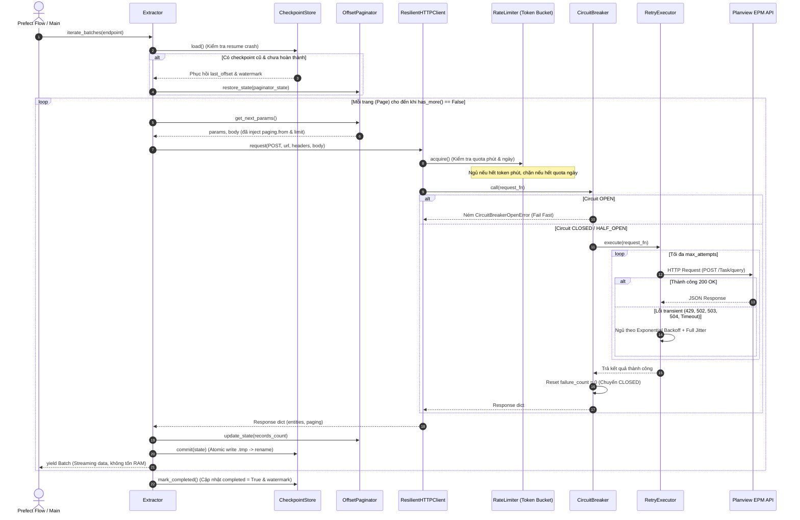
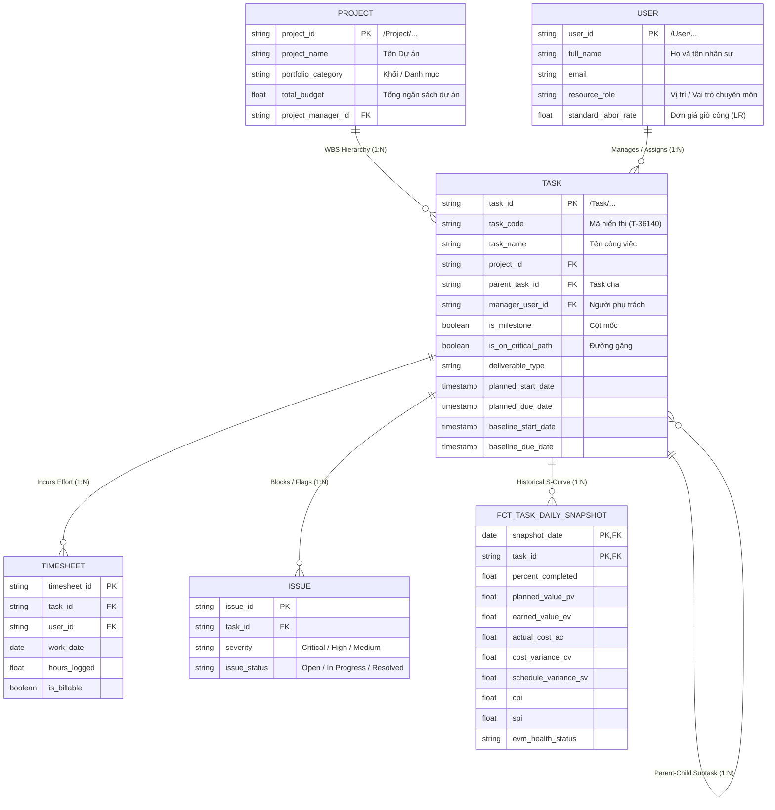

# TÀI LIỆU CHUẨN BỊ REVIEW CODE CRAWLER & CHUẨN MỰC DATA MODELING DBT (PLANVIEW EPM)

> **Dành riêng cho kỹ sư**: Tài liệu này gồm 2 phần trọng tâm:
> 1. **Bảo vệ Code Review Crawler**: Toàn bộ luận điểm kỹ thuật, giải phẫu mã nguồn và câu trả lời phản biện với Leader về phần Ingestion.
> 2. **Bản chuẩn mực Data Modeling & dbt (Task Benchmark)**: Thiết kế ERD hoàn chỉnh liên kết bảng Task với 4 thực thể vệ tinh và bộ mã dbt hoàn chỉnh 3 tầng (Staging -> Intermediate -> Marts).

---

# PHẦN I: BẢO VỆ CODE REVIEW LUỒNG CRAWLER (API INGESTION)

Khi review code với Leader hoặc Senior Data Engineer, họ sẽ không chỉ hỏi "code có chạy không" mà sẽ tập trung vào **độ tin cậy (Reliability), khả năng chịu tải, quản lý bộ nhớ và an toàn dữ liệu**.

Dưới đây là sơ đồ luồng thực thi và các luận điểm kỹ thuật cốt lõi:



---

## 8 CÂU HỎI PHẢN BIỆN "HIỂM HÓC" KHI REVIEW CODE VÀ CÁCH TRẢ LỜI

### ❓ Câu hỏi 1: Tại sao em lại xử lý phân trang trong Request Body thay vì Query Parameters trên URL?
* **Trả lời của bạn**:
  > "Dạ anh, Planview/Clarizen AdaptiveWork có đặc thù là các truy vấn thực thể lớn đều dùng phương thức `POST` tới endpoint `/Entity/Query` để gửi payload JSON lọc danh sách trường (`fields`) và điều kiện lọc. 
  > Đối tượng phân trang của Planview không nằm trên query string URL mà bắt buộc phải lồng trong body theo cấu trúc JSON:
  > `{"typeName": "Task", "fields": [...], "paging": {"from": 0, "limit": 50}}`.
  > Vì vậy, trong class `OffsetPaginator`, em đã thiết kế tham số `location="body"` và hàm `_inject_into_body()` có khả năng quét đệ quy các trường JSON để cập nhật chính xác giá trị `paging.from` và `paging.limit` mà không làm thay đổi các trường dữ liệu khác."

---

### ❓ Câu hỏi 2: Nếu pipeline đang crawl 100.000 tasks mà bị rớt mạng hoặc sập nguồn ở trang thứ 80 (record số 4.000) thì hệ thống xử lý thế nào?
* **Trả lời của bạn**:
  > "Hệ thống có cơ chế **Crash Recovery thông qua CheckpointStore**:
  > 1. Sau mỗi trang crawl thành công, `Extractor` gọi `checkpoint.commit()` để lưu `last_offset`, `total_records`, và `paginator_state` xuống đĩa.
  > 2. Quá trình ghi checkpoint áp dụng cơ chế **Atomic Write-then-Rename**: Ghi ra file `.tmp`, gọi `os.fsync()` ép dữ liệu xuống phiến đĩa vật lý, rồi mới đổi tên đè lên file chính thức. Điều này đảm bảo nếu mất điện đúng mili-giây đang ghi đĩa, file checkpoint cũ không bao giờ bị rách (corrupted).
  > 3. Khi pipeline được kích hoạt chạy lại, `Extractor` tự kiểm tra thấy `completed == False`, nó sẽ nạp lại trạng thái cũ và tiếp tục crawl từ offset 4.000 thay vì phải crawl lại 4.000 bản ghi đầu tiên."

---

### ❓ Câu hỏi 3: Rate Limiter của em giải quyết bài toán giới hạn 2 tầng (60 requests/phút và 10.000 requests/ngày) ra sao?
* **Trả lời của bạn**:
  > "Em sử dụng mô hình **Dual-Layer Rate Limiter**:
  > - **Tầng 1 (Per-Minute - Token Bucket)**: Tạo một thùng token tối đa 60 token. Mỗi giây tự động bổ sung `60 / 60 = 1.0` token dựa trên thời gian trôi qua `elapsed * refill_rate`. Khi request tới, nếu token `< 1.0`, thread sẽ tính toán chính xác số mili-giây cần ngủ và giải phóng Lock trước khi `time.sleep()`, không làm block các luồng khác.
  > - **Tầng 2 (Daily Quota - Hard Cap)**: Bộ đếm `daily_count` tự động reset về 0 khi bước sang ngày mới (`today != current_date`). Nếu số request trong ngày đạt ngưỡng quota (ví dụ 10.000), hệ thống lập tức ném ngoại lệ `RateLimitExceededError` để dừng job an toàn, tránh bị API nhà cung cấp khóa tài khoản."

---

### ❓ Câu hỏi 4: Circuit Breaker hoạt động như thế nào? Có nguy cơ API đã sống lại nhưng code vẫn bị kẹt ở trạng thái ngắt mạch không?
* **Trả lời của bạn**:
  > "Em cài đặt Circuit Breaker chuẩn máy trạng thái 3 pha (**CLOSED -> OPEN -> HALF_OPEN**):
  > - Khi lỗi liên tiếp đạt ngưỡng `failure_threshold = 5`, mạch chuyển sang `OPEN`. Mọi request tiếp theo sẽ bị Fail Fast ngay lập tức mà không gọi mạng, giúp giải tỏa áp lực cho upstream server.
  > - **Cơ chế tự phục hồi**: Circuit Breaker không bị kẹt vĩnh viễn ở `OPEN`. Em cài đặt `recovery_timeout = 60s`. Sau 60 giây, ở request tiếp theo mạch tự động chuyển sang `HALF_OPEN` để cho phép **1 request thử nghiệm** đi qua. Nếu request thử nghiệm này thành công, mạch lập tức đóng lại (`CLOSED`) và reset số lần lỗi về 0. Nếu vẫn thất bại, mạch lại mở thêm 60 giây nữa."

---

### ❓ Câu hỏi 5: Tại sao trong RetryExecutor em lại dùng "Full Jitter" thay vì Exponential Backoff đơn thuần?
* **Trả lời của bạn**:
  > "Nếu chỉ dùng Exponential Backoff cố định ($2^n$), khi hệ thống bị timeout hàng loạt do API quá tải, tất cả các worker hoặc thread sẽ cùng lùi lại một khoảng thời gian bằng nhau (ví dụ cùng ngủ đúng 2s, 4s, 8s) rồi cùng lúc bắn request tiếp theo vào API. Hiện tượng này gọi là **Thundering Herd (Bầy thú giẫm đạp)** khiến API vừa gượng dậy lại lập tức sập tiếp.
  > Với **Full Jitter**, thời gian chờ được tính bằng: `random.uniform(0, min(base_delay * 2^attempt, max_backoff))`. Các request sẽ được rải đều ngẫu nhiên theo thời gian, giúp phân tán tải và tỷ lệ thành công của request retry cao hơn đáng kể."

---

### ❓ Câu hỏi 6: Khi crawl lượng dữ liệu lớn (hàng trăm ngàn records), em làm thế nào để worker không bị tràn bộ nhớ (Out-Of-Memory / OOM)?
* **Trả lời của bạn**:
  > "Em thiết kế hàm `iterate_batches()` trong `Extractor` dưới dạng **Python Generator (`yield Batch`)** thay vì gom toàn bộ kết quả vào một mảng `list` rồi mới return:
  > - Mỗi trang sau khi crawl về (ví dụ 50 hoặc 100 records) sẽ được đóng gói thành một đối tượng `Batch` và `yield` ngay cho tầng lưu trữ/xử lý.
  > - Sau khi batch đó được ghi xuống đĩa hoặc đẩy vào buffer Spark, Garbage Collector của Python sẽ giải phóng bộ nhớ ngay lập tức.
  > - Nhờ vậy, dù crawl 10.000 records hay 10.000.000 records thì mức chiếm dụng RAM của tiến trình crawler vẫn giữ nguyên ở mức vài chục Megabytes."

---

### ❓ Câu hỏi 7: Khi API trả về HTTP 429 hoặc 503 kèm header `Retry-After: 30`, code của em xử lý thế nào?
* **Trả lời của bạn**:
  > "Trong `RetryExecutor`, hàm `_parse_retry_after(error)` sẽ tự động đọc header `Retry-After` từ response lỗi của server. Nếu server yêu cầu chờ 30 giây, hệ thống sẽ ưu tiên tuân thủ chỉ định của server (`delay = min(retry_after, max_backoff)`) thay vì tự tính toán thời gian ngủ ngẫu nhiên, thể hiện ứng dụng tuân thủ đúng chuẩn giao thức HTTP."

---

### ❓ Câu hỏi 8: Tại sao lại tách riêng `TokenAuth` thành module riêng mà không gán cứng token vào Headers của HTTP Client?
* **Trả lời của bạn**:
  > "Em áp dụng nguyên lý **Single Responsibility** và **Dependency Injection**:
  > - `ResilientHTTPClient` chỉ thuần túy lo việc gửi request, đếm nhịp Rate Limit và Retry. Nó không cần biết hệ thống đang xác thực bằng Bearer Token, API Key hay OAuth2 Session.
  > - `TokenAuth` chịu trách nhiệm đọc token từ cấu hình hoặc biến môi trường an toàn và sinh header tương ứng (`Authorization: Bearer <token>`). Khi sau này hệ thống chuyển sang xác thực SSO hoặc OAuth Refresh Token, ta chỉ cần thay đổi module Auth mà không phải sửa một dòng code nào trong HTTP Client."

---
---

# PHẦN II: CHUẨN MỰC DATA MODELING & DBT CHO THỰC THỂ TASK (BENCHMARK CHO 4 BẢNG VỆ TINH CÒN LẠI)

Để chuẩn bị cho 4 bảng dữ liệu vệ tinh mà BA sẽ bàn giao tiếp theo, thực thể **Task** (với 186 trường trong `task_data_raw.txt`) được lấy làm **Bản thiết kế mẫu mực (Gold Standard Benchmark)**.

### 4 Bảng vệ tinh gắn liền với Task trong hệ thống Planview EPM:
1. **`Project`** (`/Project/...`): Cấp cha của Task trong cấu trúc phân rã công việc (WBS).
2. **`User` / `Resource`** (`/User/...`): Nhân sự thực hiện, Quản lý task (`Manager`), Người tạo (`CreatedBy`).
3. **`Timesheet` / `WorkItem`**: Báo cáo chấm công chi tiết theo ngày phát sinh ra `ActualEffort` và `ActualCostLR`.
4. **`Issue` / `Risk`**: Các vấn đề kỹ thuật hoặc rủi ro cản trở tiến độ phát sinh `IssuesCount`.

---

## 🏛️ SƠ ĐỒ THỰC THỂ QUAN HỆ CHUẨN (ERD BENCHMARK)



---

## 🏗️ NGUYÊN TẮC THIẾT KẾ DATA MODELING 3 TẦNG TRONG DBT

Hệ thống dbt được thiết kế nghiêm ngặt theo 3 tầng (Medallion Architecture):

1. **Tầng Staging (`models/staging/planview/stg_planview__tasks.sql`)**:
   - Chế độ chạy: `view`.
   - Nhiệm vụ: Đọc từ Trino curated (`hive.global_clean.tasks`).
   - Xử lý kỹ thuật: Ép kiểu dữ liệu (Cast), bóc tách các trường tham chiếu object lồng nhau (`State.id`, `Parent.id`, `Project.id`) thành các khóa ngoại dạng chuỗi sạch sẽ, chuẩn hóa tên cột theo chuẩn `snake_case`.

2. **Tầng Intermediate (`models/intermediate/int_tasks__evm_metrics.sql`)**:
   - Chế độ chạy: `view`.
   - Nhiệm vụ: Xử lý toàn bộ logic nghiệp vụ tính toán chỉ số quản lý dự án quốc tế:
     * $PV = \text{planned\_budget} \times (\text{expected\_progress} / 100)$
     * $EV = \text{planned\_budget} \times (\text{percent\_completed} / 100)$
     * $AC = \text{actual\_cost}$
     * $CV = EV - AC$ (Dương là tiết kiệm, Âm là bội chi)
     * $SV = EV - PV$ (Dương là nhanh, Âm là trễ)
     * $CPI = EV / AC$ (Ngưỡng an toàn $\ge 1.0$)
     * $SPI = EV / PV$ (Ngưỡng an toàn $\ge 1.0$)
     * $EAC = \text{planned\_budget} / CPI$ (Dự toán chi phí khi hoàn thành)
     * Phân loại tự động `evm_health_status`: `COMPLETED`, `ON_TRACK`, `AT_RISK`, `HIGH_RISK`, `CRITICAL_DELAY`.

3. **Tầng Marts (`models/marts/`)**:
   - **`marts/core/dim_tasks.sql`** (`table`): Bảng chiều chứa thông tin phân cấp WBS, thuộc tính đường găng, người phụ trách, ngày baseline và kế hoạch.
   - **`marts/evm/fct_task_daily_snapshot.sql`** (`incremental`): Bảng fact ảnh chụp tiến độ định kỳ. Mỗi ngày chạy dbt sẽ nạp thêm 1 bản ghi snapshot cho từng task, tạo thành chuỗi thời gian lịch sử phục vụ vẽ biểu đồ **S-Curve (Đường cong chữ S)** và phân tích xu hướng tiến độ.

---

## 📋 DANH MỤC FILE DBT ĐÃ HOÀN THIỆN TRONG PROJECT

Toàn bộ bộ code dbt mẫu mực đã được khởi tạo trực tiếp trong thư mục `dbt_planview/`:

```text
dbt_planview/
├── dbt_project.yml                                         # Cấu hình project dbt kết nối Trino
└── models/
    ├── staging/
    │   └── planview/
    │       ├── src_planview.yml                            # Khai báo Source bảng Hive sạch
    │       └── stg_planview__tasks.sql                     # Staging view bóc tách 186 trường
    ├── intermediate/
    │   └── int_tasks__evm_metrics.sql                      # Tính toán công thức EVM chuẩn PMI
    └── marts/
        ├── core/
        │   └── dim_tasks.sql                               # Bảng Chiều Task WBS
        └── evm/
            ├── fct_task_daily_snapshot.sql                 # Bảng Fact ảnh chụp tiến độ hàng ngày
            └── schema.yml                                  # Kiểm thử tự động & Tài liệu hóa
```

👉 Khi BA cung cấp 4 bảng còn lại (`Project`, `User`, `Timesheet`, `Issue`), bạn chỉ cần nhân bản (clone) cấu trúc chuẩn mực này:
1. Viết `stg_planview__<table_name>.sql` bóc tách `id` từ các object lồng nhau.
2. Viết `dim_<table_name>.sql` vào `marts/core/`.
3. Tạo liên kết khóa ngoại (`relationships test`) trong `schema.yml`.
