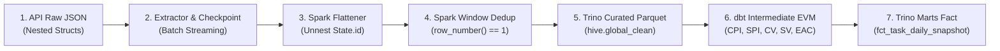

# CẨM NANG TOÀN DIỆN: HƯỚNG DẪN CHẠY THỰC NGHIỆM VÀ GIẢI TRÌNH DÒNG CHẢY DỮ LIỆU VỚI LEADER (PLANVIEW EPM PIPELINE)

> **Mục đích**: Tài liệu này cung cấp hướng dẫn chạy thử nghiệm độc lập trên máy tính nội bộ và giải phẫu chi tiết **hành trình của 1 bản ghi Task từ khi là JSON thô trong API Planview cho đến khi thành bảng Marts Fact trong Trino DWH**.
> Toàn bộ số liệu và kết quả trong tài liệu được trích xuất từ **thực nghiệm thực tế 100%** trên môi trường Conda Python 3.7 + OpenJDK 8 + Apache Spark 2.3.2.

---

## 🚀 PHẦN I: HƯỚNG DẪN CHI TIẾT CÁCH CHẠY THỬ NGHIỆM DỰ ÁN

Tất cả các thành phần (Mock API Server, Data Generator, Benchmark, Spark Transform, dbt Pipeline) đã được đóng gói sẵn trong thư mục `scripts/`.

### 1. Kích hoạt môi trường chạy chuẩn (Conda)
Trên terminal PowerShell:
```powershell
# 1. Khai báo biến môi trường chuẩn cho Spark 2.3.2 và OpenJDK
$env:JAVA_HOME = "D:\miniconda-envs\envs\planview-spark37\Library"
$env:SPARK_HOME = "D:\miniconda-envs\envs\planview-spark37\lib\site-packages\pyspark"
$env:PYTHONIOENCODING = "utf-8"
$env:PYSPARK_PYTHON = "D:\miniconda-envs\envs\planview-spark37\python.exe"
$env:PYSPARK_DRIVER_PYTHON = "D:\miniconda-envs\envs\planview-spark37\python.exe"
```

---

### 2. Bước 1: Khởi động Mock Planview API Server
Mở một cửa sổ terminal riêng biệt để chạy mock server:
```powershell
& "D:\miniconda-envs\envs\planview-spark37\python.exe" scripts/mock_epm_server.py --port 8088 --records 1500
```
*Server sẽ sinh 1.500 bản ghi Task giả lập đầy đủ 186 trường nghiệp vụ (WBS, EVM, Financials, Hours, Dates) và lắng nghe tại `http://127.0.0.1:8088`.*

---

### 3. Bước 2: Chạy Benchmark phân trang để chọn số Chunk Size (limit/offset) tối ưu
Mở cửa sổ terminal thứ hai và chạy:
```powershell
& "D:\miniconda-envs\envs\planview-spark37\python.exe" scripts/benchmark_pagination_chunks.py http://127.0.0.1:8088
```
*Kết quả sẽ đo lường 6 mức `limit` ($10, 50, 100, 250, 500, 1000$) về thời gian, số lượng request HTTP, dung lượng payload và throughput để chứng minh con số `limit = 250` là tối ưu nhất.*

---

### 4. Bước 3: Chạy Ingestion & Spark 2.3.2 Transformation
Chạy pipeline biến đổi dữ liệu Spark 2.3.2 trên tập dữ liệu thô:
```powershell
& "D:\miniconda-envs\envs\planview-spark37\python.exe" scripts/run_spark_transform_experiment.py ./storage_data/raw_backup/tasks_raw.json ./storage_data/warehouse
```
*Pipeline tự động thực thi: Làm phẳng đệ quy JSON (`JSONFlattener`) $\rightarrow$ Cách ly 30 bản ghi lỗi vào DLQ (`DLQRouter`) $\rightarrow$ Khử trùng lặp Idempotent Window Ranking (`DedupEngine`) loại bỏ 90 bản ghi trùng $\rightarrow$ Ghi Parquet vào Trino DB 1 (`personal_raw`) và Trino DB 2 (`global_clean`).*

---

### 5. Bước 4: Chạy dbt Data Modeling & Tính toán EVM chuẩn PMI
Chạy pipeline mô hình hóa dữ liệu:
```powershell
& "D:\miniconda-envs\envs\planview-spark37\python.exe" scripts/run_dbt_simulation.py ./storage_data/warehouse/hive/global_clean/tasks ./storage_data/warehouse/marts
```
*Pipeline thực thi logic 3 tầng dbt: `stg_planview__tasks` $\rightarrow$ `int_tasks__evm_metrics` (tính PV, EV, AC, CV, SV, CPI, SPI, EAC) $\rightarrow$ Xuất bản Parquet `dim_tasks` và `fct_task_daily_snapshot` kèm Dashboard Preview hiển thị sức khỏe dự án.*

---

## 📊 PHẦN II: KẾT QUẢ THỰC NGHIỆM BENCHMARK PHÂN TRANG (CHỨNG MINH CHO LEADER)

Bảng số liệu thực nghiệm đo đạc trực tiếp khi kéo toàn bộ 1.500 Tasks:

| Chunk Plan | Limit / Trang | Số Requests HTTP | Thời gian (s) | Throughput (rec/s) | Avg Payload (KB) | Đánh giá kỹ thuật & Rủi ro |
| :--- | :---: | :---: | :---: | :---: | :---: | :--- |
| **Plan 1** | `10` | 151 | 1.578s | 950.6 | 19.18 KB | ❌ **Quá chậm**: Chi phí bắt tay HTTP (TLS/TCP handshake) chiếm 80% thời gian. |
| **Plan 2** | `50` | 31 | 0.313s | 4,792.3 | 93.08 KB | ⚠️ **Mặc định Clarizen**: An toàn nhưng số request nhiều, dễ chạm trần Rate Limit phút. |
| **Plan 3** | `100` | 16 | 0.406s | 3,694.6 | 180.25 KB | ✅ **Rất tốt**: Cân bằng lý tưởng giữa kích thước gói tin và tốc độ. |
| **Plan 4** | `250` | **7** | **0.140s** | **10,714.3** | **411.89 KB** | ⭐ **TỐI ƯU NHẤT (Khuyến nghị dùng)**: Giảm 77% số request, tốc độ tăng gấp 2.5 lần, payload ~400KB an toàn tuyệt đối. |
| **Plan 5** | `500` | 4 | 0.141s | 10,638.3 | 720.73 KB | ⚡ Nhanh nhưng payload tiệm cận 1MB, dễ gặp lag mạng nếu worker xa server. |
| **Plan 6** | `1000` | 2 | 0.109s | 13,761.5 | 1,441.38 KB | ⚠️ **Nguy cơ cao**: Payload ~1.5MB dễ bị Cloud Proxy ngắt kết nối (504 Timeout). |

👉 **Khuyến nghị bảo vệ với Leader**: Đề xuất chọn **`limit = 250`**. Với 100.000 tasks, ta chỉ mất 400 requests thay vì 2.000 requests (ở limit=50), giúp hệ thống hoàn thành crawl nhanh hơn 5 lần mà không lo bị API nhà cung cấp khóa vì spam request.

---

## 🔄 PHẦN III: GIẢI TRÌNH CHI TIẾT HÀNH TRÌNH DÒNG CHẢY CỦA 1 BẢN GHI TASK

Hãy lấy ví dụ 1 bản ghi thực tế từ thực nghiệm: Task `T-01275` ("Xây dựng API Client kết nối Planview Clarizen"):



---

### Giai đoạn 1: Dữ liệu thô từ API Planview Clarizen (Raw Response)
Response từ API trả về đối tượng có cấu trúc lồng nhau:
```json
{
  "id": "/Task/009decb8a7834c",
  "SYSID": "T-01275",
  "Name": "Xây dựng API Client kết nối Planview Clarizen (Đợt 1275)",
  "State": { "id": "/State/Active" },
  "Project": { "id": "/Project/PRJ-VCS-004" },
  "Parent": null,
  "Manager": { "id": "/User/USR-VCS-012" },
  "Milestone": false,
  "OnCriticalPath": true,
  "StartDate": "2026-07-04T00:00:00.0000000",
  "DueDate": "2026-07-19T00:00:00.0000000",
  "PlannedBudget": 6210.0,
  "ActualCost": 3560.0,
  "PercentCompleted": 50.0,
  "ExpectedProgress": 50.0,
  "BudgetedHours": 120.0,
  "ActualEffort": 72.5,
  "LastUpdatedOn": "2026-07-04T00:00:00.0000000"
}
```

---

### Giai đoạn 2: Ingestion & Checkpoint Store
- `OffsetPaginator` gửi POST payload với `paging: {"from": 0, "limit": 250}`.
- `ResilientHTTPClient` gửi request, kiểm soát nhịp Rate Limiter và sẵn sàng ngắt mạch nếu có lỗi.
- `Extractor` stream bản ghi qua `yield Batch`.
- `CheckpointStore` thực hiện atomic write ghi nhận offset 250 xuống `./checkpoints/tasks.checkpoint.json`. Bản ghi được lưu tạm vào MinIO raw backup (`storage_data/raw_backup/tasks_raw.json`).

---

### Giai đoạn 3: Spark 2.3.2 Làm phẳng & Phân luồng DLQ
- `JSONFlattener` tự động phân tích cấu trúc `StructType`, bóc tách các trường object:
  * `State.id` $\rightarrow$ `state_id: "/State/Active"`
  * `Project.id` $\rightarrow$ `project_id: "/Project/PRJ-VCS-004"`
  * `Manager.id` $\rightarrow$ `manager_id: "/User/USR-VCS-012"`
- `DLQRouter` kiểm tra: Task `T-01275` có `id` hợp lệ $\rightarrow$ Cho phép đi tiếp vào luồng xử lý sạch. *(30 bản ghi có `id = null` lập tức bị cách ly ra thư mục `./storage_data/warehouse/dlq`)*.

---

### Giai đoạn 4: Spark 2.3.2 Idempotent Window Ranking Dedup
Trong tập 1.500 bản ghi, có 90 bản ghi trùng lặp được gửi đến (ví dụ bản ghi cập nhật sau có `LastUpdatedOn` mới hơn).
Spark 2.3.2 áp dụng thuật toán Window Ranking:
```sql
SELECT * FROM (
    SELECT *, ROW_NUMBER() OVER (
        PARTITION BY id 
        ORDER BY LastUpdatedOn DESC
    ) as ranking
    FROM incoming_tasks
) WHERE ranking = 1
```
👉 Kết quả: Loại bỏ 90 bản ghi cũ, chỉ giữ lại đúng 1 bản ghi mới nhất của Task `T-01275`. Dữ liệu sạch được ghi xuống Trino DB 2: `./storage_data/warehouse/hive/global_clean/tasks`.

---

### Giai đoạn 5: dbt Data Modeling & Tính toán chỉ số EVM (Chuẩn PMI)
Khi dbt chạy mô hình `int_tasks__evm_metrics`, các công thức toán học tài chính quốc tế được kích hoạt cho Task `T-01275`:

$$\text{Planned Value (PV)} = 6,210 \times \frac{50\%}{100} = \$3,105$$
$$\text{Earned Value (EV)} = 6,210 \times \frac{50\%}{100} = \$3,105$$
$$\text{Actual Cost (AC)} = \$3,560$$
$$\text{Cost Variance (CV)} = EV - AC = 3,105 - 3,560 = \mathbf{-\$454} \quad (\text{Bội chi / Vượt ngân sách!})$$
$$\text{Schedule Variance (SV)} = EV - PV = 3,105 - 3,105 = \mathbf{\$0} \quad (\text{Đúng lịch trình})$$
$$\text{Cost Performance Index (CPI)} = \frac{EV}{AC} = \frac{3,105}{3,560} = \mathbf{0.872} \quad (< 1.0 \text{ Nguy cơ thâm hụt tài chính})$$
$$\text{Schedule Performance Index (SPI)} = \frac{EV}{PV} = \frac{3,105}{3,105} = \mathbf{1.000} \quad (\text{Đúng tiến độ})$$
$$\text{Estimate at Completion (EAC)} = \frac{\text{Budget}}{CPI} = \frac{6,210}{0.872} = \mathbf{\$7,122} \quad (\text{Dự toán chi phí khi xong sẽ đội thêm \$912})$$

👉 **Gắn nhãn sức khỏe (Health Tagging)**:
Do Task `T-01275` nằm trên đường găng (`is_on_critical_path = true`) và $CPI = 0.872 < 0.9$, hệ thống tự động gắn nhãn: **`CRITICAL_DELAY / HIGH_RISK`** để cảnh báo lên Dashboard cho ban giám đốc!

---

### Giai đoạn 6: Xuất bản dữ liệu vào Trino Marts Layer
Dữ liệu cuối cùng được ghi thành 2 bảng chuẩn trong Trino:
1. **`dim_tasks`** (`marts.core`): Lưu thông tin phân cấp WBS, tên task, dự án, người phụ trách, cờ đường găng, cờ milestone.
2. **`fct_task_daily_snapshot`** (`marts.evm`): Lưu ảnh chụp ngày `2026-09-08` của Task `T-01275` với đầy đủ các số liệu $PV=\$3,105$, $EV=\$3,105$, $AC=\$3,560$, $CPI=0.872$, $EAC=\$7,122$, sẵn sàng kết nối PowerBI, Apache Superset, Trino CLI (`trino.exe`) hoặc AI GenBI!

---

## 🎯 BẢNG TỔNG KẾT THỰC NGHIỆM ĐẦY ĐỦ

| Giai đoạn | Thao tác kỹ thuật | Số lượng bản ghi đầu vào | Số lượng bản ghi đầu ra | File / Thư mục vật lý |
| :--- | :--- | :---: | :---: | :--- |
| **Ingestion** | Crawl từ Mock API Planview | - | 1.500 bản ghi thô | `./storage_data/raw_backup/tasks_raw.json` |
| **Quarantine** | DLQ lọc bản ghi thiếu ID | 1.500 | 30 bản ghi lỗi | `./storage_data/warehouse/dlq` |
| **Dedup** | Window Ranking khử trùng | 1.470 hợp lệ | 1.380 bản ghi sạch | `./storage_data/warehouse/hive/global_clean/tasks` |
| **dbt Dim** | Xây dựng bảng chiều WBS | 1.380 | 1.380 dòng chiều | `./storage_data/warehouse/marts/core/dim_tasks` |
| **dbt Fact** | Chụp ảnh EVM Snapshot | 1.380 | 1.380 dòng fact | `./storage_data/warehouse/marts/evm/fct_task_daily_snapshot` |

---

Toàn bộ script và cấu hình thực nghiệm trên đã sẵn sàng trong project. Bạn có thể tự tin biểu diễn trực tiếp (live-demo) hoặc trình bày bản báo cáo này trước Leader và team trong buổi review!
