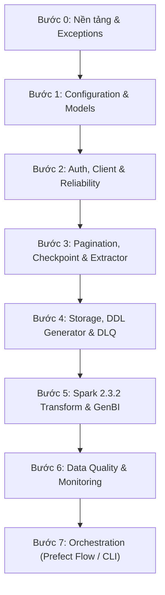

# CẨM NANG TRIỂN KHAI VÀ KIỂM THỬ TUẦN TỰ (OFFLINE ENVIRONMENT GUIDE)

> **Mục đích**: Tài liệu này phục vụ kỹ sư khi cần xây dựng lại toàn bộ source code từ đầu trên môi trường nội bộ công ty (bị chặn internet / GitHub bên ngoài).
> **Nguyên tắc vàng**: Triển khai theo thứ tự **Topological Dependency (từ dưới lên trên)**. Code đến đâu, viết test smoke test đến đó, đảm bảo 100% không bị lỗi thiếu thư viện (`ImportError`), không lỗi cú pháp (`SyntaxError`), và logic độc lập chạy chuẩn trước khi ghép vào module cha.

---

## 🗺️ TỔNG QUAN 8 BƯỚC TRIỂN KHAI TUẦN TỰ



---

## 📌 BƯỚC 0: NỀN TẢNG VÀ NGOẠI LỆ (FOUNDATION & EXCEPTIONS)

Đây là tầng dưới cùng của kiến trúc, không phụ thuộc vào bất kỳ file nội bộ nào khác.

### 1. Danh sách file cần viết theo thứ tự:
1. `exceptions/__init__.py`
2. `exceptions/errors.py` (Các class kế thừa: `APIError`, `APIHTTPError`, `APINetworkError`, `RateLimitExceededError`, `CircuitBreakerOpenError`, `PaginationError`, `CheckpointError`)
3. `utils/__init__.py`
4. `utils/env_loader.py`
5. `utils/helpers.py`

### 2. Lệnh Smoke Test ngay lập tức:
```bash
python -c "from exceptions.errors import RateLimitExceededError, CircuitBreakerOpenError, CheckpointError; print('✅ Exceptions loaded successfully!')"
```
*Tiêu chí PASS*: Màn hình in ra `✅ Exceptions loaded successfully!` không gặp `ImportError`.

---

## 📌 BƯỚC 1: CẤU HÌNH ĐỘNG VÀ SCHEMA (CONFIG & REGISTRY)

Tầng định nghĩa toàn bộ data structures, contracts giữa BA và hệ thống.

### 1. Danh sách file cần viết theo thứ tự:
1. `config/api_config.py` (`HttpMethod`, `PaginationType`, `AuthConfig`, `RateLimitConfig`, `RetryConfig`, `PaginationConfig`, `EndpointConfig`, `APIConfig`)
2. `config/job_config.py` (`ExtractionMode`, `ExtractionConfig`, `CheckpointConfig`, `StorageConfig`, `JobConfig`, `IncrementalConfig`)
3. `config/validator.py` (`ConfigValidator`)
4. `config/loader.py` (`ConfigLoader`)
5. `config/__init__.py` (`IngestionConfig`, `load_config`)
6. `config.json` (File cấu hình pipeline & các endpoints)
7. `tables_registry.json` (Registry chứa schema, primary key, metadata của các bảng)

### 2. Lệnh Smoke Test ngay lập tức:
```bash
python -c "from config.loader import ConfigLoader; cfg = ConfigLoader('config.json').load(); print(f'✅ Config loaded: {cfg.api.name}, Endpoints count: {len(cfg.api.endpoints)}')"
```
*Tiêu chí PASS*: Đọc được file JSON, parser deserialize thành công vào các Dataclass mà không bị báo lỗi thiếu trường.

---

## 📌 BƯỚC 2: BẢO MẬT, ĐỘ TIN CẬY VÀ HTTP CLIENT (RELIABILITY & CLIENT)

Tầng chịu trách nhiệm kết nối mạng an toàn, chống sập upstream API bằng Rate Limiter và Circuit Breaker.

### 1. Danh sách file cần viết theo thứ tự:
1. `auth/__init__.py`
2. `auth/base_auth.py`
3. `auth/token_auth.py`
4. `auth/session_auth.py`
5. `reliability/__init__.py`
6. `reliability/rate_limiter.py` (`RateLimiter` - Token bucket RPM + Daily cap)
7. `reliability/retry.py` (`RetryExecutor` - Exponential backoff + full jitter)
8. `reliability/circuit_breaker.py` (`CircuitBreaker` - State machine CLOSED -> OPEN -> HALF_OPEN)
9. `client/base_client.py`
10. `client/http_client.py`
11. `client/resilient_client.py` (`ResilientHTTPClient` gói cả 3 lớp bảo vệ)

### 2. Script Test độc lập (Tạo file `test_step2.py` tạm thời):
```python
# test_step2.py
from reliability.rate_limiter import RateLimiter
from reliability.circuit_breaker import CircuitBreaker, CircuitState
from reliability.retry import RetryExecutor
from exceptions.errors import CircuitBreakerOpenError

# 1. Test RateLimiter
rl = RateLimiter(requests_per_minute=60, requests_per_day=100)
rl.acquire()
assert rl.get_status()["daily_used"] == 1, "RateLimiter failed"

# 2. Test CircuitBreaker
cb = CircuitBreaker(failure_threshold=2, recovery_timeout=1)
def fail(): raise ValueError("Downstream down")

try: cb.call(fail)
except ValueError: pass
try: cb.call(fail)
except ValueError: pass

assert cb.state == CircuitState.OPEN, "Circuit should be OPEN"

print("✅ Step 2: RateLimiter & CircuitBreaker PASSED!")
```
Chạy: `python test_step2.py`
*Tiêu chí PASS*: In ra `✅ Step 2: RateLimiter & CircuitBreaker PASSED!` không có exception rò rỉ.

---

## 📌 BƯỚC 3: PHÂN TRANG, CHECKPOINT VÀ EXTRACTOR (EXTRACTION LAYER)

Tầng chịu trách nhiệm kéo dữ liệu qua nhiều trang, tự khôi phục điểm dừng khi crash.

### 1. Danh sách file cần viết theo thứ tự:
1. `pagination/__init__.py`
2. `pagination/base_paginator.py`
3. `pagination/offset_paginator.py` (Hỗ trợ inject offset vào query param hoặc body lồng nhau)
4. `pagination/page_paginator.py`
5. `pagination/cursor_paginator.py`
6. `checkpoint/__init__.py`
7. `checkpoint/checkpoint_store.py` (Ghi file nguyên tử `.tmp` rồi rename, lưu trữ watermark)
8. `ingestion/__init__.py`
9. `ingestion/extractor.py` (`Extractor`, `Batch` class)

### 2. Script Test độc lập (Tạo file `test_step3.py`):
```python
# test_step3.py
import os, shutil
from pagination.offset_paginator import OffsetPaginator
from checkpoint.checkpoint_store import CheckpointStore

# 1. Test Paginator
p = OffsetPaginator(page_size=50, location="body", offset_param="from", limit_param="limit")
_, body = p.get_next_params(base_body={"paging": {"from": 0, "limit": 50}})
assert body["paging"]["from"] == 0
p.update_state({"entities": [{}] * 50}, 50)
_, body2 = p.get_next_params(base_body={"paging": {"from": 0, "limit": 50}})
assert body2["paging"]["from"] == 50

# 2. Test Checkpoint Store
chk = CheckpointStore("./test_chk", "test_ep")
chk.commit({"last_offset": 50, "watermark": "2026-09-01T00:00:00Z"})
loaded = chk.load()
assert loaded["last_offset"] == 50
chk.mark_completed()
assert chk.load() is None  # Completed checkpoint returns None
shutil.rmtree("./test_chk", ignore_errors=True)

print("✅ Step 3: OffsetPaginator & CheckpointStore PASSED!")
```
Chạy: `python test_step3.py`
*Tiêu chí PASS*: In ra `✅ Step 3: OffsetPaginator & CheckpointStore PASSED!`.

---

## 📌 BƯỚC 4: LƯU TRỮ, DDL TRINO VÀ DEAD LETTER QUEUE (STORAGE LAYER)

Tầng chịu trách nhiệm điều phối dữ liệu lưu trữ vật lý và cách ly dữ liệu lỗi.

### 1. Danh sách file cần viết theo thứ tự:
1. `storage/__init__.py`
2. `storage/dlq_router.py` (`DeadLetterQueueRouter` - Cách ly record lỗi kèm metadata audit)
3. `storage/trino_ddl_generator.py` (`TrinoDDLGenerator` - Sinh mã SQL cho Trino `personal_raw` & `global_clean`)
4. `storage/tri_storage_sink.py` (`TriStorageSink` - Lưu MinIO Backup, Trino DB 1 và Trino DB 2)

### 2. Script Test độc lập (Tạo file `test_step4.py`):
```python
# test_step4.py
import os, shutil
from storage.trino_ddl_generator import TrinoDDLGenerator
from storage.dlq_router import DeadLetterQueueRouter

# 1. Test DDL Generator
gen = TrinoDDLGenerator("tables_registry.json", "./test_ddl")
scripts = gen.generate_all_ddl()
assert len(scripts) > 0
with open(list(scripts.values())[0], "r", encoding="utf-8") as f:
    sql = f.read()
    assert "CREATE TABLE IF NOT EXISTS hive.personal_raw" in sql
    assert "CREATE TABLE IF NOT EXISTS hive.global_clean" in sql

# 2. Test DLQ
dlq = DeadLetterQueueRouter("./test_dlq")
q_path = dlq.quarantine_records([{"id": "bad_1"}], "tasks", "MISSING_PK", {"job_id": "test_1"})
assert os.path.exists(q_path)

shutil.rmtree("./test_ddl", ignore_errors=True)
shutil.rmtree("./test_dlq", ignore_errors=True)
print("✅ Step 4: Trino DDL & DLQ Router PASSED!")
```
Chạy: `python test_step4.py`
*Tiêu chí PASS*: In ra `✅ Step 4: Trino DDL & DLQ Router PASSED!`.

---

## 📌 BƯỚC 5: XỬ LÝ DỮ LIỆU BẰNG SPARK 2.3.2 VÀ GENBI PACKER (TRANSFORM LAYER)

> **Lưu ý**: Tương thích hoàn toàn Spark 2.3.2 (Dùng Window Ranking thay vì `MERGE INTO`, dùng `rdd.isEmpty()` thay vì `df.isEmpty()`).

### 1. Danh sách file cần viết theo thứ tự:
1. `transform/__init__.py`
2. `transform/spark_session.py` (`get_spark_session` tích hợp MinIO S3A & Hive Metastore)
3. `transform/json_flattener.py` (`flatten_json_dataframe` đệ quy StructType)
4. `transform/dedup_engine.py` (`DeduplicationEngine` - Window ranking deduplication)
5. `transform/race_condition_router.py` (`KimballRaceConditionRouter` - Inferred Dimension stubs & reconciliation)
6. `transform/docstring_registry.py` (`DocstringRegistry` - Phân tích metadata dbt và sinh docs)
7. `transform/genbi_context_packer.py` (`GenBIContextPacker` - Đóng gói prompt LLM và template Apache ECharts)

### 2. Kiểm thử trên Apache Zeppelin (`%livy.spark`):
Mở file `notebooks/zeppelin_livy_test.py` và chạy tuần tự từng Paragraph:
- **Paragraph 1-3**: Khởi tạo session Spark 2.3.2 & Dummy nested JSON DataFrame.
- **Paragraph 4**: Flatten DataFrame (`df_flattened`).
- **Paragraph 5**: Dedup Engine (`DeduplicationEngine.deduplicate`).
- **Paragraph 6-7**: Kimball Race Condition (Tạo stub record cho Inferred Dimensions).
- **Paragraph 8-9**: Tri-Storage write validation.
- **Paragraph 10**: GenBI Semantic Context Pack generation (`genbi_context_pack_tasks.json`).
*Tiêu chí PASS*: Tất cả 10 Paragraphs trong Zeppelin báo trạng thái `FINISHED` màu xanh lá cây.

---

## 📌 BƯỚC 6: CHẤT LƯỢNG DỮ LIỆU VÀ GIÁM SÁT (QUALITY & MONITORING)

### 1. Danh sách file cần viết theo thứ tự:
1. `quality/__init__.py`
2. `quality/validator.py` (`DataQualityValidator` - single pass `concat_ws` validation)
3. `quality/statistics.py` (`ColumnStatisticsProfiler`)
4. `quality/profiler.py` (`QualityProfiler`, `QualityReport`)
5. `monitoring/__init__.py`
6. `monitoring/metrics.py` (`MetricsCollector`)
7. `monitoring/job_tracker.py` (`JobTracker`)

### 2. Lệnh Smoke Test:
```bash
python -c "from quality.validator import DataQualityValidator; from monitoring.metrics import MetricsCollector; m = MetricsCollector(); m.increment('records_in', 100); assert m.get_metric('records_in') == 100; print('✅ Step 6: Quality & Monitoring PASSED!')"
```
*Tiêu chí PASS*: In ra `✅ Step 6: Quality & Monitoring PASSED!`.

---

## 📌 BƯỚC 7: ĐIỀU PHỐI PREFECT FLOW VÀ ĐÓNG GÓI CHẠY THẬT (ORCHESTRATION & RUN)

Tầng trên cùng kết nối tất cả các mảnh ghép lại thành một ứng dụng hoàn chỉnh.

### 1. Danh sách file cần viết theo thứ tự:
1. `ingestion/writer.py` (`BatchWriter`, `PartitionedParquetWriter`)
2. `main.py` (Local run CLI)
3. `prefect_flow.py` (Prefect Flow kết nối Prefect HQ remote server)
4. `requirements.txt`
5. `Dockerfile`
6. `docker-compose.yml`
7. `.env` (Điền URL Prefect HQ, MinIO, Trino)

### 2. Lệnh Kiểm thử Tổng thể Cuối cùng (End-to-End Smoke Test):
```bash
# 1. Kiểm tra CLI parser không lỗi:
python prefect_flow.py --help

# 2. Chạy thử nghiệm ở chế độ dry-run / local check:
python main.py --endpoint muc_1 --config config.json
```

---

## 🎯 BẢNG CHECKLIST NGHIỆM THU CUỐI CÙNG (ZERO-BUG GUARANTEE)

| STT | Hạng mục kiểm tra | Lệnh xác minh | Kết quả mong đợi |
| :---: | :--- | :--- | :--- |
| 1 | Toàn bộ module không lỗi cú pháp | `python -m compileall .` | 0 file error |
| 2 | Config JSON đúng schema | `python -c "from config.loader import ConfigLoader; ConfigLoader('config.json').load()"` | Load thành công |
| 3 | Schema DDL Trino sinh chuẩn | `python -c "from storage.trino_ddl_generator import TrinoDDLGenerator; TrinoDDLGenerator('tables_registry.json').generate_all_ddl()"` | Sinh ra các file `.sql` |
| 4 | Spark 2.3.2 tương thích | Chạy Paragraph 1-10 trong `notebooks/zeppelin_livy_test.py` | 10/10 FINISHED |
| 5 | Prefect CLI sẵn sàng | `python prefect_flow.py --help` | Hiển thị bảng hướng dẫn CLI |
