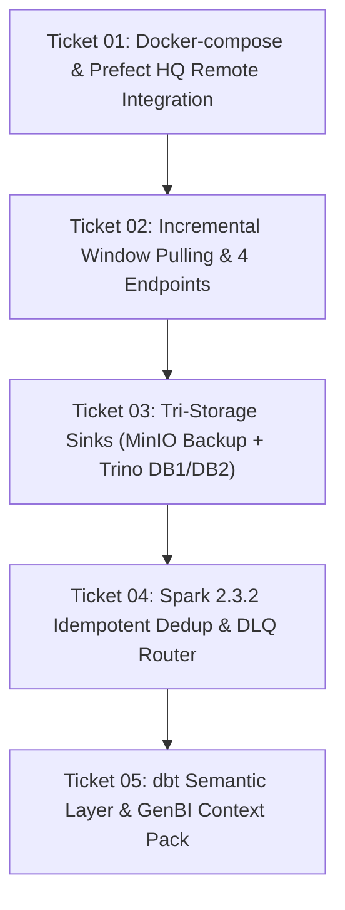

# LỘ TRÌNH VÀ CHI TIẾT CÁC TICKETS TRIỂN KHAI
*(Tracer-Bullet Vertical Slices & Execution Plan)*

Tài liệu này định nghĩa 5 tickets lát cắt dọc (Vertical Slice Tickets) theo phương pháp kỹ thuật chuẩn. Mỗi ticket có thể kiểm thử và nghiệm thu độc lập, đồng thời tuân thủ triệt để nguyên tắc **Deep Module** (giao diện nhỏ gọn, logic chuyên sâu bên trong).

---

## 🎫 TICKET 01: DOCKER-COMPOSE & PREFECT HQ REMOTE INTEGRATION

### 1. Mô tả mục tiêu
Đóng gói toàn bộ framework `api_ingestion` vào container Docker và thiết lập cấu hình `docker-compose.yml` để worker chạy ngầm trên server, tự động kết nối và nhận lệnh từ Prefect HQ server đã dựng sẵn thông qua biến môi trường `PREFECT_API_URL`.

### 2. Sự phụ thuộc (Blocked by)
- **Blocked by:** Không (Bắt đầu ngay).

### 3. Giá trị bàn giao (What it delivers)
- Môi trường thực thi đồng nhất giữa máy local và server production.
- Khả năng trigger pipeline trực tiếp từ Prefect HQ UI hoặc theo lịch trình (cron).
- Cấu hình mạng an toàn, cô lập phụ thuộc Python, không phụ thuộc vào OS server.

### 4. Tiêu chí nghiệm thu (Acceptance Criteria)
- [ ] `Dockerfile` build thành công image nhẹ với Python 3.10 và các dependencies cần thiết.
- [ ] `docker-compose.yml` khai báo service worker với `PREFECT_API_URL`, mount volumes phù hợp.
- [ ] Lệnh `docker-compose up -d` khởi động worker thành công, worker hiển thị trạng thái `Online` trên Prefect HQ Work Pool.
- [ ] Kích hoạt thử một flow dry-run từ giao diện web của Prefect HQ và xem được log realtime.

---

## 🎫 TICKET 02: INCREMENTAL WINDOW PULLING & 4-ENDPOINT ADAPTIVE CONFIGURATION

### 1. Mô tả mục tiêu
Nâng cấp `Extractor` và cấu trúc `config.json` để hỗ trợ cơ chế lọc dữ liệu theo cửa sổ thời gian (`window_start` ➜ `window_end` dựa trên trường cập nhật như `updated_at`, `modified_date`), đồng thời hỗ trợ quản lý độc lập 4 mục dữ liệu lớn (mục-1, mục-2, mục-3, mục-4) mà không gây quá tải connection pool của API nguồn.

### 2. Sự phụ thuộc (Blocked by)
- **Blocked by:** Ticket 01.

### 3. Giá trị bàn giao (What it delivers)
- Chế độ kéo gia tăng (Incremental Pull) chỉ lấy bản ghi mới hoặc có sửa đổi trong khoảng thời gian chỉ định, tiết kiệm 80-90% quota API.
- Cấu hình template chuẩn hóa cho cả 4 endpoints mục tiêu.
- Thống kê chi tiết tốc độ kéo (Records/second, Request count, RPM thực tế).

### 4. Tiêu chí nghiệm thu (Acceptance Criteria)
- [ ] `config.json` mở rộng hỗ trợ định nghĩa tham số cửa sổ thời gian `${WINDOW_START}` và `${WINDOW_END}`.
- [ ] Cấu hình mẫu cho cả 4 endpoints (mục-1, mục-2, mục-3, mục-4).
- [ ] `Extractor` tự động đọc checkpoint gần nhất để làm `window_start` cho lần chạy kế tiếp nếu không có tham số truyền vào từ CLI.
- [ ] Đo lường chính xác và ghi log structured JSON về: tổng requests, throughput, và rate-limit headroom.

---

## 🎫 TICKET 03: TRI-STORAGE SINK ENGINE (MINIO BACKUP + TRINO DB1 + TRINO DB2)

### 1. Mô tả mục tiêu
Xây dựng module lưu trữ đa tầng (`TriStorageSink`) cho Spark: ghi đồng thời một bản backup raw bất biến dạng JSON nén lên MinIO (`s3a://lakehouse/raw_backup/`), một bản Parquet thô vào Trino DB1 (`personal_raw`), và một bản Parquet sạch đã chuẩn hóa vào Trino DB2 (`global_clean`) có đồng bộ metadata với Hive Metastore.

### 2. Sự phụ thuộc (Blocked by)
- **Blocked by:** Ticket 02.

### 3. Giá trị bàn giao (What it delivers)
- Đáp ứng trọn vẹn yêu cầu bảo vệ dữ liệu: luôn có bản backup thô trên MinIO để khôi phục khi cần.
- Data Engineer / Data Scientist có Database cá nhân (DB1) trên Trino để query dữ liệu raw và thử nghiệm thuật toán mà không ảnh hưởng đến dữ liệu sản xuất.
- Database tổng (DB2) lưu trữ dữ liệu sạch, phân vùng tối ưu cho báo cáo và BI.

### 4. Tiêu chí nghiệm thu (Acceptance Criteria)
- [ ] `SparkSessionFactory` cấu hình đầy đủ thông số kết nối S3A/MinIO (`fs.s3a.endpoint`, `fs.s3a.access.key`, `fs.s3a.secret.key`).
- [ ] Dữ liệu raw được nén `.gz` và lưu trữ phân vùng theo ngày trên MinIO bucket `raw_backup`.
- [ ] Trino kết nối được và query thành công cả 2 bảng: `SELECT COUNT(*) FROM personal_raw.mục_1` và `SELECT COUNT(*) FROM global_clean.mục_1`.

---

## 🎫 TICKET 04: SPARK 2.3.2 IDEMPOTENT DEDUP, RACE CONDITION & DLQ ROUTER

### 1. Mô tả mục tiêu
Xử lý các bài toán kỹ thuật phức tạp trên Spark 2.3.2: loại bỏ trùng lặp phiên bản trong các đợt incremental hẹp bằng Window Ranking (`row_number`), ghi đè phân vùng động an toàn (`dynamic partition overwrite`), giải quyết race condition giữa bảng Fact và Dimension (kỹ thuật Inferred Member), và phân loại định tuyến bản ghi lỗi vào Dead-Letter-Queue (DLQ) trên MinIO.

### 2. Sự phụ thuộc (Blocked by)
- **Blocked by:** Ticket 03.

### 3. Giá trị bàn giao (What it delivers)
- Đảm bảo tính Idempotency: Chạy lại pipeline nhiều lần cho cùng một khoảng thời gian không làm nhân bản dữ liệu trên Trino.
- Không bao giờ bị lỗi khóa ngoại khi Fact về trước Dimension (Late-arriving dimension records).
- Dữ liệu lỗi không làm chết pipeline mà được cách ly an toàn vào DLQ, đi kèm báo cáo trực quan trên Prefect Artifacts.

### 4. Tiêu chí nghiệm thu (Acceptance Criteria)
- [ ] Logic deduplication loại bỏ sạch các version cũ của cùng một `entity_id` trong batch.
- [ ] Cờ `spark.sql.sources.partitionOverwriteMode = dynamic` hoạt động chính xác: chỉ ghi đè partition hiện tại, không xóa mất dữ liệu lịch sử.
- [ ] Cơ chế Inferred Dimension Member tự động tạo bản ghi tạm `PENDING_ENRICHMENT` cho các khóa ngoại chưa kịp xuất hiện.
- [ ] Bản ghi vi phạm validation rule tự động rẽ nhánh vào thư mục `/dlq/` trên MinIO kèm thẻ lỗi.
- [ ] Prefect HQ hiển thị bảng tóm tắt số lượng bản ghi Valid vs DLQ trong tab Artifacts.

---

## 🎫 TICKET 05: DBT SEMANTIC LAYER MODELING & GENBI KNOWLEDGE CONTEXT PACK

### 1. Mô tả mục tiêu
Thiết lập bộ khung dự án dbt (Silver & Gold models) và nâng cấp `DocstringRegistry` thành `DbtSemanticRegistry`. Module này tự động sinh file `schema.yml` chứa các thẻ `meta` giàu ngữ nghĩa (Synonyms, Roles biểu đồ: `chart_role` là `x_axis`, `y_axis`, `series`), đồng thời trích xuất toàn bộ schema và mối quan hệ thành một file ngữ cảnh nén (`genbi_context_pack.json`) sẵn sàng nạp cho AI LLM phục vụ Text-to-SQL và sinh Biểu đồ.

### 2. Sự phụ thuộc (Blocked by)
- **Blocked by:** Ticket 04.

### 3. Giá trị bàn giao (What it delivers)
- Cấu trúc dbt chuẩn mực: Silver (Làm sạch & chuẩn hóa) ➜ Gold (Mô hình Star Schema: Fact & Dimensions).
- Đầy đủ thông tin cho công cụ GenBI (AI LLM): LLM hiểu được các từ đồng nghĩa tiếng Việt ("doanh thu", "tiến độ", "công việc") và công thức tính toán.
- Định dạng dữ liệu chuẩn giúp LLM trả về cùng lúc: **Đoạn văn phân tích (Text insights)** và **Cấu hình biểu đồ trực quan (ECharts / Chart.js Spec)**.

### 4. Tiêu chí nghiệm thu (Acceptance Criteria)
- [ ] `DbtSemanticRegistry` sinh file `schema.yml` có chứa các thẻ: `meta.chart_role`, `meta.synonyms`, `meta.valid_values`.
- [ ] Tự động nhận diện trường thời gian gán `chart_role: x_axis`, trường số gán `chart_role: y_axis`.
- [ ] Script trích xuất `genbi_context_pack.json` tạo ra file JSON tổng hợp gọn nhẹ gồm danh sách bảng, cột, kiểu dữ liệu, gợi ý biểu đồ và quan hệ khóa ngoại.
- [ ] Có sẵn template prompt cho GenBI hướng dẫn LLM sinh đầu ra theo cấu trúc `{ sql, text_insights, visualization }`.
