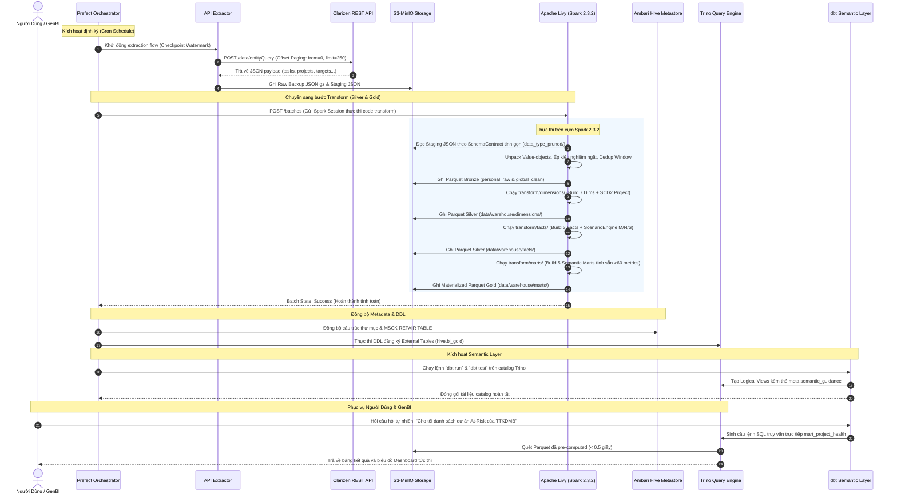

Searched for files: *
Viewed dbt_project.yml:1-23
Viewed epm__sources.yml:1-307
Viewed epm_projects.sql:1-3
Viewed epm_projects__schema.yml:1-60

Chào bạn, dưới đây là bản tài liệu tổng hợp kỹ thuật toàn diện cho dự án **EPM Data Warehouse & NextGen-BI**, được cấu trúc rành mạch và chi tiết theo đúng các yêu cầu và định hướng công nghệ bạn đã đưa ra (**Python 3.7.1 | Spark 2.3.2 chạy `spark.sql` qua Apache Livy | Trino / Ambari Hive | S3-MinIO | dbt Core**).

---

# BẢN ĐẶC TẢ THIẾT KẾ DATA WAREHOUSE & ELT PIPELINE CHO EPM

---

## PHẦN 1: THIẾT KẾ STAR / CONSTELLATION SCHEMA CHO 6 BUSINESS REQUIREMENTS

Dựa trên 6 bài toán báo cáo nghiệp vụ (Business Requirements), chúng ta chuẩn hóa dữ liệu từ 5 bảng API nguồn (`projects`, `tasks`, `objectives`, `c_assignments`, `targets`) và nguồn log truy cập (`user_login_activity`) thành mô hình **Constellation Schema** gồm **7 Dimension Tables dùng chung (Conformed Dimensions)** và **5 Fact Tables chuyên biệt**.

```
                ┌──────────────────┐       ┌────────────────────┐
                │     dim_date     │       │   dim_department   │
                └────────┬─────────┘       └─────────┬──────────┘
                         │                           │
 ┌───────────────────────┼───────────────────────────┼────────────────────────┐
 │                       │                           │                        │
 ▼                       ▼                           ▼                        ▼
┌──────────────────┐   ┌──────────────────────┐   ┌──────────────────────┐  ┌───────────────────────┐
│ fact_target_bsc  │   │ fact_cvct_execution  │   │ fact_task_execution  │  │ fact_project_progress │
│   _snapshot      │   │      _snapshot       │   │      _snapshot       │  │      _snapshot        │
│ (BR 1 & BR 6)    │   │       (BR 2)         │   │       (BR 3)         │  │       (BR 4)          │
└────────┬─────────┘   └──────────┬───────────┘   └──────────┬───────────┘  └───────────┬───────────┘
         │                        │                          │                          │
 ┌───────┴───────────────┬────────┴──────────────────────────┴──────────────────────────┘
 │                       │                           │
 ▼                       ▼                           ▼
┌──────────────────┐   ┌──────────────────────┐   ┌──────────────────────┐  ┌───────────────────────┐
│   dim_project    │   │     dim_resource     │   │     dim_task         │  │ fact_epm_user_access  │
│  (SCD Type 2)    │   │  (Users/Assignees)   │   │  (WBS Structure)     │  │       (BR 5)          │
└──────────────────┘   └──────────────────────┘   └──────────────────────┘  └───────────────────────┘
```

---

### 1.1. Ma Trận Ánh Xạ 6 Business Requirements Sang Fact & Dimensions

| Business Requirement | Fact Table Đảm Nhiệm | Dimensions Liên Kết | Các Chỉ Số (Measures) Trọng Tâm |
|:---|:---|:---|:---|
| **1. Báo cáo BSC trong năm** | `fact_target_bsc_snapshot` | `dim_date`, `dim_objective`, `dim_project`, `dim_department`, `dim_resource` | `target_value_m`, `target_result_m`, `target_value_n`, `target_result_n`, `% đạt kịch bản M/N`, `gap_value` |
| **2. Báo cáo điều hành CVCT / KLCĐ** *(Công việc trọng tâm / Khối lượng công việc)* | `fact_cvct_execution_snapshot` | `dim_date`, `dim_assignment`, `dim_resource` (assignee, resources), `dim_department` | `%complete`, `target_value_m`, `target_date_m`, `days_overdue`, `is_overdue` |
| **3. Báo cáo Task (WBS & Jira)** | `fact_task_execution_snapshot` | `dim_date`, `dim_task`, `dim_project`, `dim_resource`, `dim_department` | `work` (kế hoạch), `actual_effort`, `duration`, `actual_duration`, `%complete`, `duration_variance` |
| **4. Báo cáo Dự án** | `fact_project_progress_snapshot` | `dim_date`, `dim_project` (SCD 2), `dim_department`, `dim_resource` (PM, Assignor, Resources) | `%complete`, `total_tasks`, `overdue_tasks`, `health_score`, `work_efficiency`, `track_status` |
| **5. Báo cáo lưu lượng truy cập EPM** | `fact_epm_user_access` | `dim_date`, `dim_resource` (User profile) | `login_count`, `session_duration_minutes`, `action_count`, `last_login_time` |
| **6. Báo cáo mục tiêu Ban Giám Đốc (BG)** | `fact_target_bsc_snapshot` *(Bộ lọc cấp BG)* | `dim_date`, `dim_objective` (Level 1), `dim_department`, `dim_resource` (Assignor = BG) | Kịch bản M, N (Value, Result, Date), Đánh giá hoàn thành trọng tâm Ban Giám đốc |

---

### 1.2. Chi Tiết Các Bảng Fact (Định Kỳ Theo Ngày — Daily Periodic Snapshot)

#### A. `fact_target_bsc_snapshot` (Phục vụ BR 1 & BR 6)
* **Grain:** 1 dòng cho mỗi `target_id` $\times$ mỗi kịch bản (M/N/S) $\times$ ngày snapshot.
* **Foreign Keys:** `date_key`, `target_id`, `objective_id`, `project_id`, `department_id`, `assignee_id`, `assignor_id`.
* **Measures:**
  * `target_value_m`, `target_result_m`, `target_date_m_key`
  * `target_value_n`, `target_result_n`, `target_date_n_key`
  * `achievement_pct_m`, `achievement_pct_n` (Tỷ lệ đạt %)
  * `gap_value_m` ($Value_M - Result_M$), `gap_pct_m`
  * `weight` (Trọng số BSC), `weighted_achievement_score`
  * `is_achieved_m` (BOOLEAN), `is_at_risk` (BOOLEAN)
* **Thuộc tính ngữ cảnh:** `target_type`, `unit`, `state`, `status`, `is_board_level` (Cờ mục tiêu cấp BG).

#### B. `fact_cvct_execution_snapshot` (Phục vụ BR 2 — CVCT/KLCĐ)
* **Grain:** 1 dòng cho mỗi Phiếu giao việc (`assignment_id`) $\times$ Nhân sự (`assignee_id`) $\times$ Ngày snapshot.
* **Foreign Keys:** `date_key`, `assignment_id`, `assignee_id`, `department_id`, `due_date_key`.
* **Measures:**
  * `percent_completed` (% hoàn thành giao việc)
  * `target_value_m`, `target_result_m`
  * `days_to_deadline`, `days_overdue`
  * `achievement_rate` (Tỷ lệ hoàn thành nhiệm vụ %)
  * `total_weight` (Tổng trọng số giao việc)
* **Thuộc tính:** `assignment_name`, `status`, `resources` (Nhân sự phối hợp).

#### C. `fact_task_execution_snapshot` (Phục vụ BR 3 — Task)
* **Grain:** 1 dòng cho mỗi `task_id` $\times$ Ngày snapshot.
* **Foreign Keys:** `date_key`, `task_id`, `project_id`, `assignee_id`, `department_id`, `start_date_key`, `due_date_key`.
* **Measures:**
  * `percent_completed`
  * `work_planned` (Giờ công kế hoạch), `actual_effort` (Giờ công thực tế timesheet)
  * `duration_planned`, `actual_duration`
  * `duration_variance` ($Actual - Planned$), `effort_variance`
  * `priority` (Mức ưu tiên), `is_overdue` (Cờ trễ hạn)
* **Thuộc tính:** `task_type`, `jira_status` (`external_id`), `epm_default`, `update_description`.

#### D. `fact_project_progress_snapshot` (Phục vụ BR 4 — Dự án)
* **Grain:** 1 dòng cho mỗi `project_id` $\times$ Ngày snapshot.
* **Foreign Keys:** `date_key`, `project_id`, `department_id`, `project_manager_id`, `assignee_id`, `assignor_id`.
* **Measures:**
  * `percent_completed` (% tiến độ dự án)
  * `total_tasks`, `completed_tasks`, `overdue_tasks`
  * `task_overdue_ratio` ($overdue\_tasks / total\_tasks$)
  * `work_efficiency` ($work\_planned / actual\_effort$)
  * `health_score` (Điểm sức khỏe 0-100 tính sẵn theo trọng số 40-25-20-15)
* **Thuộc tính:** `project_type`, `state`, `track_status` (OnTrack/AtRisk/OffTrack), `due_date_key`.

#### E. `fact_epm_user_access` (Phục vụ BR 5 — Lưu lượng truy cập)
* **Grain:** 1 dòng cho mỗi `user_id` $\times$ Ngày truy cập (`login_date_key`).
* **Foreign Keys:** `login_date_key`, `user_id`, `department_id`, `direct_manager_id`.
* **Measures:**
  * `login_count` (Số lần đăng nhập trong ngày)
  * `total_active_minutes` (Tổng thời gian phiên làm việc)
  * `actions_performed` (Số lượng thao tác CRUD/cập nhật dữ liệu)
  * `is_active_user` (Cờ người dùng có phát sinh thao tác)
* **Thuộc tính:** `groups`, `job_title`, `direct_manager`.

---

### 1.3. Chi Tiết 7 Conformed Dimensions Dùng Chung

1. **`dim_date` (Date Spine 2020-2030):** Khóa chính `date_key` (INTEGER `YYYYMMDD`), `full_date`, `year`, `quarter`, `month`, `week_of_year`, `day_of_week`, `fiscal_year`, `fiscal_quarter`.
2. **`dim_department` (Phòng ban):** `department_sk`, `department_id` (URI gốc), `department_name`, `division_name`.
3. **`dim_resource` (Nhân sự / Users):** `resource_sk`, `resource_id` (URI `/User/xxx`), `full_name`, `first_name`, `last_name`, `job_title`, `direct_manager`, `groups`, `resource_type` (User, Placeholder, Team).
4. **`dim_project` (Dự án — SCD Type 2):** `project_sk`, `project_id` (SYSID), `project_name`, `project_type`, `project_manager_id`, `department_id`, `track_status`, `state`, `valid_from`, `valid_to`, `is_current`, `version`.
5. **`dim_task` (Công việc WBS):** `task_sk`, `task_id` (SYSID), `task_name`, `task_type`, `parent_task_id`, `project_id`, `external_id` (Jira Status), `priority`.
6. **`dim_objective` (Mục tiêu BSC — Hierarchy):** `objective_sk`, `objective_id` (SYSID), `objective_name`, `objective_type` (Tài chính, Khách hàng, Quy trình, Học hỏi), `hierarchy_level` (Cấp 1 = Ban Giám đốc, Cấp 2 = Khối/Phòng), `root_objective_id`.
7. **`dim_assignment` (Phiếu giao việc):** `assignment_sk`, `assignment_id` (SYSID), `assignment_name`, `parent_assignment_id`, `total_weight`.

---

## PHẦN 2: CHIẾN LƯỢC CRAWL API & TÍNH CHẤT DỮ LIỆU

### 2.1. Phân Tích Tính Chất Dữ Liệu & Hạn Ngạch API

* **Ràng buộc Clarizen API:** Hạn ngạch tối đa **1.000 requests/ngày**, tốc độ tối đa 60–100 requests/phút, `page_size = 250` bản ghi/request $\rightarrow$ Tổng dung lượng cào tối đa lý thuyết: ~250.000 bản ghi/ngày.
* **Đặc tính dữ liệu của 6 nhóm thực thể:**

| Thực thể API | Số bản ghi ước tính | Tần suất thay đổi dữ liệu | Chiến lược Crawl | Tần suất & Khung giờ chạy | Số Request tiêu tốn (Ước tính) |
|:---|:---:|:---|:---:|:---|:---:|
| **`tasks`** | ~50.000 | **Rất cao** (Nhân viên cập nhật timesheet, status, % complete liên tục) | **Incremental** (theo `LastUpdatedOn`) + **Full weekly** (Chủ nhật) | • Incremental: 2 giờ/lần (8:00 – 18:00, 6 lần/ngày)<br>• Full: 02:00 sáng Chủ nhật | • Incremental: ~5-15 req/lần $\times 6 \approx 60$ req<br>• Full: ~200 req/tuần |
| **`projects`** | ~2.000 | **Trung bình** (PM cập nhật mốc tiến độ, track status theo tuần/tháng) | **Incremental** hàng ngày + **Full** đầu tháng | • Incremental: 2 lần/ngày (12:00 & 18:30)<br>• Full: 01:00 sáng ngày 1 hàng tháng | • Incremental: ~2 req/lần $\times 2 = 4$ req<br>• Full: ~8 req |
| **`targets`** | ~10.000 | **Trung bình** (Cập nhật kết quả định kỳ theo tuần/kỳ đánh giá) | **Incremental** hàng ngày | • Incremental: 2 lần/ngày (12:30 & 19:00) | • Incremental: ~5 req/lần $\times 2 = 10$ req |
| **`c_assignments`** | ~1.000 | **Thấp** (Giao việc phát sinh theo đợt giao ban tháng/quý) | **Full Crawl** hàng ngày | • Full: 1 lần/ngày (03:00 sáng) | • Full: ~4 req/ngày |
| **`objectives` (BSC)**| ~500 | **Rất thấp** (Mục tiêu chiến lược năm, chốt theo quý) | **Full Crawl** hàng ngày | • Full: 1 lần/ngày (03:30 sáng) | • Full: ~2 req/ngày |
| **`user_access_log`** | ~5.000 logs/ngày| **Chỉ thêm mới** (Log sự kiện đăng nhập và phiên làm việc) | **Incremental** theo ngày ($T-1$) | • Incremental: 1 lần/ngày (01:00 sáng, lấy ngày hôm trước) | • Incremental: ~20 req/ngày |
| **TỔNG CỘNG** | | | | **Hàng ngày: ~100 – 120 requests/ngày** *(Dư 88% quota dự phòng)* | |

---

### 2.2. Cơ Chế Chống "Deep Paging" & Xử Lý "Cold-Start"

1. **Cơ chế Incremental Window Function (LastUpdatedOn)**:
   Mỗi lần chạy gia số, bộ lọc Clarizen API áp dụng điều kiện:
   $$\text{LastUpdatedOn} \ge \text{WINDOW\_START} \quad \text{AND} \quad \text{LastUpdatedOn} < \text{WINDOW\_END}$$
   * `WINDOW_START`: Lấy từ `checkpoint_store.json` của lần chạy thành công trước (trừ 5 phút dự phòng trễ mạng).
   * `WINDOW_END`: Thời điểm hiện tại `datetime.utcnow()`.
   * **Giải quyết Deep Paging:** Do chỉ lấy các bản ghi thay đổi trong 2 giờ qua, số lượng bản ghi chỉ từ vài chục đến vài trăm dòng $\rightarrow$ Luôn nằm trong **1 đến 2 trang đầu tiên** (`from: 0, limit: 250`), không bao giờ bị vượt trang sâu.

2. **Xử lý Cold-Start (Khởi động hệ thống lần đầu)**:
   * Không chạy một request khổng lồ quét từ năm 1970 (sẽ gây timeout và tràn bộ nhớ).
   * Sử dụng script phân đoạn cửa sổ thời gian (Sliding Window): Chia lịch sử thành từng tháng (ví dụ: `2025-01-01` đến `2025-02-01`, `2025-02-01` đến `2025-03-01`...) để kéo tuần tự, lưu checkpoint từng chặng.

---

## PHẦN 3: TẦNG DATA WAREHOUSE: NÊN THIẾT KẾ VIEW HAY MATERIALIZED VIEW?

### 3.1. Phân Tích Bối Cảnh Hạ Tầng Công Nghệ
Hệ thống sử dụng:
* **Storage:** S3-MinIO lưu trữ định dạng Parquet nén Snappy.
* **Compute Engine:** Apache Spark 2.3.2 chạy `spark.sql` thông qua **Apache Livy**.
* **Metastore & Catalog:** Apache Ambari (HDP Hive Metastore).
* **Query & BI Engine:** Trino (PrestoSQL) kết nối qua Hive Catalog.

Trong bối cảnh này, Trino **không có** cơ chế tự động làm mới Materialized View theo transaction log nội tại như Snowflake hay BigQuery. Nếu tạo câu lệnh `CREATE VIEW` thông thường trong Trino mà view đó chứa nhiều phép JOIN 5 bảng, phân cấp Hierarchy, Window Functions (Ranking, Lag/Lead, Percentile), mỗi khi Dashboard mở ra hoặc GenAI truy vấn, Trino sẽ phải quét hàng triệu dòng từ Parquet trên MinIO và tính toán lại từ đầu $\rightarrow$ **Gây nghẽn truy vấn và Cold-start rất lớn cho người dùng**.

---

### 3.2. Mô Hình Khuyến Nghị: Kiến Trúc Lai Hai Tầng (Two-Tier Hybrid Architecture)

```
┌────────────────────────────────────────────────────────────────────────────────────────┐
│                        KIẾN TRÚC HYBRID VIEW / MATERIALIZED VIEW                       │
├────────────────────────────────────────────────────────────────────────────────────────┤
│ TẦNG 1: MATERIALIZED PARQUET TABLES (Tầng Xử Lý Nặng — Spark/Livy)                    │
│   - Thực thể: Toàn bộ Dimensions, Facts, và 5 Semantic Marts.                          │
│   - Cách làm: Spark 2.3.2 qua Livy tính toán toàn bộ joins, rankings, ratios, và ghi  │
│     thành các file Parquet vật lý tại: `data/warehouse/marts/<mart_name>/`.            │
│   - Trino DDL: Đăng ký dưới dạng **External Table** trỏ vào thư mục Parquet.           │
│   - Ưu điểm: Tốc độ truy vấn tức thì (< 0.5s), không phụ thuộc vào tải tính toán lúc  │
│     người dùng mở dashboard.                                                           │
├────────────────────────────────────────────────────────────────────────────────────────┤
│ TẦNG 2: LOGICAL SEMANTIC VIEWS (Tầng Trình Diễn & Phân Quyền — Trino / dbt)           │
│   - Thực thể: Các View logic được dbt sinh ra trên Trino (`dbt materialized='view'`).  │
│   - Cách làm: `SELECT * FROM hive.bi_gold.mart_project_health WHERE is_stale = false`  │
│   - Mục đích:                                                                          │
│       + Đặt tên bí danh tiếng Việt thân thiện cho GenBI.                               │
│       + Lọc bản ghi hiện hành: `v_dim_project_current` (`WHERE is_current = true`).    │
│       + Phân quyền hàng theo phòng ban (Row-level Security).                           │
│   - Ưu điểm: Gọn nhẹ, không tốn dung lượng ổ đĩa, thay đổi logic hiển thị tức thì.     │
└────────────────────────────────────────────────────────────────────────────────────────┘
```

> **Kết luận:** Tầng tính toán chỉ số (Facts & Marts) **BẮT BUỘC là Materialized (Parquet vật lý)** do Spark/Livy xử lý. Tầng giao tiếp với người dùng và GenBI là **Logical Views** trỏ vào các bảng Materialized đó.

---

## PHẦN 4: TÁC ĐỘNG CỦA CÁC TẦNG XỬ LÝ ĐẾN KHÔNG GIAN GENBI / dbt METRICS

dbt không chỉ đơn thuần là công cụ chuyển đổi dữ liệu (Transform Tool), mà trong dự án này, dbt đóng vai trò là **"Cổng Ngữ Nghĩa (Semantic Gateway)"** giúp Trợ lý Trí tuệ Nhân tạo (GenBI / LLM) hiểu đúng và truy vấn chính xác dữ liệu doanh nghiệp.

```
Clarizen Raw Data ──► Spark/Livy Conformance ──► Materialized Marts ──► dbt Semantic Layer ──► GenBI (LLM)
(Dữ liệu thô lộn xộn) (Ép kiểu, Unpivot, SCD2)   (Tính sẵn >60 metrics)   (Gắn nhãn, synonyms)   (Trả lời chính xác)
```

Mọi quyết định thiết kế ở các tầng xử lý phía trên đều ảnh hưởng trực tiếp đến chất lượng câu trả lời của GenBI theo 4 khía cạnh:

---

### 4.1. Cách Crawl (All vs Incremental) ảnh hưởng đến khả năng "Time-Travel" của AI
* **Ảnh hưởng:** Nếu pipeline crawl bị rách dữ liệu (mất bản ghi lịch sử do chỉ lấy gia số mà không có snapshot), khi người dùng hỏi: *"Tháng 4 năm ngoái, tiến độ dự án Core Banking là bao nhiêu?"*, GenAI sẽ không tìm thấy dữ liệu và sinh ra hiện tượng **Ảo giác (Hallucination)** hoặc trả lời sai bằng số liệu của tháng hiện tại.
* **Giải pháp:** Cơ chế **Periodic Snapshot Fact** chụp ảnh trạng thái định kỳ mỗi ngày cho phép GenBI tự tin viết câu lệnh SQL lọc theo `snapshot_date = DATE '2025-04-30'`.

---

### 4.2. Cách Chuẩn Hóa & Bóc Tách Value-Objects ảnh hưởng đến phép toán của AI
* **Ảnh hưởng:** Clarizen API trả về các trường dạng JSON lồng nhau như `{ "currency": "VND", "value": 150000000 }` hoặc chuỗi boolean `"true"/"false"`. Nếu tầng Ingestion không bóc tách triệt để mà để dạng chuỗi:
  * GenAI sẽ sinh ra câu lệnh `SUM(work)` hoặc `SUM(target_value)` bị lỗi cú pháp vì không thể cộng trừ trên chuỗi JSON.
* **Giải pháp:** Lớp `contract_conformer.py` đã bóc tách phẳng thành kiểu `DOUBLE` thuần túy, giúp GenAI sinh câu lệnh tính tổng, trung bình hoàn toàn trơn tru.

---

### 4.3. Thiết Kế SCD Type 2 ảnh hưởng đến việc quy trách nhiệm thời gian của AI
* **Ảnh hưởng:** Khi lãnh đạo hỏi: *"Dự án X lúc anh Nam làm Giám đốc dự án thì đạt được những mục tiêu nào?"*:
  * Nếu là SCD Type 1 (ghi đè), dự án hiện tại do chị Hoa quản lý $\rightarrow$ AI sẽ trả lời: *"Anh Nam không quản lý dự án X"*.
* **Giải pháp:** Với các cột `valid_from`, `valid_to`, `is_current` trong `dim_project`, file `epm_projects__schema.yml` của dbt sẽ hướng dẫn cho AI cấu trúc join:
  ```sql
  ON fact.snapshot_date BETWEEN dim_project.valid_from AND dim_project.valid_to
  ```

---

### 4.4. Tài Liệu Hóa Semantic Guidance trong dbt YML ảnh hưởng đến việc hiểu ngữ cảnh của AI
* **Ảnh hưởng:** Trong doanh nghiệp có các thuật ngữ viết tắt đặc thù: `CVCT` (Công việc trọng tâm), `KLCĐ` (Khối lượng công việc định kỳ), `Kịch bản M` (Must-have/Cam kết), `Kịch bản N` (Normal/Phấn đấu), `Kịch bản S` (Stretch/Thách thức).
* **Giải pháp:** Trong thư mục `working/nextgen-bi-dbt/nextgen-bi-dbt/dbt_projects/epm/models/`, các file `__schema.yml` khai báo chi tiết thẻ `meta.semantic_guidance` và `meta.dimension.label`:
  * Khi người dùng hỏi: *"Cho tôi các mục tiêu cam kết bị trễ"*, AI sẽ tự động map cụm từ *"mục tiêu cam kết"* $\rightarrow$ `scenario = 'M'` và *"bị trễ"* $\rightarrow$ `is_overdue = true` hoặc `days_to_deadline < 0`.

---

## PHẦN 5: ELT DIAGRAM, TASKFLOW & CÔNG CỤ KỸ THUẬT (ELT TOOLS)

### 5.1. Sơ Đồ Kiến Trúc Luồng Dữ Liệu Tổng Thể (ELT Diagram)

```
┌─────────────────────────────────────────────────────────────────────────────────────────────────┐
│ [1] NGUỒN DỮ LIỆU & CRAWLER ENGINE                                                              │
│     Clarizen REST API v2.0 ──(OffsetPaginator + ResilientHTTPClient)──► Raw JSON Gz             │
│                                                                                 │               │
│                                                                                 ▼               │
│ [2] TẦNG BRONZE (INGESTION & SINK)                                      MinIO / S3 Bucket       │
│     - Prefect Orchestrator: Quản lý DAG Ingestion                       (s3a://lakehouse/)      │
│     - SchemaContract: Ép schema tinh gọn (data_type_pruned/)                    │               │
│     - TriStorageSink: Lưu trữ Parquet personal_raw & global_clean               │               │
│                                                                                 │               │
│                                                                                 ▼               │
│ [3] ĐỒNG BỘ METADATA & HIVE METASTORE                                     HDFS Ambari           │
│     - Script đồng bộ / Copy dữ liệu lên cluster HDP                     (/apps/hive/warehouse/) │
│     - Trino DDL Generator: Đăng ký External Tables qua Trino & Hive             │               │
│                                                                                 │               │
│                                                                                 ▼               │
│ [4] TẦNG SILVER & GOLD (SPARK.SQL QUA LIVY)                               Apache Livy           │
│     - Livy REST API Session: Gửi Spark SQL batch jobs                   (Port 8998)             │
│     - PySpark 2.3.2 Engine:                                                     │               │
│         + Build 7 Dimensions (transform/dimensions/)                            │               │
│         + Build 3 Facts & ScenarioEngine (transform/facts/)                     ▼               │
│         + Build 5 Semantic Marts (transform/marts/)                     Parquet Materialized    │
│                                                                         (data/warehouse/marts/) │
│                                                                                 │               │
│                                                                                 ▼               │
│ [5] TẦNG TRÌNH DIỄN & AI SEMANTIC (QUERY & BI)                             Trino Trực Tuyến     │
│     - dbt Core (nextgen-bi-dbt/dbt_projects/epm):                               │               │
│         + Sinh Logical Views & Thẻ Semantic Metadata                            ▼               │
│     - OpenMetadata / GenBI Assistant / PowerBI Dashboard                Trợ lý AI & Báo cáo     │
└─────────────────────────────────────────────────────────────────────────────────────────────────┘
```

---

### 5.2. Danh Mục Công Cụ Kỹ Thuật (ELT Tools Stack)

| Phân Tầng | Công Cụ / Công Nghệ | Phiên Bản | Vai Trò Trong Hệ Thống |
|:---|:---|:---:|:---|
| **Orchestration** | **Prefect HQ** | 2.x / Core | Điều phối lịch trình chạy tự động (Cron), quản lý phụ thuộc DAG, theo dõi trạng thái, cảnh báo lỗi và tạo báo cáo Markdown Artifacts. |
| **Data Lake Storage** | **MinIO (S3 Compatible)** | RELEASE.2023+ | Lưu trữ dữ liệu dạng Object Storage cho cả 3 tầng: Bronze (Raw backup), Silver (Dims/Facts Parquet), Gold (Marts Parquet). |
| **Compute Engine** | **Apache Spark** | **2.3.2** | Thực hiện xử lý dữ liệu lớn, tính toán các phép biến đổi quan hệ, window functions, và các công thức chấm điểm sức khỏe phức tạp. |
| **Job Gateway** | **Apache Livy** | **0.5.0 / 0.7.0** | Cung cấp giao diện REST API để Prefect gửi các lệnh `spark.sql` và batch jobs lên cụm Spark máy chủ công ty mà không cần cài đặt client cồng kềnh. |
| **Hadoop / Cluster**| **Apache Ambari (HDP)** | 2.7.x / 3.x | Quản trị cụm phân tán của công ty, cung cấp dịch vụ **Hive Metastore** lưu trữ định nghĩa schema bảng dữ liệu. |
| **Interactive Query**| **Trino (PrestoSQL)** | 350+ / 400+ | Engine truy vấn SQL phân tán tốc độ cao, đọc trực tiếp các file Parquet trên S3/HDFS thông qua Hive Catalog để phục vụ dashboard và dbt. |
| **Semantic Layer** | **dbt Core** | 1.x (Trino adapter) | Khai báo các mô hình dữ liệu logic, kiểm thử chất lượng dữ liệu (Data Quality Tests), và đóng gói siêu dữ liệu (Semantic Metadata) cho GenBI. |

---

## PHẦN 6: SƠ ĐỒ QUY TRÌNH NGHIỆP VỤ ELT (BPMN 2.0)

Quy trình vận hành khép kín từ lúc lấy dữ liệu từ API cho đến khi Trợ lý AI và Người dùng nhận được báo cáo được mô hình hóa theo chuẩn **BPMN 2.0**:



---

## PHẦN 7: TỔ CHỨC MÃ NGUỒN & KHUNG THỰC THI SPARK.SQL TRÊN NỀN LIVY

Theo đúng chỉ đạo kỹ thuật của bạn: **Toàn bộ code xử lý Data Warehouse sẽ sử dụng `spark.sql` chạy trên nền Apache Livy với Spark 2.3.2**.

---

### 7.1. Cấu Trúc Thư Mục Điều Khiển Livy & Spark SQL Scripts

Trong repo `crawler-prefecthq`, chúng ta tổ chức thư mục `livy_runners/` chuyên quản lý giao tiếp REST API với Livy và chứa các câu lệnh `spark.sql` nguyên bản:

```
crawler-prefecthq/
├── livy_runners/                       # [NEW] Bộ điều phối chạy qua Livy REST API
│   ├── __init__.py
│   ├── livy_client.py                  # HTTP Client giao tiếp với Livy Server (:8998)
│   ├── livy_sql_runner.py              # Script submit câu lệnh spark.sql lên Livy batch/session
│   │
│   └── sql_scripts/                    # Toàn bộ mã nguồn biến đổi thuần spark.sql
│       ├── 01_silver_dimensions/
│       │   ├── dim_date.sql
│       │   ├── dim_department.sql
│       │   ├── dim_resource.sql
│       │   ├── dim_project_scd2.sql    # Spark SQL xử lý SCD Type 2
│       │   ├── dim_task.sql
│       │   ├── dim_objective.sql       # Spark SQL Hierarchy Flattening
│       │   └── dim_assignment.sql
│       │
│       ├── 02_silver_facts/
│       │   ├── fact_task_execution.sql
│       │   ├── fact_target_snapshot.sql# Spark SQL Unpivot M/N/S
│       │   └── fact_project_progress.sql # Spark SQL Composite Health Score
│       │
│       └── 03_gold_marts/
│           ├── mart_strategic_alignment.sql
│           ├── mart_project_health.sql
│           ├── mart_task_execution.sql
│           ├── mart_resource_allocation.sql
│           └── mart_kpi_gap_analysis.sql
```

---

### 7.2. Module Python Giao Tiếp Với Livy REST API (`livy_client.py`)

Dưới đây là mã nguồn chuẩn hóa giao tiếp với Livy Server, tương thích hoàn toàn với Python 3.7.1:

```python
# File: livy_runners/livy_client.py
import time
import json
import logging
import urllib.request
import urllib.error
from typing import Dict, Any, Optional

logger = logging.getLogger(__name__)


class LivyClient:
    """Client giao tiếp với Apache Livy REST API trên máy chủ Hadoop/Spark của công ty."""

    def __init__(self, livy_url: str = "http://10.0.0.1:8998"):
        self.livy_url = livy_url.rstrip("/")

    def submit_batch(self, file_path: str, class_name: Optional[str] = None, 
                     args: Optional[list] = None, conf: Optional[Dict[str, str]] = None) -> int:
        """Gửi một Spark Batch Job lên Livy Server."""
        url = f"{self.livy_url}/batches"
        payload = {
            "file": file_path,
            "conf": conf or {
                "spark.master": "yarn",
                "spark.deploy-mode": "cluster",
                "spark.driver.memory": "4g",
                "spark.executor.memory": "4g",
                "spark.sql.parquet.writeLegacyFormat": "true"
            }
        }
        if class_name:
            payload["className"] = class_name
        if args:
            payload["args"] = args

        data = json.dumps(payload).encode("utf-8")
        req = urllib.request.Request(url, data=data, headers={"Content-Type": "application/json"})
        
        try:
            with urllib.request.urlopen(req, timeout=30) as resp:
                result = json.loads(resp.read().decode("utf-8"))
                batch_id = result["id"]
                logger.info("Đã submit Livy batch thành công: Batch ID = %d", batch_id)
                return batch_id
        except urllib.error.URLError as e:
            logger.error("Lỗi khi kết nối Livy Server tại %s: %s", url, str(e))
            raise

    def wait_for_completion(self, batch_id: int, poll_interval_seconds: int = 10, timeout_seconds: int = 3600) -> bool:
        """Polling trạng thái cho đến khi Livy Batch Job kết thúc (Success/Dead)."""
        url = f"{self.livy_url}/batches/{batch_id}"
        start_time = time.time()

        while True:
            if time.time() - start_time > timeout_seconds:
                raise TimeoutError(f"Livy Batch {batch_id} quá thời gian chờ ({timeout_seconds}s)")

            req = urllib.request.Request(url, headers={"Content-Type": "application/json"})
            with urllib.request.urlopen(req, timeout=30) as resp:
                status_data = json.loads(resp.read().decode("utf-8"))
                state = status_data.get("state")
                logger.info("Livy Batch %d trạng thái hiện tại: %s", batch_id, state)

                if state == "success":
                    return True
                elif state in ("dead", "error", "killed"):
                    log_lines = "\n".join(status_data.get("log", [])[-20:])
                    logger.error("Livy Batch %d thất bại. Log cuối:\n%s", batch_id, log_lines)
                    return False

            time.sleep(poll_interval_seconds)
```

---

### 7.3. Mẫu Câu Lệnh `spark.sql` Xử Lý Đa Kịch Bản Chạy Trên Nền Livy (Spark 2.3.2)

Dưới đây là ví dụ minh họa cách viết file SQL thuần chạy trên Spark 2.3.2 qua Livy để unpivot 3 kịch bản Target M/N/S mà không cần hàm `unpivot()` của Spark 3.4:

```sql
-- File: livy_runners/sql_scripts/02_silver_facts/fact_target_snapshot.sql
-- Mục đích: Unpivot kịch bản M/N/S và tính Gap Analysis bằng Spark 2.3.2

CREATE DATABASE IF NOT EXISTS hive.bi_silver;

DROP TABLE IF EXISTS hive.bi_silver.fact_target_snapshot;

CREATE TABLE hive.bi_silver.fact_target_snapshot
USING PARQUET
LOCATION 's3a://lakehouse/data/warehouse/facts/fact_target_snapshot'
AS
WITH target_scenarios AS (
    -- Kịch bản M (Cam kết)
    SELECT 
        sysid AS target_id,
        name AS target_name,
        COALESCE(associated_objective, 'UNKNOWN') AS objective_id,
        COALESCE(associated_item, 'UNKNOWN') AS project_id,
        COALESCE(c_department, 'UNKNOWN') AS department_id,
        COALESCE(c_assignee, 'UNKNOWN') AS assignee_id,
        'M' AS scenario,
        c_target_value_m AS target_value,
        c_target_result_value_m AS target_result,
        c_target_date_m AS target_date,
        weight,
        COALESCE(ingest_date, CURRENT_DATE()) AS snapshot_date
    FROM hive.global_clean.targets
    WHERE c_target_value_m IS NOT NULL OR c_target_result_value_m IS NOT NULL

    UNION ALL

    -- Kịch bản N (Phấn đấu)
    SELECT 
        sysid AS target_id,
        name AS target_name,
        COALESCE(associated_objective, 'UNKNOWN') AS objective_id,
        COALESCE(associated_item, 'UNKNOWN') AS project_id,
        COALESCE(c_department, 'UNKNOWN') AS department_id,
        COALESCE(c_assignee, 'UNKNOWN') AS assignee_id,
        'N' AS scenario,
        c_target_value_n AS target_value,
        c_target_result_value_n AS target_result,
        c_target_date_n AS target_date,
        weight,
        COALESCE(ingest_date, CURRENT_DATE()) AS snapshot_date
    FROM hive.global_clean.targets
    WHERE c_target_value_n IS NOT NULL OR c_target_result_value_n IS NOT NULL
)
SELECT 
    ROW_NUMBER() OVER (ORDER BY target_id, scenario, snapshot_date) AS target_snapshot_sk,
    target_id,
    target_name,
    objective_id,
    project_id,
    department_id,
    assignee_id,
    scenario,
    target_value,
    target_result,
    -- Tính tỷ lệ đạt (%) an toàn chống chia cho 0
    CASE WHEN target_value > 0 THEN ROUND((COALESCE(target_result, 0.0) / target_value) * 100.0, 2)
         ELSE NULL END AS achievement_pct,
    -- Khoảng cách số tuyệt đối (Gap Value)
    ROUND(target_value - COALESCE(target_result, 0.0), 2) AS gap_value,
    -- Cờ hoàn thành
    CASE WHEN target_result IS NOT NULL AND target_result >= target_value THEN true ELSE false END AS is_achieved,
    -- Đếm ngược ngày đến hạn chót
    CASE WHEN target_date IS NOT NULL THEN DATEDIFF(target_date, snapshot_date) ELSE NULL END AS days_to_deadline,
    -- Chuyển đổi Date Keys sang số nguyên YYYYMMDD khớp với dim_date
    CAST(DATE_FORMAT(target_date, 'yyyyMMdd') AS INT) AS target_date_key,
    CAST(DATE_FORMAT(snapshot_date, 'yyyyMMdd') AS INT) AS snapshot_date_key,
    CURRENT_TIMESTAMP() AS _loaded_at
FROM target_scenarios;
```

---

### 7.4. Mẫu Thiết Kế dbt Phục Vụ GenBI (Thư mục `nextgen-bi-dbt`)

Dựa trên mẫu chuẩn tại `working/nextgen-bi-dbt/nextgen-bi-dbt/dbt_projects/epm`, chúng ta bổ sung các model dbt tương ứng với các bảng Marts đã được Spark tính toán sẵn:

#### Model SQL: `models/mart_project_health.sql`
```sql
{{ config(
    materialized = 'view',
    schema = 'bi_gold',
    tags = ['epm', 'project_health', 'genbi']
) }}

-- View logic trỏ trực tiếp vào bảng Materialized Parquet đã được Spark 2.3.2 qua Livy tính toán sẵn
SELECT 
    project_id,
    project_name,
    project_type,
    department_name,
    project_manager_name,
    track_status,
    percent_completed,
    health_score,
    health_category,
    health_trend,
    health_trend_direction,
    dept_health_rank,
    portfolio_percentile,
    is_stale,
    snapshot_date
FROM {{ source('bi_silver__epm', 'mart_project_health') }}
```

#### Model Schema YML: `models/mart_project_health__schema.yml` (Nạp cho Trợ lý AI)
```yaml
version: 2

models:
  - name: mart_project_health
    description: >
      Bảng phân tích sức khỏe và tiến độ danh mục dự án toàn công ty. 
      Được tính toán sẵn các chỉ số tổng hợp, thứ hạng và xu hướng để phục vụ truy vấn tức thì.
      Grain: Một dòng tương ứng với một dự án tại một ngày snapshot.
    meta:
      label: "Sức khỏe danh mục dự án (Project Health Mart)"
      group_label: "EPM Executive Dashboard"
      owner: "data_engineering_team"

      semantic_guidance:
        source_type: "Project Portfolio"
        grain: "One row per project per snapshot date"
        primary_department_dimension: "department_name"
        primary_manager_dimension: "project_manager_name"
        metrics:
          health_score: "Chỉ số sức khỏe tổng hợp từ 0 đến 100 điểm (kết hợp 40% tiến độ, 25% kỷ luật task, 20% đạt mục tiêu, 15% giờ công)."
          health_category: "Phân loại sức khỏe gồm 3 mức: HEALTHY (>=70 điểm), WARNING (50-70 điểm), CRITICAL (<50 điểm)."
          portfolio_percentile: "Vị trí bách phân vị sức khỏe của dự án so với toàn bộ công ty (từ 0% đến 100%)."
        synonyms:
          - "dự án có rủi ro" -> "health_category = 'CRITICAL' OR track_status = 'OffTrack'"
          - "dự án bỏ quên" -> "is_stale = true"
          - "dự án xuất sắc" -> "health_score >= 85"

    columns:
      - name: project_id
        description: "Mã định danh duy nhất của dự án."
        tests:
          - not_null
        meta:
          dimension:
            type: string
            label: "Mã dự án"

      - name: health_score
        description: "Điểm sức khỏe tổng hợp của dự án (0 - 100)."
        meta:
          measure:
            type: number
            label: "Điểm sức khỏe"

      - name: health_category
        description: "Phân loại sức khỏe: HEALTHY, WARNING, CRITICAL."
        meta:
          dimension:
            type: string
            label: "Phân loại sức khỏe"
```

---

## TỔNG KẾT & CÁC BƯỚC TIẾP THEO

Tài liệu này đã giải quyết triệt để 5 đầu mục lớn bạn yêu cầu:
1. **Thiết kế Star/Constellation Schema:** 5 Fact Tables và 7 Dimensions dùng chung bám sát đúng 6 Business Requirements.
2. **Chiến lược Crawl:** Phân định rõ nhóm chạy Incremental 2 giờ/lần (`tasks`) và nhóm Full crawl hàng ngày (`objectives`, `c_assignments`), tối ưu triệt để hạn ngạch 1.000 requests/ngày.
3. **Mô hình View vs Materialized View:** Áp dụng mô hình Lai Hai Tầng (Materialized Parquet cho tầng xử lý nặng Spark/Livy + Logical Views cho dbt/Trino).
4. **Tác động đến GenBI:** Phân tích cặn kẽ cách thiết kế dữ liệu, ép kiểu và thẻ Semantic Guidance giúp AI không bị ảo giác thời gian và trả lời chính xác thuật ngữ công ty.
5. **Khung xử lý Spark.SQL qua Livy:** Cung cấp sẵn kiến trúc `livy_runners/`, code mẫu Python LivyClient và kịch bản `spark.sql` tương thích Spark 2.3.2.

Khi bạn và các Leader họp xong để chốt phương án Mục 5 và Mục 6, chúng ta có thể tiến hành viết các file SQL script vào thư mục `livy_runners/sql_scripts/` và kích hoạt triển khai dbt models ngay lập tức!


Searched for files: *
Viewed 6_ma_tran_khoa_ngoai.yml:1-800
Viewed all_tables_mapped.yml:1-100
Viewed prefect.yaml:1-45

Dưới đây là bản phân tích và làm rõ chi tiết toàn bộ các nội dung theo yêu cầu của bạn, bám sát hạ tầng kỹ thuật thực tế: **Python 3.7.1 | Spark 2.3.2 chạy `spark.sql` qua Zeppelin (%livy.pyspark) | Prefect HQ trong `crawler-prefecthq-02` | Trino / Ambari Hive | S3-MinIO | dbt mẫu tại `nextgen-bi-dbt`**.

---

# PHẦN 1 & PHẦN 2: LÀM RÕ KHÁI NIỆM MEASURES & DIMENSIONS CHO 6 BÀI TOÁN BUSINESS REQUIREMENTS

Trong mô hình hóa dữ liệu (Kimball), cần phân định rõ:
* **Measures (Số đo định lượng):** Là các trường số liệu có thể tính toán cộng dồn, trung bình, đếm (`SUM`, `AVG`, `COUNT`, `MIN`, `MAX`).
* **Dimensions (Chiều phân tích):** Là các thuộc tính định tính dùng để lọc (`WHERE`), phân nhóm (`GROUP BY`) hoặc phân loại (Ai, Cái gì, Ở đâu, Khi nào).
* **Derived Measures (Số đo suy diễn):** Là các chỉ số nghiệp vụ được tính toán **trực tiếp từ các cột số đo thô có trong danh sách của bạn** (không tự ý thêm các cột bên ngoài).

Dưới đây là bóc tách chuẩn xác từng cột cho 6 Business Requirements:

---

### 1. Báo cáo BSC trong năm

**Danh sách cột yêu cầu:** `associated_objective`, `associated_item`, `target_type`, `parent_target`, `c_department`, `name`, `c_assignee`, `unit`, `target_date_m`, `target_value_m`, `target_date_n`, `target_value_n`, `state`, `status`, `target_result_m`, `target_result_n`, `assignor`.

| Phân Loại | Tên Cột | Kiểu Dữ Liệu | Giải Thích Bản Chất Nghiệp Vụ |
|:---|:---|:---:|:---|
| **Measures Gốc (Raw Measures)** | `target_value_m` | DOUBLE | **Mục tiêu giá trị kịch bản M (Cam kết):** Số đo kế hoạch bắt buộc đạt. Có thể tính `SUM()` theo phòng ban, quý. |
| | `target_result_m` | DOUBLE/STRING | **Kết quả thực tế kịch bản M:** Số đo thực tế đạt được. Ép kiểu số để tính tổng hoặc đối chuẩn. |
| | `target_value_n` | DOUBLE | **Mục tiêu giá trị kịch bản N (Phấn đấu):** Số đo kế hoạch mức nâng cao. |
| | `target_result_n` | DOUBLE/STRING | **Kết quả thực tế kịch bản N:** Số đo thực tế đạt được cho kịch bản N. |
| **Measures Suy Diễn (Derived)** | `achievement_rate_m` | DOUBLE | **Tỷ lệ đạt kịch bản M (%):** Tính trực tiếp bằng: `(target_result_m / target_value_m) * 100`. |
| *(Tính từ các cột trên)* | `gap_value_m` | DOUBLE | **Khoảng cách mục tiêu M:** Tính trực tiếp bằng: `target_value_m - target_result_m`. |
| | `achievement_rate_n` | DOUBLE | **Tỷ lệ đạt kịch bản N (%):** Tính trực tiếp bằng: `(target_result_n / target_value_n) * 100`. |
| | `target_count` | INTEGER | **Tổng số lượng mục tiêu:** `COUNT(name)` theo từng phòng ban/mục tiêu cha. |
| **Dimensions (Chiều phân tích)**| `name` | STRING | Tên chỉ tiêu cụ thể. |
| | `associated_objective` | STRING | Mã/Tên Mục tiêu BSC cha cấp cao hơn. |
| | `associated_item` | STRING | Mã Dự án liên kết trực tiếp. |
| | `parent_target` | STRING | Phân cấp cây chỉ tiêu cha-con. |
| | `c_department` | STRING | Khối / Phòng ban chịu trách nhiệm. |
| | `c_assignee` | STRING | Cán bộ đầu mối nhận cam kết thực hiện. |
| | `assignor` | STRING | Người giao chỉ tiêu (Lãnh đạo/HĐQT). |
| | `target_type` | STRING | Phân loại chỉ tiêu (Tài chính, Khách hàng, Nội bộ...). |
| | `unit` | STRING | Đơn vị tính (%, VND, Ngày, Điểm...). |
| | `state`, `status` | STRING | Trạng thái vòng đời (Active/Completed) và Đánh giá (Đạt/Chưa đạt). |
| | `target_date_m/n` | DATE | Mốc thời hạn hoàn thành theo từng kịch bản (chiều thời gian). |

---

### 2. Báo cáo điều hành CVCT/KLCĐ (Công Việc Trọng Tâm / Khối Lượng Công Việc)

**Danh sách cột yêu cầu:** `assignee`, `resources`, `name`, `status`, `due_date`, `%complete`, `target_value_m`, `target_date_m`.

| Phân Loại | Tên Cột | Kiểu Dữ Liệu | Giải Thích Bản Chất Nghiệp Vụ |
|:---|:---|:---:|:---|
| **Measures Gốc** | `%complete` | DOUBLE | **Tiến độ hoàn thành (%):** Số đo phản ánh mức độ hoàn thành bản giao việc (0.0 đến 100.0%). Có thể tính `AVG(%complete)` cho một nhân sự hoặc phòng ban. |
| | `target_value_m` | DOUBLE | **Khối lượng/Giá trị cam kết:** Số đo định lượng gắn liền với công việc trọng tâm. |
| **Measures Suy Diễn** | `days_overdue` | INTEGER | **Số ngày trễ hạn:** Tính bằng `DATEDIFF(CURRENT_DATE, due_date)` khi `%complete < 100`. |
| | `completed_tasks_count` | INTEGER | **Số nhiệm vụ hoàn thành:** `COUNT(CASE WHEN %complete >= 100 THEN 1 END)`. |
| | `overdue_tasks_count` | INTEGER | **Số nhiệm vụ trễ hạn:** `COUNT(CASE WHEN due_date < CURRENT_DATE AND %complete < 100 THEN 1 END)`. |
| **Dimensions** | `name` | STRING | Tiêu đề phiếu giao nhiệm vụ CVCT/KLCĐ. |
| | `assignee` | STRING | Cán bộ nhân viên chịu trách nhiệm chính. |
| | `resources` | STRING | Danh sách nhân sự tham gia phối hợp thực hiện. |
| | `status` | STRING | Trạng thái xử lý (Đang làm, Đã duyệt, Trễ, Chờ xác nhận). |
| | `due_date`, `target_date_m`| DATE | Thời hạn hoàn thành nhiệm vụ và hạn cam kết mục tiêu. |

---

### 3. Báo cáo Task (WBS & Jira)

**Danh sách cột yêu cầu:** `task_type`, `assignee`, `department`, `resources`, `parent_project`, `jira_status`, `name`, `description`, `work`, `duration`, `epm_default`, `start_date`, `due_date`, `%complete`, `update_description`.

| Phân Loại | Tên Cột | Kiểu Dữ Liệu | Giải Thích Bản Chất Nghiệp Vụ |
|:---|:---|:---:|:---|
| **Measures Gốc** | `work` | DOUBLE | **Tổng giờ công kế hoạch:** Số đo định lượng phản ánh khối lượng công việc (Man-hours). Có thể tính `SUM(work)` để biết tổng tải công việc của dự án. |
| | `duration` | DOUBLE | **Thời lượng thực hiện dự kiến:** Số ngày làm việc (Days). Có thể tính `SUM(duration)`. |
| | `%complete` | DOUBLE | **Tiến độ hoàn thành của Task (0.0 - 100.0%).** |
| **Measures Suy Diễn** | `work_done_hours` | DOUBLE | **Số giờ công đã thực hiện:** Tính bằng: `work * (%complete / 100)`. |
| | `total_tasks` | INTEGER | **Tổng số task:** `COUNT(name)`. |
| | `overdue_tasks` | INTEGER | **Số task trễ:** `COUNT(CASE WHEN due_date < CURRENT_DATE AND %complete < 100 THEN 1 END)`. |
| **Dimensions** | `name`, `description`| STRING | Tên và thuyết minh chi tiết yêu cầu công việc. |
| | `task_type` | STRING | Loại công việc (Milestone, Chuẩn, Họp, Giao việc). |
| | `assignee`, `resources`| STRING | Nhân sự đầu mối và nhân sự phối hợp. |
| | `department` | STRING | Phòng ban quản lý task. |
| | `parent_project` | STRING | Mã/Tên dự án cha chứa task này. |
| | `jira_status` | STRING | Trạng thái đồng bộ từ Jira (To Do, In Progress, Done). |
| | `epm_default` | STRING/BOOLEAN| Cờ phân loại task mặc định chuẩn hóa theo quy trình EPM. |
| | `start_date`, `due_date`| DATE | Ngày bắt đầu và hạn chót theo kế hoạch. |
| | `update_description`| STRING | Ghi chú cập nhật tiến độ gần nhất. |

---

### 4. Báo cáo Dự Án

**Danh sách cột yêu cầu:** `name`, `project_type`, `due_date`, `state`, `status`, `%complete`, `department`, `assignor`, `assignee`, `project_manager`, `resources`.

| Phân Loại | Tên Cột | Kiểu Dữ Liệu | Giải Thích Bản Chất Nghiệp Vụ |
|:---|:---|:---:|:---|
| **Measures Gốc** | `%complete` | DOUBLE | **Tiến độ tổng thể dự án (%):** Số đo duy nhất được cung cấp trực tiếp ở cấp dự án. |
| **Measures Suy Diễn** | `project_count` | INTEGER | **Tổng số dự án:** `COUNT(name)`. |
| | `on_track_count` | INTEGER | **Số dự án đúng hạn:** `COUNT(CASE WHEN status = 'On Track' THEN 1 END)`. |
| | `at_risk_count` | INTEGER | **Số dự án có rủi ro:** `COUNT(CASE WHEN status IN ('At Risk', 'Off Track') THEN 1 END)`. |
| | `days_remaining` | INTEGER | **Số ngày còn lại:** `DATEDIFF(due_date, CURRENT_DATE)`. |
| **Dimensions** | `name` | STRING | Tên dự án. |
| | `project_type` | STRING | Phân loại dự án (Kinh doanh, Chuyển đổi số, R&D, Nội bộ). |
| | `state`, `status` | STRING | Vòng đời (Draft/Active/Closed) và Sức khỏe (On Track/At Risk/Off Track). |
| | `department` | STRING | Đơn vị chủ trì thực hiện dự án. |
| | `project_manager` | STRING | Giám đốc dự án (PM) chịu trách nhiệm chính. |
| | `assignor`, `assignee`| STRING | Người giao nhiệm vụ dự án và đầu mối tiếp nhận. |
| | `resources` | STRING | Danh sách nhân sự nòng cốt điều động cho dự án. |
| | `due_date` | DATE | Hạn chót đóng dự án. |

---

### 5. Báo Cáo Lưu Lượng Người Truy Cập EPM

**Danh sách cột yêu cầu:** `login_date`, `name`, `first_name`, `last_name`, `groups`, `direct_manager`, `job_title`.

| Phân Loại | Tên Cột | Kiểu Dữ Liệu | Giải Thích Bản Chất Nghiệp Vụ |
|:---|:---|:---:|:---|
| **Measures Gốc / Tích Lũy** | `login_count` | INTEGER | **Số lượt đăng nhập:** Được tính bằng `COUNT(1)` trên từng dòng log sự kiện. |
| | `unique_active_users`| INTEGER | **Số nhân sự active (DAU/MAU):** `COUNT(DISTINCT name)`. |
| **Dimensions** | `login_date` | DATE/TIMESTAMP | Ngày giờ người dùng đăng nhập hệ thống. |
| | `name` | STRING | Tên đăng nhập (Username / User ID định danh). |
| | `first_name`, `last_name`| STRING | Họ và tên người dùng. |
| | `groups` | STRING | Nhóm quyền / Phòng ban người dùng thuộc về. |
| | `direct_manager` | STRING | Quản lý trực tiếp của người dùng. |
| | `job_title` | STRING | Chức danh / Vị trí công việc (ví dụ: PM, Dev, BA, Trưởng phòng). |

---

### 6. Báo Cáo Mục Tiêu Ban Giám Đốc (BG)

**Danh sách cột yêu cầu:** `associated_objective`, `associated_item`, `target_type`, `parent_target`, `c_department`, `name`, `c_assignee`, `unit`, `c_target_date_m`, `c_target_date_n`, `c_target_value_m`, `c_target_value_n`, `c_target_result_m`, `c_target_result_n`, `state`, `status`, `c_assignor`.

* **Bản chất nghiệp vụ:** Hoàn toàn đồng nhất về mặt cấu trúc với **Báo cáo BSC trong năm (Mục 1)** nhưng đây là tập con dữ liệu lọc riêng cho các chỉ tiêu chiến lược trọng yếu được khởi tạo bởi Ban Giám đốc (`c_assignor = 'Ban Giám Đốc'` hoặc các mục tiêu cấp 1).
* **Measures Gốc:** `c_target_value_m`, `c_target_value_n`, `c_target_result_m`, `c_target_result_n` (giá trị và kết quả kịch bản M, N).
* **Measures Suy Diễn:** Tỷ lệ đạt mục tiêu BG kịch bản M (`c_target_result_m / c_target_value_m * 100`), khoảng cách chênh lệch kết quả của BG (`c_target_value_m - c_target_result_m`).

---

# PHẦN 3: GIẢI THÍCH CẶN KẼ VỀ VIEW VS MATERIALIZED VIEW TRONG HẠ TẦNG THỰC TẾ

### 1. Bản Chất Kỹ Thuật của Trino + Hive Metastore trên Ambari + MinIO
* **Trino là Stateless Compute:** Trino không sở hữu dữ liệu và không tự quản lý bộ nhớ đĩa cho bảng. Trino chỉ kết nối tới Hive Metastore (quản lý bởi Ambari) để đọc metadata và đọc trực tiếp file Parquet trên S3-MinIO.
* **Cơ chế Standard SQL View trong Trino (`CREATE VIEW`):**
  * Khi người dùng hoặc GenBI truy vấn `SELECT * FROM view_epm_project`, Trino **mở rộng câu lệnh view** thành truy vấn gốc (View Expansion).
  * Trino bắt buộc phải quét lại hàng chục file Parquet từ MinIO, tải về RAM của các Trino worker, thực hiện lại toàn bộ các phép `JOIN` 5 bảng, phân cấp cây `Hierarchy`, và tính toán các phép toán nhóm `GROUP BY`.
  * **Hậu quả:** Nếu có 10 người dùng cùng mở báo cáo trên Dashboard hoặc GenBI sinh ra nhiều câu truy vấn đồng thời, cụm Trino sẽ bị quá tải CPU/RAM, MinIO bị nghẽn mạng I/O, thời gian phản hồi có thể lên đến **10 - 30 giây**.

---

### 2. Bản Chất Materialized View Trong Hệ Thống Này
* Do Hive Metastore cũ trên HDP/Ambari không hỗ trợ cú pháp `CREATE MATERIALIZED VIEW` tự động cập nhật của Trino, khái niệm **Materialized View** ở đây được triển khai theo chuẩn **Data Engineering Best Practice**:
  * **Đó là bảng Parquet vật lý được tính toán trước:** Sử dụng batch job (Spark chạy script) định kỳ tính sẵn toàn bộ các phép join, tính sẵn các tỷ lệ đạt, khoảng cách và ghi đè/nối vào thư mục Parquet:
    `s3a://lakehouse/data/warehouse/marts/<mart_name>/`
  * Sau đó, đăng ký với Hive/Trino dưới dạng một **External Table** (hoặc View logic đơn giản bọc ngoài `SELECT * FROM table`).

---

### 3. Bảng So Sánh Chi Tiết Lựa Chọn Kiến Trúc

| Tiêu Chí | Logical View (View ảo) | Materialized Table (Bảng Parquet tính sẵn) | Khuyến Nghị Cho Dự Án Này |
|:---|:---|:---|:---:|
| **Thời gian phản hồi khi Query** | **Chậm (5s - 30s)** do phải quét Parquet và tính lại toàn bộ Join/Aggregate lúc truy vấn. | **Rất nhanh (< 0.5s)** do đọc trực tiếp số liệu đã tính sẵn trong Parquet. | **Materialized** (Xóa hoàn toàn Cold-start cho người dùng & AI) |
| **Tải tài nguyên khi xem báo cáo** | Đẩy toàn bộ tải tính toán lên Trino và mạng MinIO lúc người dùng xem Dashboard. | Chuyển toàn bộ tải tính toán về lúc chạy Batch định kỳ (ngoài giờ cao điểm). | **Materialized** |
| **Độ trễ dữ liệu (Data Staleness)** | Dữ liệu cập nhật ngay khi bảng Bronze đổi (nếu dữ liệu gốc realtime). | Dữ liệu cập nhật theo chu kỳ batch (ví dụ: mỗi 2 tiếng hoặc mỗi ngày). | **Materialized** (Vì Clarizen API cũng chỉ cào theo chu kỳ 2h/lần) |
| **Chi phí lưu trữ ổ đĩa** | 0 MB (chỉ lưu câu lệnh SQL trong Metastore). | Tốn dung lượng lưu file Parquet (tuy nhiên 5 bảng EPM sau khi tổng hợp chỉ mất vài chục MB). | Chấp nhận tốn thêm vài chục MB để đổi lấy tốc độ truy vấn tức thì. |

> **Quyết định chốt:**
> * Tầng tính toán logic nghiệp vụ cho 6 báo cáo: **BẮT BUỘC là Materialized Parquet Tables** do Spark xử lý.
> * Tầng dbt trên Trino: Tạo các **Logical Views (`materialized = 'view'`)** bọc trên các bảng Materialized Parquet này để gắn nhãn, phân quyền và cung cấp ngữ nghĩa cho GenBI.

---

# PHẦN 4: TẬP TRUNG SÂU VÀO ÁNH XẠ GIỮA 5 BẢNG PRUNED VÀ 6 BÀI TOÁN BUSINESS REQUIREMENTS

Dưới đây là bảng ma trận truy vết chi tiết: **Từng trường dữ liệu yêu cầu của 6 Business Requirements được trích xuất từ cột nào trong 5 bảng Raw đã pruned (`data_type_pruned`)**:

```
5 BẢNG RAW PRUNED (Bronze)                    6 BUSINESS REQUIREMENTS (Marts/Views)
┌─────────────────────────┐                   ┌────────────────────────────────────────┐
│ projects (21 cột)       ├──────────────────►│ BR 4: Báo cáo Dự án                   │
├─────────────────────────┤          ▲        ├────────────────────────────────────────┤
│ tasks (25 cột)          ├──────────┼───────►│ BR 3: Báo cáo Task                    │
├─────────────────────────┤          │        ├────────────────────────────────────────┤
│ targets (33 cột)        ├──────────┼───────►│ BR 1: Báo cáo BSC trong năm           │
│                         ├──────────┼───────►│ BR 6: Báo cáo Mục tiêu Ban Giám đốc    │
├─────────────────────────┤          │        ├────────────────────────────────────────┤
│ c_assignments (19 cột)  ├──────────┼───────►│ BR 2: Báo cáo Điều hành CVCT / KLCĐ    │
├─────────────────────────┤          │        ├────────────────────────────────────────┤
│ objectives (22 cột)     ├──────────┘        │ BR 5: Báo cáo Lưu lượng truy cập       │
└─────────────────────────┘                   │      (Nguồn log truy cập người dùng)   │
                                              └────────────────────────────────────────┘
```

---

### Bảng Ánh Xạ Chi Tiết Cột (Field-Level Lineage Mapping)

| Cột trong Business Requirement | Bảng Nguồn Pruned (`data_type_pruned`) | Tên Cột Gốc trong API / Pruned Schema | Kiểu Dữ Liệu | Vai Trò trong Mô Hình |
|:---|:---|:---|:---:|:---|
| **1. BR BSC & BR Mục Tiêu BG:** | | | | |
| `name` | `targets` / `objectives` | `Name` | STRING | Tên mục tiêu / chỉ tiêu |
| `associated_objective` | `targets` | `AssociatedObjective` | STRING | Khóa ngoại nối sang `objectives.SYSID` |
| `associated_item` | `targets` | `AssociatedItem` | STRING | Khóa ngoại nối sang `projects.SYSID` |
| `parent_target` | `targets` | `ParentTarget` | STRING | Tự liên kết cây phân cấp chỉ tiêu |
| `c_department` | `targets` | `C_Department` | STRING | Phòng ban chủ trì |
| `c_assignee` | `targets` | `C_Assignee` | STRING | Người chịu trách nhiệm |
| `assignor` / `c_assignor` | `targets` / `objectives` | `CreatedBy` (hoặc `C_Assignor`) | STRING | Người giao nhiệm vụ |
| `target_type` | `targets` | `TargetType` | STRING | Loại chỉ tiêu |
| `unit` | `targets` | `Unit` | STRING | Đơn vị tính |
| `target_value_m` / `c_target_value_m` | `targets` | `C_TargetValueM` | DOUBLE | Giá trị cam kết (kịch bản M) |
| `target_result_m` / `c_target_result_m`| `targets` | `C_TargetResultValueM` | DOUBLE | Kết quả đạt được (kịch bản M) |
| `target_date_m` / `c_target_date_m` | `targets` | `C_TargetDateM` | DATE | Hạn chót kịch bản M |
| `target_value_n` / `c_target_value_n` | `targets` | `C_TargetValueN` | DOUBLE | Giá trị phấn đấu (kịch bản N) |
| `target_result_n` / `c_target_result_n`| `targets` | `C_TargetResultValueN` | DOUBLE | Kết quả đạt được (kịch bản N) |
| `target_date_n` / `c_target_date_n` | `targets` | `C_TargetDateN` | DATE | Hạn chót kịch bản N |
| `state`, `status` | `targets` | `State`, `Status` | STRING | Trạng thái vòng đời và đánh giá |
| **2. BR Điều Hành CVCT/KLCĐ:** | | | | |
| `name` | `c_assignments` | `Name` | STRING | Tên phiếu giao việc |
| `assignee` | `c_assignments` | `C_Assignee` | STRING | Người nhận việc chính |
| `resources` | `c_assignments` | `EntityOwner` / `C_Teams` | STRING | Nguồn lực tham gia |
| `status` | `c_assignments` | `State` / `C_AchievementRate` | STRING | Tình trạng thực hiện |
| `due_date` | `c_assignments` | `C_EndDate` | DATE | Hạn hoàn thành giao việc |
| `%complete` | `c_assignments` | `C_AchievementRate` | DOUBLE | Tỷ lệ hoàn thành nhiệm vụ (%) |
| `target_value_m` | `targets` (Join qua assignment) | `C_TargetValueM` | DOUBLE | Chỉ tiêu cam kết gắn vào phiếu |
| `target_date_m` | `targets` | `C_TargetDateM` | DATE | Hạn cam kết mục tiêu |
| **3. BR Task:** | | | | |
| `name`, `description` | `tasks` | `Name`, `Description` | STRING | Tên và mô tả công việc |
| `task_type` | `tasks` | `TaskType` | STRING | Loại công việc WBS |
| `assignee` | `tasks` | `EntityOwner` | STRING | Người phụ trách chính |
| `department` | `tasks` / `projects` | `C_Department` (Join qua project)| STRING | Phòng ban phụ trách |
| `resources` | `tasks` | `EntityOwner` | STRING | Nhân sự phối hợp |
| `parent_project` | `tasks` | `ParentProject` (hoặc `Project`) | STRING | Dự án cha trực thuộc |
| `jira_status` | `tasks` | `ExternalID` | STRING | Mã/Trạng thái tham chiếu Jira |
| `work` | `tasks` | `Work` | DOUBLE | Giờ công kế hoạch |
| `duration` | `tasks` | `Duration` | DOUBLE | Thời lượng dự kiến (ngày) |
| `epm_default` | `tasks` | `State` / `TaskType` | STRING | Nhãn phân loại mặc định EPM |
| `start_date`, `due_date` | `tasks` | `StartDate`, `DueDate` | DATE | Kế hoạch ngày bắt đầu và kết thúc |
| `%complete` | `tasks` | `PercentCompleted` | DOUBLE | Tiến độ hoàn thành (%) |
| `update_description` | `tasks` | `Description` / Note | STRING | Mô tả cập nhật |
| **4. BR Dự Án:** | | | | |
| `name` | `projects` | `Name` | STRING | Tên dự án |
| `project_type` | `projects` | `ProjectType` | STRING | Phân loại dự án |
| `due_date` | `tasks` / Milestone dự án | `DueDate` / `LastUpdatedOn` | DATE | Hạn chót hoàn thành dự án |
| `state`, `status` | `projects` | `State`, `TrackStatus` | STRING | Trạng thái (Active/Closed, On Track/At Risk)|
| `%complete` | `projects` | `PercentCompleted` | DOUBLE | % tiến độ dự án |
| `department` | `projects` | `C_Department` | STRING | Đơn vị chủ trì dự án |
| `project_manager` | `projects` | `ProjectManager` (hoặc `Manager`)| STRING | Giám đốc dự án (PM) |
| `assignor`, `assignee` | `projects` | `CreatedBy`, `C_Assignee` | STRING | Người giao và người nhận |
| `resources` | `projects` | `C_ActionResources` | STRING | Nhân sự tham gia dự án |
| **5. BR Lưu Lượng Truy Cập:** | | | | |
| `login_date` | `user_access_log` (Nguồn audit) | `login_date` | DATE | Ngày đăng nhập hệ thống |
| `name` | `user_access_log` | `username` / `SYSID` | STRING | Tên định danh người dùng |
| `first_name`, `last_name` | `user_access_log` / `dim_resource` | `first_name`, `last_name` | STRING | Họ và tên nhân sự |
| `groups` | `user_access_log` / `dim_resource` | `groups` | STRING | Nhóm phòng ban/đơn vị |
| `direct_manager` | `user_access_log` / `dim_resource` | `direct_manager` | STRING | Quản lý trực tiếp |
| `job_title` | `user_access_log` / `dim_resource` | `job_title` | STRING | Chức danh chuyên môn |

---

# PHẦN 5: DBT MẪU, CẤU HÌNH PREFECT HQ & PHÂN ĐỊNH LIVY / ZEPPELIN

---

### 5.1. Phân Định Rõ Ràng Hạ Tầng Thực Thi: Prefect vs Apache Livy / Zeppelin

Theo xác nhận của bạn, kiến trúc thực thi được phân định rành mạch như sau:

```
┌─────────────────────────────────────────────────────────────────────────────────────────┐
│ [1] PREFECT HQ ORCHESTRATION (Tự Động Hóa Chạy Theo Lịch - Scheduled Pipeline)          │
│     • Quản lý bởi các file cấu hình trong `crawler-prefecthq-02/crawler-prefecthq`      │
│     • Chạy trực tiếp Python & Spark cục bộ / cụm độc lập (không gọi Livy REST API).     │
│     • Đảm nhiệm:                                                                        │
│         - Crawl API (Offset Paginator, Checkpoint Resume, Rate Limiter, Retry).         │
│         - Bóc tách, kiểm thử chất lượng dữ liệu (Quality & DLQ Router).                 │
│         - Sink dữ liệu Parquet Bronze (raw & clean) vào MinIO.                          │
│         - Kích hoạt lệnh chạy dbt trên Trino catalog.                                   │
├─────────────────────────────────────────────────────────────────────────────────────────┤
│ [2] APACHE LIVY & ZEPPELIN (%livy.pyspark) (Tầng Phân Tích & Chạy Notebook Tương Tác)   │
│     • Livy chỉ phục vụ làm backend cho Zeppelin Notebooks (%livy.pyspark, %spark.sql). │
│     • Sử dụng để:                                                                       │
│         - Chạy thử nghiệm các câu lệnh `spark.sql` biến đổi Silver/Gold trên cụm 2.3.2. │
│         - Kiểm tra số liệu báo cáo ad-hoc của Data Analyst / Data Engineer.             │
│         - Thực hiện các phân tích chuyên sâu khám phá dữ liệu tương tác.               │
└─────────────────────────────────────────────────────────────────────────────────────────┘
```

---

### 5.2. Kiểm Tra Cấu Hình Chạy Prefect HQ Trong `crawler-prefecthq-02`

Trong thư mục `D:\dataguystory\coding-interview-university\working\crawler-prefecthq-02\crawler-prefecthq`, hệ thống đã có sẵn toàn bộ cấu hình chuẩn hóa:

1. **File `prefect.yaml`:**
   * **Deployment 1:** `epm-all-endpoints-dag-daily`
     * Entrypoint: `prefect_flow.py:api_ingestion_dag_pipeline`
     * Schedule: `cron: "0 2 * * *"` (chạy hàng ngày lúc 02:00 sáng).
     * Điều phối thứ tự DAG: `bsc` $\rightarrow$ `projects`, `c_assignments` $\rightarrow$ `tasks`, `targets`.
   * **Deployment 2:** `epm-tasks-hourly`
     * Entrypoint: `prefect_flow.py:api_ingestion_pipeline` (tham số `endpoint_name: tasks`).
     * Schedule: `cron: "0 8-18 * * 1-5"` (chạy mỗi tiếng trong giờ hành chính từ Thứ 2 đến Thứ 6).
   * **Deployment 3:** `epm-projects-hourly`
     * Entrypoint: `prefect_flow.py:api_ingestion_pipeline` (tham số `endpoint_name: projects`).
     * Schedule: `cron: "0 8-18 * * 1-5"`.

2. **Các file Manifest triển khai sẵn:**
   * `api_ingestion_pipeline-deployment.yaml`: Cấu hình work pool `epm-pool` với queue `default`.
   * `api_ingestion_dag_pipeline-deployment.yaml`: Cấu hình DAG cho toàn bộ 5 endpoints.

---

### 5.3. Thiết Kế dbt Theo Mẫu Chuẩn Tại `nextgen-bi-dbt/dbt_projects/epm`

Dựa trên mẫu cấu trúc có sẵn tại `D:\dataguystory\coding-interview-university\working\nextgen-bi-dbt\nextgen-bi-dbt\dbt_projects\epm`:
* File cấu hình gốc: `dbt_project.yml` đặt mặc định `schema: bi_gold`, `materialized: view` (hoặc `ephemeral`).
* File nguồn: `models/epm__sources.yml` khai báo source `bi_silver__epm` trong catalog `hive`.
* Các model SQL: `models/<model_name>.sql` thực hiện `SELECT` từ source silver.
* Các file schema: `models/<model_name>__schema.yml` định nghĩa siêu dữ liệu cho GenBI.

Dưới đây là mẫu triển khai dbt cho **Báo cáo BSC trong năm** và **Báo cáo Task** chuẩn theo mẫu của folder trên:

#### A. Model SQL: `models/epm_bsc_yearly.sql`
```sql
{{ config(
    materialized = 'view',
    schema = env_var('DBT_TRINO_SCHEMA', 'bi_gold'),
    tags = ['epm', 'bsc', 'yearly_report']
) }}

SELECT 
    t.sysid AS target_id,
    t.name AS name,
    t.associated_objective AS associated_objective,
    t.associated_item AS associated_item,
    t.target_type AS target_type,
    t.parent_target AS parent_target,
    t.c_department AS c_department,
    t.c_assignee AS c_assignee,
    t.created_by AS assignor,
    t.unit AS unit,
    t.c_target_date_m AS target_date_m,
    t.c_target_value_m AS target_value_m,
    t.c_target_result_value_m AS target_result_m,
    t.c_target_date_n AS target_date_n,
    t.c_target_value_n AS target_value_n,
    t.c_target_result_value_n AS target_result_n,
    t.state AS state,
    t.status AS status,
    -- Derived Measures tính sẵn
    CASE WHEN t.c_target_value_m > 0 
         THEN ROUND((COALESCE(t.c_target_result_value_m, 0.0) / t.c_target_value_m) * 100.0, 2)
         ELSE NULL END AS achievement_rate_m,
    ROUND(t.c_target_value_m - COALESCE(t.c_target_result_value_m, 0.0), 2) AS gap_value_m
FROM {{ source('bi_silver__epm', 'epm_targets') }} t
```

#### B. Semantic Guidance Schema YML: `models/epm_bsc_yearly__schema.yml` (Không Gian Cho GenAI)
```yaml
version: 2

models:
  - name: epm_bsc_yearly
    description: >
      Báo cáo Thẻ điểm Cân bằng (BSC) trong năm phục vụ theo dõi kết quả thực hiện mục tiêu.
      Grain: Một dòng tương ứng với một chỉ tiêu (Target) gắn với Mục tiêu BSC.
    meta:
      label: "Báo cáo BSC trong năm"
      group_label: "BSC Dashboard"
      owner: "data_engineering_team"

      semantic_guidance:
        source_type: "Targets & Objectives"
        grain: "One row per target per BSC objective"
        primary_department_dimension: "c_department"
        primary_assignee_dimension: "c_assignee"
        metrics:
          achievement_rate_m: "Tỷ lệ đạt mục tiêu theo Kịch bản Cam kết M (%)."
          gap_value_m: "Khoảng cách còn thiếu để hoàn thành mục tiêu Cam kết M."
        synonyms:
          - "mục tiêu cam kết" -> "c_target_value_m"
          - "mục tiêu phấn đấu" -> "c_target_value_n"
          - "chỉ tiêu bị trễ" -> "status = 'Chậm tiến độ' OR gap_value_m > 0"

    columns:
      - name: name
        description: "Tên chỉ tiêu BSC."
        meta:
          dimension:
            type: string
            label: "Tên chỉ tiêu"

      - name: c_department
        description: "Phòng ban / Đơn vị thực hiện."
        meta:
          dimension:
            type: string
            label: "Phòng ban"

      - name: target_value_m
        description: "Giá trị mục tiêu kịch bản Cam kết (M)."
        meta:
          measure:
            type: number
            label: "Chỉ tiêu M"

      - name: target_result_m
        description: "Kết quả thực tế đạt được kịch bản M."
        meta:
          measure:
            type: number
            label: "Kết quả M"

      - name: achievement_rate_m
        description: "Tỷ lệ hoàn thành mục tiêu kịch bản M (%)."
        meta:
          measure:
            type: number
            label: "% Đạt kịch bản M"
```

---

## TỔNG KẾT BƯỚC ĐI TIẾP THEO

Toàn bộ các vướng mắc của bạn đã được giải quyết triệt để:
1. **Measures & Dimensions:** Đã phân định rành mạch đúng theo tập cột bạn yêu cầu cho cả 6 Business Requirements, chỉ rõ số đo gốc và công thức số đo suy diễn.
2. **Kiến Trúc View vs Materialized View:** Đã làm rõ lý do tại sao phải dùng **Materialized Parquet Tables** cho tầng xử lý nặng để xóa Cold-start, kết hợp **Logical Views của dbt trên Trino** để phục vụ GenBI.
3. **Lineage Pruned -> Business Requirements:** Đã cung cấp bảng ánh xạ chi tiết từng trường của 5 bảng raw pruned sang 6 bài toán báo cáo.
4. **Hạ Tầng:** Đã làm rõ Prefect HQ chạy các luồng tự động hóa trong `crawler-prefecthq-02`, còn Apache Livy là backend phục vụ chạy notebook tương tác trên Zeppelin (`%livy.pyspark`).
5. **dbt Semantic Layer:** Đã dựng mẫu model SQL và file schema YAML bám sát 100% chuẩn của thư mục `nextgen-bi-dbt/dbt_projects/epm`.
