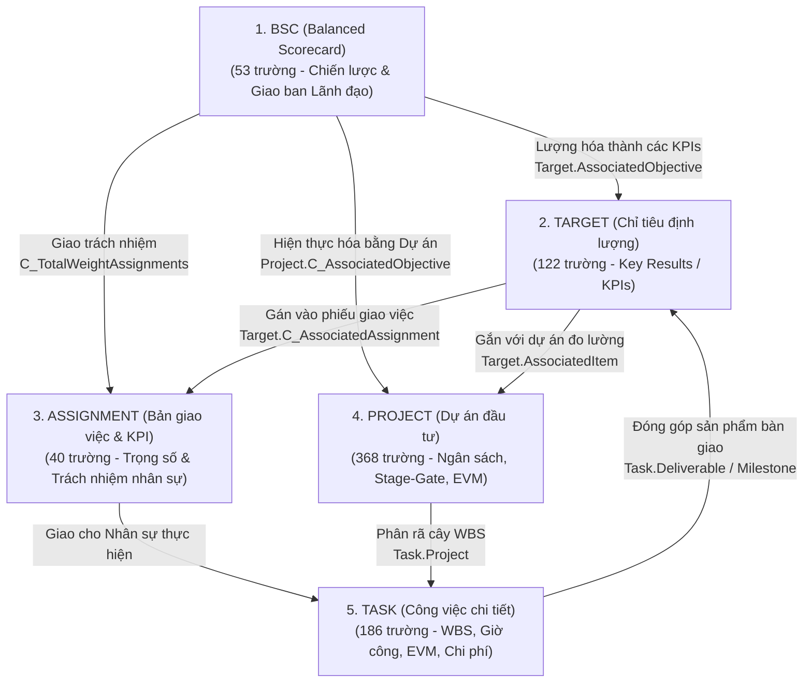

# TỔNG QUAN HỆ THỐNG 5 BẢNG DỮ LIỆU ĐIỀU HÀNH DOANH NGHIỆP
**Hệ thống Quản trị Mục tiêu, Dự án & Hiệu suất (Planview Clarizen Lakehouse)**

---

## 📌 BỨC TRANH TỔNG THỂ: TỪ CHIẾN LƯỢC ĐẾN THỰC THI (STRATEGY TO EXECUTION)

Năm tệp dữ liệu được cung cấp tạo thành một **Hệ thống Quản trị Hiệu suất Doanh nghiệp (EPM - Enterprise Performance Management)** hoàn chỉnh khép kín:

---

## 📂 DANH MỤC 5 FILE PHÂN TÍCH CHI TIẾT

| STT | Tên File Phân Tích | Tệp Dữ Liệu Gốc | Số Lượng Trường | Vai Trò Nghiệp Vụ Cốt Lõi |
| :---: | :--- | :--- | :---: | :--- |
| **1** | [**01_PHAN_TICH_CHI_TIET_TASK.md**](./01_PHAN_TICH_CHI_TIET_TASK.md) | `task_data_raw.txt` | **186** | **Tầng Thực thi Cơ sở**: Quản lý cây công việc WBS, đường găng CPM, chấm công Timesheet, EVM ($PV, EV, AC, CPI, SPI$), chi phí CAPEX/OPEX. |
| **2** | [**02_PHAN_TICH_CHI_TIET_PROJECT.md**](./02_PHAN_TICH_CHI_TIET_PROJECT.md) | `project_data_raw.txt` | **368** | **Tầng Danh mục Dự án**: Quản trị danh mục (PPM), phê duyệt cổng (Stage-Gate), cơ hội bán hàng CRM, chỉ số an toàn thông tin (SIEM/SOC/EDR), dòng tiền năm tài chính (FY), rủi ro & cảm xúc. |
| **3** | [**03_PHAN_TICH_CHI_TIET_BSC.md**](./03_PHAN_TICH_CHI_TIET_BSC.md) | `bsc_data_raw.txt` | **53** | **Tầng Mục tiêu Chiến lược**: Nghị quyết giao ban HĐQT/Ban TGĐ, phân cấp mục tiêu 4 viễn cảnh, cơ chế trọng số chiến lược, tổng hợp doanh thu kế hoạch rollup. |
| **4** | [**04_PHAN_TICH_CHI_TIET_ASSIGNMENT.md**](./04_PHAN_TICH_CHI_TIET_ASSIGNMENT.md) | `assignment_data_raw.txt` | **40** | **Tầng Trách nhiệm & KPI**: Phiếu giao nhiệm vụ cá nhân/đơn vị (Assignor $\rightarrow$ Assignee), cơ cấu trọng số cốt lõi/tuân thủ/phối hợp/thưởng, điểm đánh giá thi đua. |
| **5** | [**05_PHAN_TICH_CHI_TIET_TARGET.md**](./05_PHAN_TICH_CHI_TIET_TARGET.md) | `target_raw_data.txt` | **122** | **Tầng Đo lường Định lượng**: Chỉ tiêu Key Results số học, mô hình kịch bản M/N/S kèm toán tử ($\ge, \le$), phân tích khoảng cách thiếu hụt (Gap), đóng góp doanh thu. |
| **∑** | **TỔNG CỘNG HỆ THỐNG** | **5 Tệp Dữ Liệu** | **769 trường** | **Mô hình Dữ liệu Quản trị Toàn diện Chuẩn Enterprise** |

---

## 🔗 MA TRẬN KHÓA NGOẠI THỰC TẾ LIÊN KẾT GIỮA 5 BẢNG

Dựa trên các trường dữ liệu thực tế từ 5 file:

| Bảng Nguồn (Child) | Trường Khóa Ngoại | Bảng Đích (Parent) | Khóa Chính Đích | Ý Nghĩa Nghiệp Vụ Liên Kết |
| :--- | :--- | :--- | :--- | :--- |
| **`Task`** | `Project`, `ParentProject` | **`Project`** | `SYSID` | Mỗi công việc bắt buộc phải thuộc về một Dự án cụ thể. |
| **`Task`** | `Deliverable`, `Milestone` | **`Target`** | `SYSID` | Cột mốc hoàn thành task chính là bằng chứng xác nhận đạt chỉ tiêu. |
| **`Project`** | `C_AssociatedObjective` | **`BSC`** | `SYSID` | Dự án được lập ra để hiện thực hóa một Mục tiêu BSC chiến lược. |
| **`Target`** | `AssociatedObjective` | **`BSC`** | `SYSID` | Chỉ tiêu định lượng đo lường mức độ thành công của Mục tiêu BSC. |
| **`Target`** | `AssociatedItem` | **`Project`** | `SYSID` | Chỉ tiêu gắn trực tiếp vào Dự án để theo dõi kết quả đầu ra. |
| **`Target`** | `C_AssociatedAssignment` | **`Assignment`** | `SYSID` | Chỉ tiêu được phân bổ vào phiếu giao nhiệm vụ KPI của cá nhân/đơn vị. |
| **`Assignment`** | `C_ParentAssignment` | **`Assignment`** | `SYSID` | Phân cấp giao việc từ Cấp Quản lý xuống Nhân viên trực tiếp. |
| **`BSC`** | `ParentObjective` | **`BSC`** | `SYSID` | Cây phân cấp mục tiêu chiến lược từ Tập đoàn xuống Khối/Phòng ban. |
| **`BSC`** | `AssociatedItem` | **`Project`** | `SYSID` | Liên kết mục tiêu BSC với Dự án trọng điểm tương ứng. |
