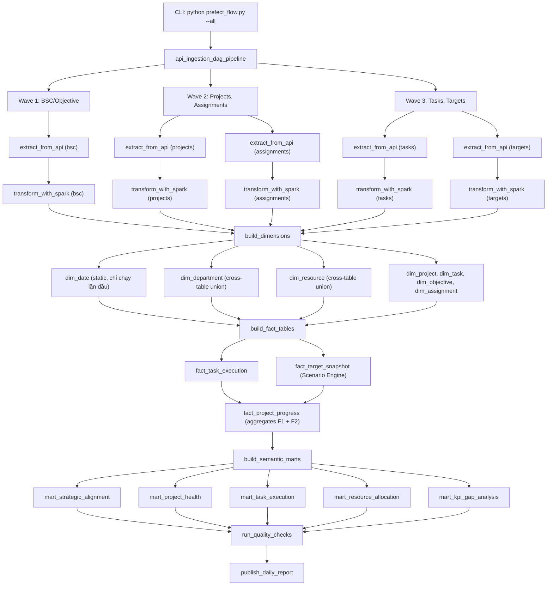

# EPM Data Warehouse — Source Tree Map & Pipeline Configuration

## 1. Source Tree Map (Sau khi triển khai đầy đủ Tickets 01–04)

```
crawler-prefecthq/
│
├── config.json                          # Cấu hình endpoints, extraction, storage
├── tables_registry.json                 # DAG dependencies giữa 5 entity tables
├── prefect.yaml                         # Prefect deployment manifest
├── prefect_flow.py                      # Main orchestration flow (1048+ lines)
│
├── config/
│   └── env_loader.py                    # Load biến môi trường từ .env
│
├── ingestion/
│   ├── auth.py                          # Clarizen OAuth2 authentication
│   ├── extractor.py                     # API extraction + batch writing
│   └── ... 
│
├── pagination/
│   └── offset_paginator.py              # Offset-based API pagination
│
├── data_type/                           # ▼ FULL SCHEMA CONTRACTS (giữ nguyên làm reference)
│   ├── project_dataType.sql             #   364 columns
│   ├── task_dataType.sql                #   256 columns
│   ├── objective_dataType.sql           #   51 columns
│   ├── c_assignment_dataType.sql        #   39 columns
│   └── target_dataType.sql              #   116 columns
│
├── data_type_pruned/                    # ▼ PRUNED SCHEMA CONTRACTS [TICKET 01 — NEW]
│   ├── project_dataType.sql             #   ~21 columns (DA scope + tech)
│   ├── task_dataType.sql                #   ~25 columns
│   ├── objective_dataType.sql           #   ~18 columns
│   ├── c_assignment_dataType.sql        #   ~18 columns
│   └── target_dataType.sql              #   ~31 columns
│
├── transform/
│   ├── __init__.py                      # Exports all transform classes/functions
│   ├── spark_session.py                 # SparkSessionFactory (4g driver/executor, S3A config)
│   ├── json_flattener.py                # Fallback schema inference + CamelCase → snake_case
│   ├── schema_contract.py               # ColumnSpec + SchemaContract — nguồn sự thật schema
│   ├── contract_conformer.py            # unwrap_expr + cast_expr + conform + assert
│   ├── dedup_engine.py                  # DedupEngine (PK=sysid, window dedup)
│   ├── race_condition_router.py         # InferredDimensionRouter (late-arriving dims)
│   ├── docstring_registry.py            # DocstringRegistry → dbt schema.yml export
│   ├── genbi_context_packer.py          # GenBI AI semantic context pack
│   │
│   ├── dimensions/                      # ▼ DIMENSION BUILDERS [TICKET 02 — NEW]
│   │   ├── __init__.py
│   │   ├── base_dimension.py            #   Abstract base: extract → transform → load
│   │   ├── dim_date_generator.py        #   Static date spine (2020–2030)
│   │   ├── dim_department_builder.py    #   Cross-table union C_Department
│   │   ├── dim_resource_builder.py      #   Cross-table union user URIs
│   │   ├── dim_project_builder.py       #   Project dimension
│   │   ├── dim_task_builder.py          #   Task dimension
│   │   ├── dim_objective_builder.py     #   BSC Objective dimension
│   │   └── dim_assignment_builder.py    #   Assignment dimension
│   │
│   ├── facts/                           # ▼ FACT TABLE BUILDERS [TICKET 03 — NEW]
│   │   ├── __init__.py
│   │   ├── base_fact.py                 #   Abstract base: extract → compute → load
│   │   ├── fact_task_execution.py       #   Task execution snapshot
│   │   ├── fact_target_snapshot.py      #   Target KPI unpivot M/N/S
│   │   ├── fact_project_progress.py     #   Project aggregation from tasks + targets
│   │   └── scenario_engine.py           #   Reusable M/N/S unpivot + gap analysis
│   │
│   └── marts/                           # ▼ SEMANTIC MART BUILDERS [TICKET 04 — NEW]
│       ├── __init__.py
│       ├── base_mart.py                 #   Abstract base cho mart builders
│       ├── mart_strategic_alignment.py  #   BSC → Project → Target cascade
│       ├── mart_project_health.py       #   Project portfolio health dashboard
│       ├── mart_task_execution.py       #   WBS task bottleneck analysis
│       ├── mart_resource_allocation.py  #   Workload & resource matrix
│       └── mart_kpi_gap_analysis.py     #   Multi-scenario KPI gap drill-down
│
├── storage/
│   ├── __init__.py
│   ├── tri_storage_sink.py              # Tri-layer: raw_backup → personal_raw → global_clean
│   ├── trino_ddl_generator.py           # Trino Hive DDL generator
│   ├── spark_sql_ddl_generator.py       # Zeppelin Spark SQL DDL generator
│   └── dlq_router.py                    # Dead Letter Queue routing
│
├── quality/
│   ├── schema_validator.py              # NOT NULL / type checks
│   └── statistics_profiler.py           # Null ratio, min/max/mean, distinct counts
│
├── data/                                # ▼ DATA LAKE STRUCTURE
│   ├── staging/                         #   Raw JSON from API (landing zone)
│   │   └── clarizen/<endpoint>/
│   ├── raw_backup/                      #   Gzipped JSON backup
│   │   └── <entity>/year=YYYY/month=MM/day=DD/
│   ├── bronze/                          #   Conformed Parquet (per-entity)
│   │   └── clarizen/<endpoint>/
│   └── warehouse/
│       ├── personal_raw/                #   Append-only + _raw_payload
│       │   └── <entity>/
│       ├── global_clean/                #   Deduped, no _raw_payload
│       │   └── <entity>/
│       ├── dlq/                         #   Dead Letter Queue
│       │   └── <entity>/
│       ├── dimensions/                  #   ▼ DIMENSION PARQUET [TICKET 02 — NEW]
│       │   ├── dim_date/
│       │   ├── dim_department/
│       │   ├── dim_resource/
│       │   ├── dim_project/
│       │   ├── dim_task/
│       │   ├── dim_objective/
│       │   └── dim_assignment/
│       ├── facts/                       #   ▼ FACT PARQUET [TICKET 03 — NEW]
│       │   ├── fact_task_execution/
│       │   ├── fact_target_snapshot/
│       │   └── fact_project_progress/
│       └── marts/                       #   ▼ MATERIALIZED MART PARQUET [TICKET 04 — NEW]
│           ├── mart_strategic_alignment/
│           ├── mart_project_health/
│           ├── mart_task_execution/
│           ├── mart_resource_allocation/
│           └── mart_kpi_gap_analysis/
│
├── generated_schema/                    # dbt schema.yml (auto-generated)
│   └── schema_clarizen_<endpoint>.yml
├── generated_context/                   # GenBI AI context packs (auto-generated)
│   └── genbi_context_pack_<endpoint>.json/
├── generated_ddl/                       # DDL scripts (auto-generated)
│   ├── <entity>_trino_ddl.sql           #   Existing bronze DDL
│   ├── <entity>_spark_ddl.sql           #   Existing bronze DDL
│   ├── dim_*_trino_ddl.sql              #   ▼ Dimension DDL [TICKET 02 — NEW]
│   ├── dim_*_spark_ddl.sql              #   ▼ Dimension DDL [TICKET 02 — NEW]
│   ├── fact_*_trino_ddl.sql             #   ▼ Fact DDL [TICKET 03 — NEW]
│   ├── fact_*_spark_ddl.sql             #   ▼ Fact DDL [TICKET 03 — NEW]
│   ├── mart_*_trino_ddl.sql             #   ▼ Mart DDL [TICKET 04 — NEW]
│   └── mart_*_spark_ddl.sql             #   ▼ Mart DDL [TICKET 04 — NEW]
│
├── checkpoints/                         # Incremental watermark checkpoints
├── epm_documentation/                   # Entity analysis docs (5 files)
└── .scratch/epm-data-warehouse/         # Ticket files (this project)
    └── issues/
        ├── 01-data-contract-field-pruning.md
        ├── 02-dimension-tables-transformation.md
        ├── 03-fact-tables-transformation.md
        └── 04-dbt-warehouse-views-semantic-marts.md
```

---

## 2. Pipeline Execution Flow (Full — sau Tickets 01–04)



---

## 3. Spark Configuration Sizing

| Parameter | Dev/Small | Staging/Medium | Production/Large |
|-----------|----------|---------------|-----------------|
| `spark.driver.memory` | `2g` | `4g` | `8g` |
| `spark.executor.memory` | `2g` | `4g` | `8g` |
| `spark.sql.shuffle.partitions` | `8` | `16` | `32` |
| `spark.master` | `local[2]` | `local[4]` | `local[*]` |
| `spark.sql.parquet.compression.codec` | `snappy` | `snappy` | `snappy` |
| `spark.sql.session.timeZone` | `UTC` | `UTC` | `UTC` |
| `spark.sql.sources.partitionOverwriteMode` | `dynamic` | `dynamic` | `dynamic` |
| `spark.sql.parquet.writeLegacyFormat` | `true` | `true` | `true` |

### Estimated Data Volumes

| Entity | Records (est.) | Bronze Size | After Pruning | With Dims+Facts |
|--------|---------------|-------------|---------------|-----------------|
| Project | ~2,000 | ~50 MB | ~5 MB | dim: ~1 MB |
| Task | ~50,000 | ~500 MB | ~50 MB | fact: ~20 MB |
| BSC/Objective | ~500 | ~10 MB | ~2 MB | dim: ~0.5 MB |
| Assignment | ~1,000 | ~15 MB | ~3 MB | dim: ~0.5 MB |
| Target | ~10,000 | ~100 MB | ~15 MB | fact: ~10 MB |
| **Total** | **~63,500** | **~675 MB** | **~75 MB** | **~32 MB** |

---

## 4. config.json — Proposed New Sections

### Section `contract` (New)
```json
{
  "contract": {
    "mode": "pruned",
    "full_dir": "./data_type",
    "pruned_dir": "./data_type_pruned",
    "comment": "mode=pruned uses data_type_pruned/, mode=full uses data_type/"
  }
}
```

### Section `warehouse` (New)
```json
{
  "warehouse": {
    "dimensions": {
      "output_base": "./data/warehouse/dimensions",
      "tables": ["dim_date", "dim_department", "dim_resource", "dim_project", "dim_task", "dim_objective", "dim_assignment"],
      "refresh_policy": "full_rebuild"
    },
    "facts": {
      "output_base": "./data/warehouse/facts",
      "tables": ["fact_task_execution", "fact_target_snapshot", "fact_project_progress"],
      "refresh_policy": "snapshot_append"
    },
    "marts": {
      "output_base": "./data/warehouse/marts",
      "tables": ["mart_strategic_alignment", "mart_project_health", "mart_task_execution", "mart_resource_allocation", "mart_kpi_gap_analysis"],
      "refresh_policy": "full_rebuild"
    },
    "ddl_output": "./generated_ddl",
    "trino_catalog": "hive",
    "trino_schema_dims": "dimensions",
    "trino_schema_facts": "facts",
    "trino_schema_marts": "marts"
  }
}
```

---

## 5. Environment Variables

| Variable | Default | Mô tả |
|----------|---------|-------|
| `MINIO_ENDPOINT` | `http://127.0.0.1:9000` | MinIO/S3 endpoint |
| `MINIO_ACCESS_KEY` | *(required)* | S3 access key |
| `MINIO_SECRET_KEY` | *(required)* | S3 secret key |
| `WAREHOUSE_URI` | `s3a://lakehouse/warehouse` | Base URI for lakehouse |
| `ENABLE_PARTITIONING` | `false` | Physical Hive partitioning |
| `CONTRACT_MODE` | `pruned` | `pruned` or `full` |
| `SPARK_MASTER` | `local[4]` | Spark master URL |
| `PREFECT_API_URL` | *(optional)* | Prefect server URL |

---

## 6. CLI Commands (Proposed Extensions)

```bash
# Full pipeline (existing)
python prefect_flow.py --all --mode incremental --standalone

# Build only dimensions (new)
python prefect_flow.py --build-dims --standalone

# Build only facts (new)
python prefect_flow.py --build-facts --standalone

# Build only marts (new)
python prefect_flow.py --build-marts --standalone

# Build entire DW layer (dims → facts → marts)
python prefect_flow.py --build-warehouse --standalone

# Use full contract instead of pruned
python prefect_flow.py --all --contract-mode full --standalone
```
