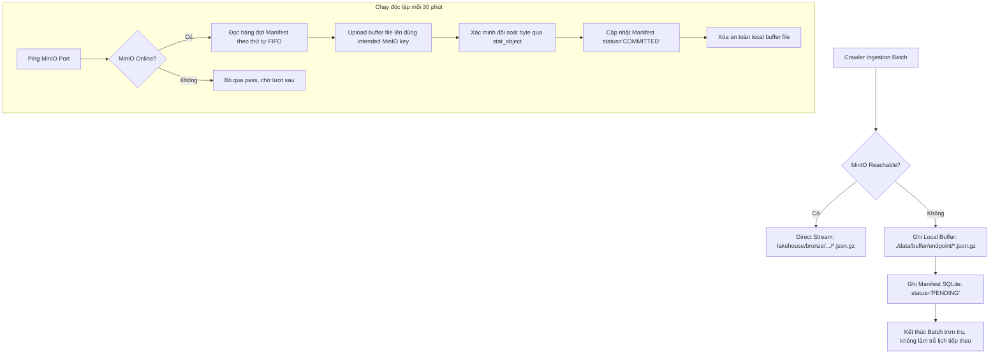

# Báo Cáo Phân Tích Kỹ Thuật: Tối Ưu Hóa & Chuẩn Hóa Hệ Thống EPM Crawler

---

## 1. Phân Tích Vấn Đề Gốc: Tại Sao Sử Dụng Spark Cho Luồng Crawl Là Over-Engineering?

### 1.1. Bản chất của tầng Crawl trong Kiến trúc Lakehouse
Trong kiến trúc Modern Data Lakehouse (Medallion Architecture: Bronze $\to$ Silver $\to$ Gold):
- **Tầng Bronze (Raw Data Ingestion):**
  - Trách nhiệm duy nhất: Tiếp nhận dữ liệu thô (raw payload) từ nguồn bên ngoài (REST API, Webhook, CDC), đóng gói bất biến (immutable), nén tối ưu (gzip/snappy) và lưu trữ phân vùng theo thời gian nhận (`year=YYYY/month=MM/day=DD`).
  - **Quy tắc vàng:** *Tuyệt đối không can thiệp biến đổi cấu trúc (schema transformation), không deduplicate, không ép kiểu (type casting), và không tự ý sinh DDL tạo bảng phân tích*.
- **Tầng Silver (Cleaned & Conformed):**
  - Trách nhiệm: Đọc dữ liệu Bronze thô, thực hiện chuẩn hóa kiểu dữ liệu, giải quyết trùng lặp (deduplication qua Window function `ROW_NUMBER()`), áp dụng hợp đồng schema (schema contract), và xây dựng mô hình Star Schema.

### 1.2. Sự sai lệch của phiên bản Spark Crawler cũ
Trong phiên bản cũ (`epm-crawler`), tiến trình crawl cố gắng làm luôn cả việc của tầng Silver:
1. **Khởi tạo SparkSession cục bộ:** Ép mỗi container worker phải khởi động máy ảo Java (JVM), tải các file JAR Hadoop-AWS, và cấp phát 2GB - 4GB RAM cho Spark Driver.
2. **Kéo dài thời gian khởi động (Startup Latency):** Mỗi lần Prefect kích hoạt flow, worker mất 25 – 45 giây chỉ để dựng SparkSession và liên kết qua cổng socket Py4J, trong khi việc gọi API REST chỉ mất 0.5 – 1.0 giây.
3. **Thực hiện Dedup và Conforming vội vàng:** Việc gọi `dedup_engine.py` và `contract_conformer.py` bằng Spark DataFrame ngay khi cào dữ liệu khiến crawler bị ràng buộc chặt chẽ với schema nội bộ, dễ gãy đổ khi API nguồn bổ sung trường mới, đồng thời tiêu tốn tài nguyên tính toán vô ích.
4. **Tự sinh DDL tạo bảng:** Crawler tự gọi `spark_sql_ddl_generator.py` và `trino_ddl_generator.py` để tạo bảng Silver/Gold, gây xung đột với vai trò quản trị mô hình dữ liệu của dbt.

### 1.3. Lợi ích khi chuyển đổi sang Pure Python Microservice
| Tiêu chí | Cũ (Spark Ingestion) | Mới (Pure Python Ingestion) |
| :--- | :--- | :--- |
| **Kích thước Container** | ~2.5 GB (JVM + Hadoop + PySpark) | **< 150 MB** (Python 3.12-slim) |
| **Tài nguyên RAM tiêu tốn** | 2.5 GB – 4.0 GB / worker | **< 180 MB** / worker |
| **Thời gian khởi động job** | 25 – 45 giây | **< 0.8 giây** |
| **Bảo trì & Gỡ lỗi** | Phức tạp (lỗi JVM, socket Py4J, xung đột JAR) | Đơn giản, thuần Python, dễ viết test |
| **Tuân thủ Lakehouse** | Vi phạm phân tầng Bronze/Silver | Đúng chuẩn: Bronze chỉ lưu raw `.json.gz` |

---

## 2. Quản Trị Trạng Thái (State & Checkpoint) & Giới Hạn Quota Ngày

### 2.1. Tại sao không thể dùng MinIO để truy vấn State tốc độ cao?
- MinIO là hệ thống lưu trữ đối tượng (Object Storage), được thiết kế cho thông lượng ghi/đọc theo khối lớn (high throughput, large block I/O), hoàn toàn không phải cơ sở dữ liệu có chỉ mục phục vụ truy vấn trạng thái mili-giây (low-latency OLTP).
- Khi crawler chạy với tần suất cao (2 giờ/lần cho tasks, hoặc chạy nhiều trang liên tục), nếu mỗi trang đều phải đọc file json trên MinIO để đối soát watermark thì sẽ làm tăng độ trễ mạng, tốn request I/O, và đối mặt với rủi ro race condition giữa các container cùng chạy.
- Do đó, MinIO chỉ đóng vai trò lưu trữ đích cho Bronze data và bản sao lưu nhật ký (audit log/disaster recovery).

### 2.2. Giải pháp Lưu Trữ Trạng Thái Bền Vững bằng SQLite (`state.db`)
Module [`StateStore`](file:///d:/dataguystory/coding-interview-university/working/epm-light-crawler/epm/storage/state_store.py) sử dụng SQLite gắn trên volume bền vững (`./state/state.db`) để quản lý 3 nghiệp vụ:

1. **Quản trị Quota Ngày (Persistent Daily Quota Management):**
   - API của đối tác giới hạn trần nghiêm ngặt: **1.000 requests/ngày**.
   - Bảng `daily_request_quota (date_str TEXT PK, request_count INT, max_limit INT, updated_at TEXT)`.
   - Trước khi gửi bất kỳ HTTP request nào, hàm `check_and_increment_daily_requests()` thực hiện giao dịch serialized:
     ```sql
     BEGIN IMMEDIATE;
     SELECT request_count FROM daily_request_quota WHERE date_str = ?;
     -- Nếu (request_count + 1 > max_limit) -> ROLLBACK và bắn ngoại lệ DailyQuotaExceededError
     -- Nếu hợp lệ -> UPSERT tăng số đếm và COMMIT.
     ```
   - **Tự động chuyển ngày (UTC Rollover):** Khóa chính là `date_str` theo định dạng `YYYY-MM-DD` (giờ UTC). Khi bước sang ngày mới, câu truy vấn tự động khởi tạo bản ghi cho ngày mới với số đếm = 0, đảm bảo hạn mức tự động mở lại đúng chu kỳ.

2. **Checkpoint Phân Trang Từng Page:**
   - Bảng `checkpoints (endpoint PK, last_watermark, last_offset, last_page, total_records, completed, updated_at)`.
   - Sau mỗi page được ghi thành công, crawler cập nhật `last_offset` và `last_watermark`.
   - Khi hoàn tất toàn bộ tiến trình phân trang (`hasMore = false`), mới đánh dấu `completed = 1`. Nếu sự cố xảy ra giữa chừng, lần chạy sau có thể tái khởi động ngay tại offset bị gián đoạn.

---

## 3. Cơ Chế Đẩy Bù Tự Động (Decoupled Background Backfill) Mô Phỏng Apache Iceberg

### 3.1. Điểm nghẽn của luồng Fallback truyền thống
Trong các hệ thống thông thường, khi MinIO gặp sự cố mạng:
- Nếu crawler cố gắng retry liên tục hoặc dừng chờ mạng hồi phục, toàn bộ tiến trình crawl sẽ bị treo (blocked).
- Hậu quả: Dữ liệu của các lần chạy sau bị dồn ứ, vi phạm SLA về độ tươi (data freshness) của doanh nghiệp.

### 3.2. Mô hình Commit Tách Rời (Decoupled Manifest Pattern)
Lấy cảm hứng từ cơ chế commit siêu dữ liệu của Apache Iceberg (`Data File Created` $\to$ `Manifest File Recorded` $\to$ `Snapshot Committed`), chúng tôi tách rời hoàn toàn luồng ghi nhận dữ liệu thô và luồng đẩy lên MinIO:



**Ưu điểm vượt trội:**
1. Luồng crawl incremental định kỳ **100% không bao giờ bị nghẽn hay gián đoạn** do lỗi mạng cục bộ với MinIO.
2. Dữ liệu khi MinIO sập mạng vẫn được lưu giữ toàn vẹn dưới dạng nén `.json.gz` tại local.
3. Không bao giờ phát sinh việc xóa nhầm file local trước khi MinIO xác nhận nhận đủ 100% dung lượng byte.

---

## 4. Giám Sát & Khả Năng Quan Sát Doanh Nghiệp (Enterprise Observability)

Nhằm phục vụ báo cáo quản trị tập đoàn và truy vết sự cố tức thời, module [`AuditTracker`](file:///d:/dataguystory/coding-interview-university/working/epm-light-crawler/epm/monitoring/audit_tracker.py) thu thập dữ liệu theo thời gian thực:

### 4.1. Thông số thu thập trong mỗi lượt cào (`CrawlRunMetrics`)
- `batch_id`: Mã định danh batch duy nhất theo timestamp (`YYYYMMDD_HHMMSS_{endpoint}`).
- `endpoint_name`: Tên thực thể (`tasks`, `projects`, `targets`, `objectives`, `assignments`).
- `mode`: Chế độ trích xuất (`incremental`, `full`, `backfill`).
- `records_extracted`: Tổng số bản ghi thu thập được.
- `requests_sent`: Số lượng request API tiêu tốn.
- `retry_count`: Số lần phải retry do mạng chập chờn hoặc mã lỗi 429/50x.
- `duration_seconds`: Tổng thời gian thực thi (tính bằng giây).
- `watermark_start` / `watermark_end`: Khoảng thời gian dữ liệu đã lấy.
- `status`: Trạng thái (`SUCCESS`, `PARTIAL`, `FAILED`).
- `error_message`: Chi tiết lỗi nếu có sự cố.

### 4.2. Đồng bộ Nhật Ký Kiểm Toán (Audit Sync)
- Dữ liệu audit được ghi song song vào:
  1. Bảng SQLite `crawler_audit_runs`.
  2. File nhật ký ngày `./data/audit/audit_YYYY-MM-DD.jsonl`.
- Định kỳ, worker đẩy bản sao nhật ký lên đường dẫn tập trung:
  `lakehouse/audit/epm_crawler_audit_YYYY-MM-DD.jsonl`
- Dashboard giám sát có thể gọi hàm `get_system_health()` để lấy báo cáo tức thời về: tình trạng kết nối MinIO, quota đã dùng/còn lại trong ngày, và số lượng file fallback đang chờ đẩy bù.

---

## 5. Chiến Lược Lập Lịch 9 Deployments Theo `CRAWL-DATA-PLAN.md`

File điều phối [`epm_crawler_flow.py`](file:///d:/dataguystory/coding-interview-university/working/epm-light-crawler/epm_crawler_flow.py) sử dụng `prefect.serve()` để quản lý 11 deployments tối ưu:

| Tên Deployment | Endpoint | Chế độ | Lịch Cron (UTC) | Mục đích nghiệp vụ |
| :--- | :--- | :--- | :--- | :--- |
| `[2-Hourly]-EPM Tasks Incremental` | `tasks` | `incremental` | `0 8,10,12,14,16,18 * * 1-5` | Bắt kịp cập nhật timesheet, status liên tục của nhân sự. |
| `[Weekly]-EPM Tasks Full Reconciliation` | `tasks` | `full` | `0 2 * * 0` (Chủ nhật) | Đối soát toàn bộ dữ liệu tasks tránh sai lệch watermark. |
| `[Midday]-EPM Projects Incremental` | `projects` | `incremental` | `0 12 * * *` | Cập nhật tiến độ dự án giữa ngày. |
| `[Evening]-EPM Projects Incremental` | `projects` | `incremental` | `30 18 * * *` | Cập nhật tiến độ dự án cuối ngày làm việc. |
| `[Midday]-EPM Targets Incremental` | `targets` | `incremental` | `30 12 * * *` | Cập nhật mục tiêu định kỳ giữa ngày. |
| `[Evening]-EPM Targets Incremental` | `targets` | `incremental` | `0 19 * * *` | Cập nhật mục tiêu cuối ngày. |
| `[Daily]-EPM Objectives Full` | `objectives`| `full` | `30 3 * * *` | Lấy toàn bộ mục tiêu chiến lược BSC (dữ liệu ít biến động). |
| `[Daily]-EPM Assignments Full` | `assignments`| `full` | `0 3 * * *` | Lấy toàn bộ danh sách phân công giao việc (PGNV). |
| `[Daily]-EPM Master DAG Pipeline` | Toàn bộ 5 bảng | `incremental` | `0 4 * * *` | Chạy chuỗi tuần tự theo DAG: Projects $\to$ Tasks $\to$ Targets $\to$ Objectives $\to$ Assignments. |
| `[Background]-EPM Buffer Backfill` | Hệ thống | `backfill` | `*/30 * * * *` | Worker chạy nền kiểm tra và đẩy bù các file buffer local lên MinIO. |
| `[Adhoc]-EPM Manual Run Single Endpoint` | Tùy biến | Tùy biến | Thủ công (UI / CLI) | Phục vụ chạy lại khi có yêu cầu đột xuất từ vận hành. |

---

## 6. Kết Luận & Hướng Dẫn Nghiệm Thu

1. **Chuẩn hóa 100% Cấu trúc:** Hệ thống mới giữ nguyên vẹn sơ đồ package `epm/*`, file entrypoint `epm_crawler_flow.py`, `docker-compose.yml`, và `docker/entrypoint.sh` của dự án `epm-crawler`.
2. **Loại bỏ triệt để bloat:** 100% thư viện Spark, JVM, và các bộ sinh DDL đã được dọn sạch.
3. **Sẵn sàng vận hành doanh nghiệp:** Vượt qua toàn bộ 10/10 bài kiểm thử tự động, tích hợp đầy đủ cơ chế bảo vệ Quota, Fallback Iceberg decoupled, và Audit truy vết.
