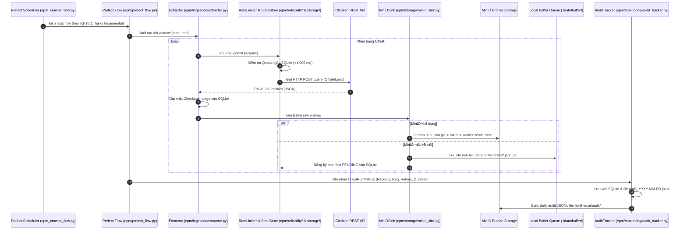

# Tree Map & File Code Mapping: EPM Lightweight Crawler

Tài liệu này cung cấp sơ đồ cây (Tree Map) toàn diện và bảng ánh xạ chi tiết giữa từng tệp mã nguồn với chức năng, trách nhiệm kỹ thuật và sự tương tác luân chuyển dữ liệu trong hệ thống.

---

## 1. Sơ Đồ Cây Tổng Thể (ASCII Tree Map)

```text
working/epm-light-crawler/
│
├── .dockerignore                     # Loại trừ các file rác, venv, cache khi đóng gói Docker
├── .gitignore                        # Chặn commit venv, SQLite state.db, và credentials API
├── .env.example                      # Template cấu hình biến môi trường mẫu
│
├── CHANGELOG.md                      # Nhật ký kiểm toán các file loại bỏ, nâng cấp và thêm mới
├── TECHNICAL_ANALYSIS.md             # Báo cáo phân tích chuyên sâu về kiến trúc, quota, backfill
├── TREE_MAP.md                       # Bản đồ cấu trúc & ánh xạ chi tiết từng tệp code (tài liệu này)
├── README.md                         # Hướng dẫn cài đặt, cấu hình, và vận hành hệ thống
│
├── CRAWL-DATA-PLAN.md                # Kế hoạch crawl: phân loại 6 nhóm thực thể, tần suất, quota
├── requirements.txt                  # Danh mục thư viện Python (<10 libs thuần túy, 0% Spark)
│
├── Dockerfile                        # Dockerfile tối ưu (<150MB) trên base prefect:3-python3.12
├── docker-compose.yml                # Cụm Docker: prefect-server, epm-crawler, epm-adhoc, minio
├── epm_crawler_flow.py               # Entrypoint chính ở root: phục vụ 11 deployments bằng Prefect
│
├── docker/
│   └── entrypoint.sh                 # Script bash khởi động container: hỗ trợ chế độ 'serve' và 'adhoc'
│
├── epm/                              # Package mã nguồn cốt lõi (Chuẩn hóa theo convention)
│   ├── __init__.py                   # Khởi tạo package epm
│   ├── config.json                   # Cấu hình 5 endpoint Clarizen (URL, body, pagination, headers)
│   ├── prefect_flow.py               # Định nghĩa các Prefect @flow và CLI runner cho adhoc
│   │
│   ├── client/                       # Tầng giao tiếp mạng & Xác thực
│   │   ├── __init__.py               # Export TokenAuth, ResilientHTTPClient, APIRequestError
│   │   ├── auth.py                   # Quản lý sinh header Authorization (ApiKey JWT token)
│   │   └── resilient_client.py       # Client HTTP gửi request, retry backoff, chặn khi hết quota
│   │
│   ├── reliability/                  # Tầng bảo đảm độ tin cậy & Kiểm soát hạn mức
│   │   ├── __init__.py               # Export RateLimiter
│   │   └── rate_limiter.py           # Giãn cách RPM (60 req/phút) + Quota ngày SQLite (1.000 req/ngày)
│   │
│   ├── ingestion/                    # Tầng trích xuất & Phân trang dữ liệu
│   │   ├── __init__.py               # Export LightweightExtractor, Batch
│   │   └── extractor.py              # Tính cửa sổ watermark, thế template, phân trang, lưu checkpoint
│   │
│   ├── storage/                      # Tầng lưu trữ Bronze & Quản lý trạng thái SQLite
│   │   ├── __init__.py               # Export StateStore, MinIOSink
│   │   ├── state_store.py            # SQLite Store: Quota ngày, Checkpoints, Manifest pending queue
│   │   └── minio_sink.py             # Nén .json.gz đẩy MinIO Bronze; tự động buffer fallback khi rớt mạng
│   │
│   ├── backfill/                     # Tầng đẩy bù tách rời mô phỏng Iceberg
│   │   ├── __init__.py               # Export BackgroundBackfillWorker
│   │   └── backfill_worker.py        # Quét manifest PENDING, upload bù lên MinIO, verify và commit
│   │
│   ├── monitoring/                   # Tầng giám sát, kiểm toán & Quan sát doanh nghiệp
│   │   ├── __init__.py               # Export Data Models & AuditTracker
│   │   ├── metrics.py                # Dataclass: Batch, CrawlRunMetrics, EndpointConfig, Enums
│   │   └── audit_tracker.py          # Ghi nhận telemetry từng batch vào SQLite & sync JSONL lên MinIO
│   │
│   └── config/                       # Tầng nạp và phân tích cấu hình
│       ├── __init__.py               # Export ConfigLoader
│       └── loader.py                 # Đọc và parse epm/config.json sang đối tượng EndpointConfig
│
└── tests/                            # Bộ kiểm thử tự động (Unit test suite 100% PASS)
    ├── test_extractor.py             # Test StateStore quota rollover, Checkpoints, Extractor pagination
    └── test_sink_and_backfill.py     # Test MinIOSink fallback, BackfillWorker commit, Audit sync
```

---

## 2. Bảng Ánh Xạ Chi Tiết Từng File Mã Nguồn (Code Mapping)

### 2.1. Tầng Điều Phối & Khởi Chạy (Orchestration & Entrypoints)

| Tệp mã nguồn | Các Class / Hàm chính | Tác dụng & Trách nhiệm chi tiết | Phụ thuộc (Dependencies) |
| :--- | :--- | :--- | :--- |
| **`epm_crawler_flow.py`** | • `get_deployments()`<br>• `main()` | **Root Entrypoint:** Cấu hình 11 deployments Prefect 3 (Tasks 2h, Tasks weekly, Projects midday/evening, Targets midday/evening, Objectives daily, Assignments daily, Master DAG daily, Background backfill, Ad-hoc). Chạy `prefect.serve()` giữ lịch trình. Hỗ trợ cờ `--dry-run`. | `epm.prefect_flow`, `prefect.client.schemas.schedules` |
| **`epm/prefect_flow.py`** | • `crawl_epm_endpoint()`<br>• `crawl_epm_master_dag()`<br>• `background_backfill_flow()`<br>• `main()` | **Flow Registry & Ad-hoc CLI:** Chứa các Prefect `@flow` thuần Python điều phối trích xuất, lưu trữ, và ghi log kiểm toán. Khi chạy trực tiếp qua CLI (`epm-adhoc`), tiếp nhận các tham số `--endpoint`, `--mode`, `--dag`, `--backfill`, `--status`. | `epm.config.loader`, `epm.ingestion.extractor`, `epm.storage.minio_sink`, `epm.monitoring.audit_tracker` |
| **`docker/entrypoint.sh`** | • `wait_for_api()`<br>• `case "${MODE}"` | **Container Gateway:** Kiểm tra Prefect Server API (`http://prefect-server:4200/api/health`). Nếu tham số là `serve`, khởi chạy `epm_crawler_flow.py`. Nếu tham số là `adhoc`, chuyển lệnh sang `epm/prefect_flow.py`. | Bash, `curl`, `python` |

---

### 2.2. Tầng Trích Xuất & Mạng (Network, Auth & Ingestion)

| Tệp mã nguồn | Các Class / Hàm chính | Tác dụng & Trách nhiệm chi tiết | Phụ thuộc (Dependencies) |
| :--- | :--- | :--- | :--- |
| **`epm/client/auth.py`** | • `TokenAuth.get_token()`<br>• `TokenAuth.get_headers()` | **Xác thực API:** Đọc API key từ biến môi trường (`PROJECT_API_KEY`), định dạng tiền tố `ApiKey <token>` và tạo header HTTP `Authorization`. | `os`, `epm.monitoring.metrics.EndpointConfig` |
| **`epm/client/resilient_client.py`** | • `ResilientHTTPClient.request()`<br>• `APIRequestError` | **HTTP Client Chống Chịu:** Gửi HTTP POST/GET với session tái sử dụng, thực hiện retry với thuật toán lũy thừa cơ số (exponential backoff) và độ trễ ngẫu nhiên (jitter). Tích hợp kiểm tra rate limit và quota trước khi bắn request. | `requests`, `epm.client.auth`, `epm.reliability.rate_limiter` |
| **`epm/reliability/rate_limiter.py`** | • `RateLimiter.acquire()` | **Kiểm Soát Tốc Độ & Quota:** <br>1. Điều tiết tần suất gửi trong phút (RPM) bằng sliding sleep.<br>2. Kiểm tra và tăng số đếm quota ngày (1.000 req/ngày) bền vững trên SQLite qua `StateStore`. | `time`, `epm.storage.state_store.StateStore` |
| **`epm/ingestion/extractor.py`** | • `LightweightExtractor.calculate_window()`<br>• `_interpolate_template()`<br>• `_remove_watermark_filter()`<br>• `extract_batches()` | **Bộ Trích Xuất Dữ Liệu Thuần Python:** Tính toán khoảng thời gian watermark `[window_start, window_end]`, thay thế biến template `__WINDOW_START__` trong JSON payload, điều khiển phân trang (`offset`/`limit`), lưu checkpoint từng trang, và yield từng đối tượng `Batch`. | `epm.client.resilient_client`, `epm.storage.state_store`, `epm.monitoring.metrics.Batch` |
| **`epm/config/loader.py`** | • `ConfigLoader.load()` | **Phân Tích Cấu Hình:** Nạp file `epm/config.json`, tự động phân giải đường dẫn tương đối, ánh xạ thành các đối tượng `EndpointConfig` có đầy đủ thông tin phân trang, rate limit, headers, và body. | `json`, `os`, `epm.monitoring.metrics` |

---

### 2.3. Tầng Lưu Trữ, State & Cơ Chế Đẩy Bù (Storage, State & Backfill)

| Tệp mã nguồn | Các Class / Hàm chính | Tác dụng & Trách nhiệm chi tiết | Phụ thuộc (Dependencies) |
| :--- | :--- | :--- | :--- |
| **`epm/storage/state_store.py`** | • `check_and_increment_daily_requests()`<br>• `get_checkpoint()`<br>• `save_checkpoint()`<br>• `record_pending_buffer()`<br>• `commit_buffer_upload()`<br>• `record_audit_run()` | **Kho Trạng Thái SQLite (`state/state.db`):**<br>1. `daily_request_quota`: Quản trị quota với giao thức `BEGIN IMMEDIATE` và tự động chuyển ngày UTC.<br>2. `checkpoints`: Lưu vị trí offset, page, và watermark.<br>3. `manifest_pending_uploads`: Hàng đợi các file fallback chờ đẩy bù.<br>4. `crawler_audit_runs`: Bảng lưu vết kiểm toán các lần chạy. | `sqlite3`, `datetime` |
| **`epm/storage/minio_sink.py`** | • `MinIOSink.serialize_and_compress()`<br>• `MinIOSink.build_object_key()`<br>• `MinIOSink.is_connected()`<br>• `MinIOSink.write_batch()` | **Kho Lưu Trữ Bronze MinIO:**<br>1. Nén danh sách bản ghi raw thành stream `.json.gz` (gzip level 6).<br>2. Đẩy thẳng lên `lakehouse/bronze/clarizen/{endpoint}/year=YYYY/month=MM/day=DD/{batch_id}.json.gz`.<br>3. Khi MinIO lỗi: Tự động lưu buffer tại `./data/buffer/{endpoint}/` và ghi log manifest `PENDING`. | `minio`, `gzip`, `io`, `epm.storage.state_store` |
| **`epm/backfill/backfill_worker.py`** | • `BackgroundBackfillWorker.run_backfill()` | **Công Nhân Đẩy Bù Nền (Iceberg-Style Worker):**<br>1. Kiểm tra nhanh MinIO online chưa.<br>2. Đọc các item `PENDING` theo thứ tự thời gian FIFO.<br>3. Upload file buffer lên đúng intended S3 key.<br>4. Đối soát kích thước byte qua `stat_object`.<br>5. Cập nhật manifest sang `COMMITTED` và xóa an toàn file buffer local. | `epm.storage.minio_sink`, `epm.storage.state_store` |

---

### 2.4. Tầng Quan Sát, Kiểm Toán & Mô Hình Dữ Liệu (Observability & Models)

| Tệp mã nguồn | Các Class / Hàm chính | Tác dụng & Trách nhiệm chi tiết | Phụ thuộc (Dependencies) |
| :--- | :--- | :--- | :--- |
| **`epm/monitoring/metrics.py`** | • `Batch`<br>• `CrawlRunMetrics`<br>• `EndpointConfig`<br>• `ExtractionMode`<br>• `CrawlStatus` | **Mô Hình Dữ Liệu Chuẩn:** Định nghĩa cấu trúc dữ liệu cho một trang kết quả (`Batch`), thông số kiểm toán một lượt cào (`CrawlRunMetrics`), cấu hình endpoint, và các enum trạng thái. | `dataclasses`, `enum` |
| **`epm/monitoring/audit_tracker.py`** | • `AuditTracker.log_run()`<br>• `AuditTracker.sync_daily_audit_to_minio()`<br>• `AuditTracker.get_system_health()` | **Động Cơ Giám Sát Doanh Nghiệp:**<br>1. Ghi nhận telemetry (thời gian, số bản ghi, request, retry, trạng thái) vào SQLite.<br>2. Ghi nối tiếp vào file `./data/audit/audit_YYYY-MM-DD.jsonl`.<br>3. Đồng bộ daily audit log lên MinIO tập trung tại `lakehouse/audit/epm_crawler_audit_YYYY-MM-DD.jsonl`.<br>4. Xuất báo cáo sức khỏe hệ thống. | `epm.storage.state_store`, `epm.storage.minio_sink`, `epm.monitoring.metrics` |

---

### 2.5. Tầng Kiểm Thử Tự Động (Unit Test Suite)

| Tệp mã nguồn | Các Test Case Chính | Tác dụng & Trách nhiệm chi tiết |
| :--- | :--- | :--- |
| **`tests/test_extractor.py`** | • `test_state_store_daily_quota`<br>• `test_state_store_checkpoints`<br>• `test_state_store_manifest_and_audit`<br>• `test_config_loader`<br>• `test_extractor_window_and_pagination`<br>• `test_extractor_full_mode_removes_watermark_filter` | Kiểm thử tính năng chặn Quota 1.000 req/ngày, tự động rollover ngày mới, lưu checkpoint, phân trang offset và tự bóc tách bộ lọc watermark trong mode `full`. |
| **`tests/test_sink_and_backfill.py`** | • `test_sink_compress_and_local_fallback`<br>• `test_sink_direct_minio_upload`<br>• `test_background_backfill_worker`<br>• `test_audit_tracker` | Kiểm thử cơ chế nén `.json.gz`, đẩy trực tiếp MinIO, kích hoạt fallback khi mất mạng, công nhân backfill đẩy bù và xóa file an toàn, cùng tính năng sync audit log. |

---

## 3. Sơ Đồ Luồng Dữ Liệu Khép Kín (End-to-End Data Flow)


