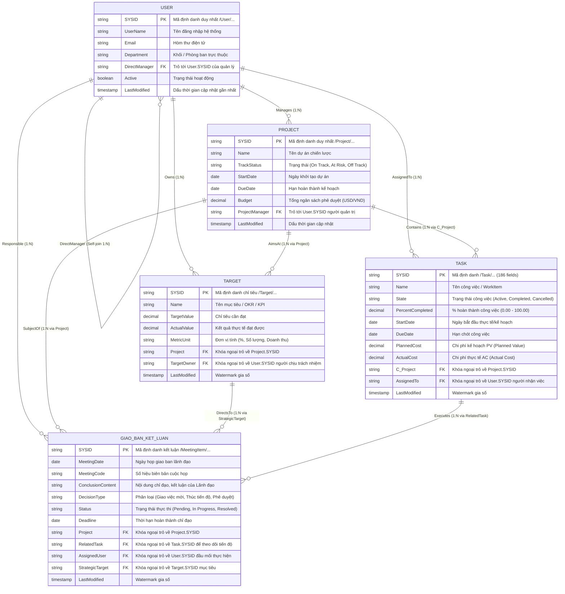

# BẢN THIẾT KẾ ERD & DATA MODELING CHO 5 THỰC THỂ LIÊN KẾT
**Hệ thống Quản trị Dự án & Điều hành Doanh nghiệp (Planview Clarizen Lakehouse)**

---

## 1. TỔNG QUAN HỆ THỐNG 5 THỰC THỂ (5 ENTITIES OVERVIEW)

Hệ thống điều hành doanh nghiệp và quản trị dự án được cấu thành từ 5 thực thể cốt lõi:
1. **User (Nhân sự / Người dùng)**: Bảng chiều gốc lưu trữ toàn bộ người dùng, chức vụ, phòng ban và cấu trúc quản lý phân cấp.
2. **Project (Dự án)**: Bảng chiều gốc lưu trữ danh mục các chương trình, dự án trọng điểm, ngân sách và thời hạn.
3. **Task (Công việc / Nhiệm vụ)**: Bảng thực thể chi tiết (đã giải mã 186 trường Planview) thể hiện khối lượng công việc, tiến độ phần trăm, chi phí thực tế ($AC$), kế hoạch ($PV$), và giá trị hoàn thành ($EV$).
4. **Target (Mục tiêu / OKR / KPI)**: Bảng chỉ tiêu định lượng gán cho từng dự án và cá nhân phụ trách.
5. **Giao-Ban-Ket-Luan (Biên bản Giao ban / Kết luận Chỉ đạo / Action Items)**: Bảng sự kiện giao dịch lưu trữ các chỉ đạo từ ban lãnh đạo, gắn liền với mục tiêu, dự án, công việc và người thi hành.

---

## 2. BIỂU ĐỒ QUAN HỆ THỰC THỂ (ERD DIAGRAM)



---

## 3. MÔ HÌNH DỮ LIỆU DATA WAREHOUSE (STAR SCHEMA TRÊN TRINO / DBT)

Tại tầng Silver/Gold của Data Lakehouse, dữ liệu được tổ chức theo mô hình Kim tinh (Star Schema) để tối ưu hóa truy vấn phân tích cho BI (PowerBI, Trino CLI, Superset):

```
                        ┌────────────────────────┐
                        │       dim_users        │
                        │    (SCD Type 1/2)      │
                        └───────────▲────────────┘
                                    │
         ┌──────────────────────────┼──────────────────────────┐
         │                          │                          │
┌────────┴───────────────┐ ┌────────┴──────────────┐ ┌─────────┴───────────────┐
│      dim_projects      │ │      dim_targets      │ │        dim_tasks        │
│     (SCD Type 1/2)     │ │     (SCD Type 1)      │ │     (SCD Type 1/2)      │
└────────▲───────────────┘ └────────▲──────────────┘ └─────────▲───────────────┘
         │                          │                          │
         │                          │                          │
         └──────────────────────────┼──────────────────────────┘
                                    │
               ┌────────────────────┴────────────────────┐
               │  fct_meeting_conclusions_action_items   │
               │        (Accumulating Snapshot)          │
               ├─────────────────────────────────────────┤
               │  user_key (FK)                          │
               │  project_key (FK)                       │
               │  target_key (FK)                        │
               │  task_key (FK)                          │
               │  days_overdue                           │
               │  action_completion_rate                 │
               └─────────────────────────────────────────┘
```

### Các Bảng Dimension (Bảng Chiều):
1. **`dim_users`**: Quản lý hồ sơ nhân sự, phân cấp quản lý trực tiếp.
2. **`dim_projects`**: Quản lý hồ sơ dự án, ngân sách tổng thể.
3. **`dim_targets`**: Quản lý mục tiêu OKR/KPI liên kết trực tiếp với dự án.
4. **`dim_tasks`**: Quản lý danh mục 186 thuộc tính công việc, mã WBS (Work Breakdown Structure).

### Các Bảng Fact (Bảng Sự kiện):
1. **`fct_task_daily_snapshot`**:
   * Chu kỳ chụp: Mỗi ngày 1 snapshot cho toàn bộ Task đang hoạt động.
   * Số đo: $PV$ (Planned Value), $EV$ (Earned Value), $AC$ (Actual Cost), $CPI$ (Cost Performance Index), $SPI$ (Schedule Performance Index).
2. **`fct_meeting_conclusions_action_items`**:
   * Bảng sự kiện tích lũy (Accumulating Snapshot) theo dõi vòng đời của từng kết luận giao ban: từ lúc lãnh đạo phát biểu chỉ đạo $\rightarrow$ giao nhiệm vụ $\rightarrow$ theo dõi tiến độ $\rightarrow$ đóng kết luận.
   * Liên kết 4 chiều: Ai làm (`dim_users`), Trong dự án nào (`dim_projects`), Đạt mục tiêu gì (`dim_targets`), Bằng công việc cụ thể nào (`dim_tasks`).
